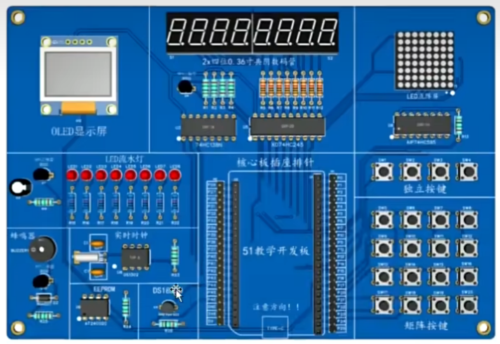
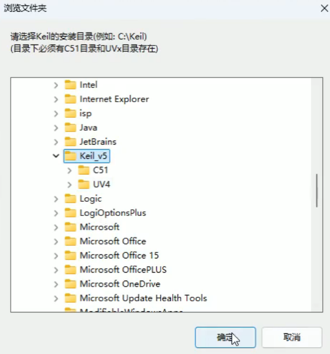
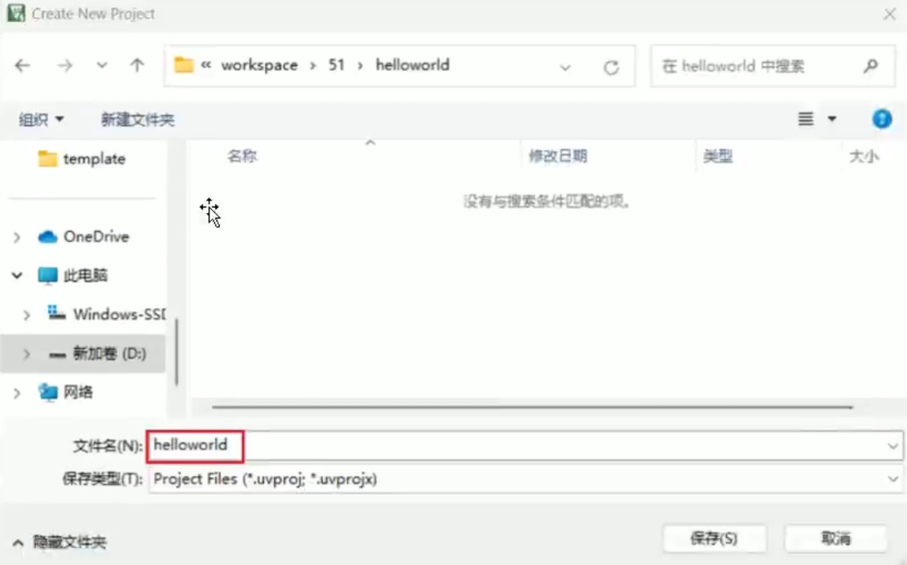
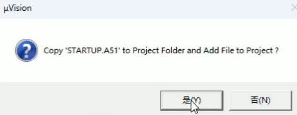
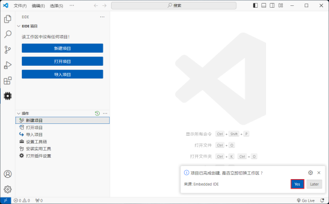
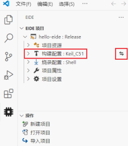
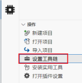
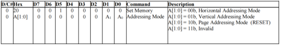
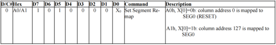
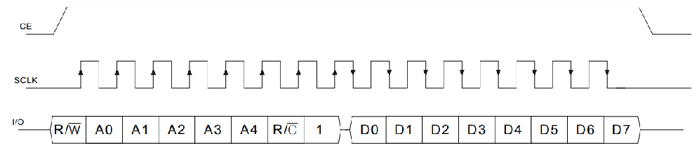

# 第1章 单片机概述

## 1.1 单片机简介

​	单片机是一种将中央处理器（CPU）、存储器、I/O接口等集成在一个芯片上的微型计算机。它具有体积小、价格便宜、易于编程等特点，广泛应用于家用电器的智能控制模块，无人售卖系统、医疗设备中的监测系统等。

## 1.2 51单片机概述

​	51单片机（或称8051单片机）原是指1980年由Intel公司推出的一种8位微控制器系列，现在更多的指实现了**8051指令集**（单片机的”语言“）的一系列单片机。

## 1.3 STC89C52RC 概述

### 1.3.1 单片机命名规范

**例名**：STC89C52RC-40I-LOFP44

**拆分**：STC	89	C	52	RC	-40	I	-LOFP	44

- STC：深圳宏晶科技有限公司的缩写（开头字母表示生产此款单片机的半导体公司名）
- 89：STC公司生产的8051内核单片机的具体型号
- C：表示工作电压
  - C：5.5V~3.3V
  - LE：3.6V~2.0V
- 52：表示程序空间大小，用于存放用户程序（断电程序不丢失）。
  - 51：4KB
  - 52：8KB
  - 53：13KB
  - 54：16KB
  - 58：32KB
  - 516：64KB
- RC：RAM大小，用于存放程序执行的过程数据（断电数据丢失）。
  - RC：512B
  - RD+：1280B
- 40：表示工作频率，频率越高，CPU指令执行速度越快。
  - 25：工作频率可到25MHz
  - 40：工作频率可到40MHz
  - 50：工作频率可到50MHz
- I：表示工作温度，根据设备的使用场景进行选择
  - I：工业级，-40°C~85°C
  - C：商业级，0°C~70°C
- LQFP：表示封装类型，根据设备的使用场景进行选择
  - LQFP：四侧引脚扁平封装
  - PDIP：双列直插封装
- 44：表示引脚数量
  - 40
  - 44

### 1.3.2 封装类型

1. LQFP（Low-profile Quad Flat Package）

   

2. PDIP（Plastic Dual In-line Package）


### 1.3.3 引脚功能概述


- **电源引脚**：用于为单片机供电
  - Vcc
  - Gnd
- **复位引脚**：RST，用于将单片机恢复到初始状态，以便重新运行程序，相当于电脑的重启功能（从第一条指令重新开始执行）
- **时钟引脚**：用于连接时钟源，为单片机提供时钟信号
  - XTAL1
  - XTAL2
- **通用输入输出引脚**（GPIO，General Purpose I/O）：可以被程序员配置为输入或输出，用于连接和控制外部设备。与其他引脚相比，GPIO引脚的主要特点是通用性，可以根据应用的需求进行灵活配置。GPIO引脚只有高低两种电平。
  - P0：P0.0~P0.7
  - P1：P1.0~P1.7
  - P2：P2.0~P2.7
  - P3：P3.0~P3.7
  - P4：P4.0~P4.6
- **复用引脚**：在GPIO引脚中，有些引脚还可用于其他功能，例如39号引脚（INT3/P4.2）
  - INT0、INT1、INT2、INT3
  - T0、T1、T2
  - TxD（输出数据接口）、RxD（输入数据接口）
  - ALE
  - T2EX
  - RD
  - WR

### 1.3.4 最小系统概述


# 第2章 开发环境

**概述**：嵌入式的开发环境通常包括**硬件**（开发板）和**软件**（代码编辑器、编译器等）两部分。

## 2.1 硬件环境

扩展板：



核心板：


## 2.2 软件环境

**概述**：51单片机的软件开发环境需要具备代码编辑、代码编译、程序烧录等功能，典型的开发环境如下：


​	<span style="color:blue;">Keil</span>是一个运行在Windows系统中的单片机集成开发环境，其提供了代码编辑、代码编译、仿真和调试等功能。

​	<span style="color:blue;">Keil C51 Compiler</span>是一个专门用于51单片机的C语言编译器，基于ANSI C（C89/C90）标准，并对C语言在内存管理、数据类型等方面进行了若干扩展和修改。具体内容参考此文档：https://developer.arm.com/documentation/101655/0961/Cx51-User-s-Guide?lang=en

​	<span style="color:blue;">STC-ISP</span>是STC公司专门为STC芯片提供的程序烧录工具，用于将程序写入单片机。

​	Keil编写代码没有变量提示、不会自动补全括号等，体验非常不友好，所以我们选择<span style="color:blue;">VS Code</span>作为替代。

# 第3章 Keil快速入门

## 3.1 创建项目

1. 创建工作空间：存放代码的总目录

2. 创建当前项目的目录：存放当前项目的目录

3. 打开STC-ISP，将目标芯片信息添加到Keil中（第一次创建项目执行此操作）

   1. 点击“Keil仿真设置”

   2. 在芯片型号中选择“STC89C52RC/LE52RC”

   3. 点击”添加......“

      

   4. 选择Keil的安装目录

      

4. 创建Keil项目：启动Keil

   1. 选择菜单的Project -> New uVersion Project选项

      

   2. 选择当前项目目录，输入项目名称后保存

      

   3. 选择单片机型号，点击OK

      

   4. 为当前项目添加启动文件

      

5. 创建C源程序

   1. 点击”Add New Item to Group 'Source Group 1'......“

      

   2. 创建main.c文件（文件名随意，不是必须是main），点击Add

      

## 3.2 编写程序

1. 编写代码（main.c）

   ```c
   #include <STC89C5xRC.H>		// 包含STC89C52的头文件
   
   void main() {
       // 让P00引脚输出低电平
       P00 = 0;
       // 死循环卡住单片机，让它不要继续往下执行
       while(1);
   }
   ```

2. 修改编译配置

   1. 点击魔法棒图标

      

   2. 选择Output，然后勾选Create HEX File选项，然后点击OK

      

3. 点击编译，然后点击连接

   

## 3.3 程序烧录

1. 打开STC-ISP

2. 选择芯片型号为“STC89C52RC/LE52RC”

3. 点击“打开程序文件”，选择当前项目下Objects文件夹下的“xxx.hex”文件

   

4. 用USB数据线连接电脑和单片机，并在扫描串口处选择“（COM4）USB-SERIAL CH340K”

   

5. 点击“下载/编程”，等待右侧提示“操作成功”，然后观察开发板效果


# 第4章 闪烁LED

**需求描述**：令Led1每秒钟闪烁一次（即亮0.5秒，灭0.5秒），效果图如下：


**实现思路**：通过延时函数，每500ms改变一次LED的状态。

## 4.1 获取延时函数

1. 打开STC-ISP

2. 点击“软件延时计算器”

   

3. 设置系统频率为“11.0592MHz”，定时长度设置为“500毫秒”，8051指令集为“STC-Y1”，复制代码

   

## 4.2 程序编写与烧录

1. 代码编写

   ```c
   #include <STC89C5xRC.H>
   #include <INTRINS.H>
   
   void Delay500ms(void) {
       unsigned char data i, j, k;
       
       _nop_();
       i = 4;
       j = 129;
       k = 119;
       
       do {
           do {
               while (--k);
           } while (--j);
       } while (--i);
   }
   
   void main() {
       while (1) {
           P00 = ~P00;
           Delay500ms();
       }
   }
   ```

2. 烧录效果


# 第5章 流水灯

**需求描述**：令P00到P07的LED依次亮起，间隔100ms，不断循环。

**实现思路**：通过延时函数，每100ms改变一次整个P0引脚的状态，要呈现出流水灯的效果，需要将P0引脚依次设置为：0xfe、0xfd、0xfb、0xf7、0xef、0xdf、0xbf、0x7f，然后从0xfe重新开始。举例：0xfe = 11111110，0xfd = 11111101，可以通过左移1位后加1的方式实现。若想避免加法运算，可以通过设置一个变量tmp = 0x01 = 00000001，然后将tmp左移1位后取反的方式得到更新状态的P0。

## 5.1 程序编写

```c
#include <STC89C5xRC.H>

void Delay100ms() {
    unsigned char data i, j;
    
    i = 180;
    j = 73;
    
    do {
        while(--j);
    } while(--i);
}

void main() {
    unsigned char tmp = 0x01;
    while(1) {
        P0 = ~tmp;
        Delay100ms();
        tmp <<= 1;
        if(tmp == 0x00) {
            tmp = 0x01;
        }
    }
}
```

# 第6章 VS Code快速入门

## 6.1 EIDE插件安装

**概述**：EIDE（Embedded IDE）插件用于提供单片机开发环境，借助该插件，我们可以在VS Code中实现单片机的开发、编译以及烧录等工作，安装完成后侧边栏便会出现该插件。


## 6.2 创建项目

1. 点击“New Project”或“新建项目”

   

2. 选择“空项目”，选择“8位 MCU 项目”，选择“8051 Empty Project”

   

3. 填写项目名称，然后选择项目路径（即存放代码的总目录）

   

4. 项目创建完成后，切换到新项目

   

5. 切换之后会有如下错误提示，暂时忽略即可


## 6.3 配置项目

**概述**：由于EIDE需要承接代码的编辑、编译等一整套工作流程，所以我们需要为配置相应的工具链。

### 6.3.1 编译相关配置

1. 选择编译器

   概述：选择Keil中的C51 Compiler作为编译器，如果默认不是Keil_C51，可点击后边的按钮进行选择。

   

2. 为EIDE制定Keil安装目录

   概述：由于EIDE需要使用Keil中的C51 Compiler，所以要为EIDE指定Keil的安装路径。

   1. 点击“设置工具链”

      

   2. 选择要配置的工具链

      

      

### 6.3.2 设置Include Path

**概述**：将STC芯片的头文件添加到项目的Include Path，方便项目引用。

1. 点击“添加包含路径”

   

2. 选择STC头文件所在目录


## 6.4 程序编写、编译与烧录

1. 编写代码

   ```c
   #include <STC89C5xRC.H>
   #include <INTRINS.H>
   
   void Delay500ms(void) {
       unsigned char data i, j, k;
       
       _nop_();
       i = 4;
       j = 129;
       k = 119;
       
       do {
           do {
               while (--k);
           } while (--j);
       } while (--i);
   }
   
   void main() {
       while (1) {
           P00 = ~P00;
           Delay500ms();
       }
   }
   ```

2. 程序编译：点击右上角的编译按钮进行编译

   

3. 查看“xxx.hex”文件：默认情况下“xxx.hex”文件会在项目根目录下的“build\Relase”目录中生成

   

4. 程序烧录：可以使用VS Code进行程序烧录（很麻烦需要配置很多东西），所以仍然使用STC-ISP进行烧录（注意选择新的“xxx.hex”文件路径）

   

# 第7章 数码管

## 7.1 数码管静态显示

**需求概述**：开发板上有2个并排的4位数码管，将其视为一个整体。要求能在8位中的任一位置同一时刻只显示任一数字。


### 7.1.1 硬件初步设计

**概述**：我们通过阴极控制显示的位置，阳极控制显示的内容。两个数码管共有8个阴极引脚和16个阳极引脚，若所有引脚都直接接入MCU，会很浪费引脚个数。为了节省引脚，可以将两个数码管的阳极接在一起，如下图所示：


**结论**：这样一来，我们只需通过8个GPIO引脚就能控制这8位数码管的显示内容了。

### 7.1.2 74HC138（译码器）

**概述**：由于同一时刻只显示1位，因此数码管的阴极可使用<span style="color:blue;">74HC138芯片</span>进一步节省引脚，它可以将3位二进制转换成8位二进制，如下图所示：


### 7.1.3 74HC245N（驱动器）

**概述**：由于51单片高电平的驱动能力很微弱，不足以点亮数码管，因此可以使用<span style="color:blue;">74HC245N</span>作为驱动芯片。此时，51单片引脚的输出就只用作信号，而驱动数码管的电流则由74HC245的电源提供。


### 7.1.3 原理图

- 译码器、驱动器、数码管原理图


- 电路原理图


### 7.1.4 程序编写与烧录

1. 编写代码

   ```c
   #include <STC89C5xRC.H>
   
   #define SMG_EN P36
   #define LED_EN P34
   
   // 增加自定义类型，简化代码编写
   typedef unsigned char u8;
   typedef unsigned int u16;
   
   // 数字0-9的编码
   static u8 s_digit_codes[10] = {
       0x3F,
       0x06,
       0x5B,
       0x4F,
       0x66,
       0x6D,
       0x7D,
       0x07,
       0x7F,
       0x6F};
   
   void DigitalTube_DisplaySingle(u8 dig, u8 num)
   {
       // 清理上一次显示
       P0 = 0;
   
       // 首先片选dig
       P1 &= 0xC7;
       dig <<= 3;
       P1 |= dig;
   
       P0 = num;
   }
   
   void main()
   {
       // 打开数码管总开关
       SMG_EN = 0;
       LED_EN = 0;
   
       // 让第5个数码管显示数字1
       DigitalTube_DisplaySingle(5 - 1, s_digit_codes[1]);
   
       // 卡住程序
       while (1);
   }
   ```

2. 程序烧录

   

## 7.2 数码管动态显示

**需求概述**：显示8位以内的任意整数，要求靠右显示。


### 7.2.1 程序编写与烧录

1. 编写代码

   ```c
   #include <STC89C5xRC.H>
   #include <INTRINS.H>
   
   #define SMG_EN P36
   #define LED_EN P34
   
   // 增加自定义类型，简化代码编写
   typedef unsigned char u8;
   typedef unsigned int u16;
   typedef unsigned long u32;
   
   // 数字0-9的编码
   static u8 codes[10] = {
       0x3F,
       0x06,
       0x5B,
       0x4F,
       0x66,
       0x6D,
       0x7D,
       0x07,
       0x7F,
       0x6F};
   
   u8 buffer[8];
   
   // 延时函数
   void Delay1ms(u16 count)
   {
       unsigned char data i, j;
   
       while (count-- > 0) {
           _nop_();
           i = 2;
           j = 199;
           do {
               while (--j);
           } while (--i);
       }
   }
   
   void DigitalTube_DisplaySingle(u8 dig, u8 num)
   {
       // 清理上一次显示
       P0 = 0;
   
       // 首先片选dig
       P1 &= 0xC7;
       dig <<= 3;
       P1 |= dig;
   
       P0 = num;
   }
   
   // 设置显存数组
   void DigitalTube_DisplayNum(u32 num)
   {
       u8 i;
       for (i = 0; i < 8; i++) {
           buffer[i] = 0;
       }
   
       if (num == 0) {
           buffer[7] = codes[0];
       }
   
       // num = 12345
       for (i = 7; num > 0; i--) {
           buffer[i] = codes[num % 10];
           num /= 10;
       }
   }
   
   // 动态扫描
   void DigitalTube_Refresh()
   {
       u8 i;
       for (i = 0; i < 8; i++) {
           DigitalTube_DisplaySingle(i, buffer[i]);
           Delay1ms(200);
       }
   }
   
   void main()
   {
       // 打开数码管总开关
       SMG_EN = 0;
       LED_EN = 0;
   
       DigitalTube_DisplayNum(5201314);
   
       // 卡住程序
       while (1) {
           DigitalTube_Refresh();
       };
   }
   ```

2. 程序烧录


# 第8章 模块化编程

## 8.1 命名规范

### 8.1.1 变量命名

- 使用有意义的名字，该名字应反映变量的用途或其代表的值
- 避免使用单个字符名字，除非是常见的循环变量如：i，j
- 使用小写字母，并在多个单词间使用下划线连接，例如：sensor_value，update_interval
- 使用g_前缀来标识全局变量，例如：g_system_state
- 使用s_前缀来标识静态变量，例如：s_internal_counter
- 使用st_前缀来标识结构体变量，例如：st_date
- 使用p_前缀来标识指针，例如：p_num
- 使用p_st_前缀来标识结构体指针，例如：p_st_date
- 常量和宏定义使用全大写字母，并用下划线分隔单词，例如：MAX_VALUE，TIMER_INTERVAL
- 结构体类型声明需要使用_Struct后缀，例如：Date_Struct
- 枚举类型名称使用大写字母开始，例如：ColorType
- 枚举值使用全大写字母，并用下划线分隔单词，例如：COLOR_RED，COLOR_BLUE
- 内部变量都要加static关键字

### 8.1.2 函数命名

- 函数名称应描述其功能或执行的操作
- 使用{分层}_ {模块} _{功能}作为函数名称，分层详见分层定义，模块首字母大写，功能使用首字母大写的驼峰命名，特殊名词全部大写
- 返回布尔值的函数，其名称应该是一个问题或断言，例如：IsButtonPressed()，HasDataArrived()
- 为属性/变量获取值的函数使用Get前缀，例如：GetSpeed()
- 为属性/变量设置值的函数使用Set前缀，例如：SetSpeed(int speed)
- 函数应尽量短小，并执行单一功能，这样可以提高代码的可读性和可维护性
- 内部函数都要加static关键字

### 8.1.3 文件命名

- 使用{分层}_{模块}作为文件名称，分层详见分层定义，模块首字母大写，特殊名词全部大写
- 如果项目规模较大，头文件和源文件建议分开存放

## 8.2 代码分层规范

1. **工具函数和常用宏定义**：所有特定算法、工具函数和常规宏定义
   - 目录：Com/
   - 前缀：Com_
2. **驱动层**：所有与芯片直接交互的自身硬件代码，例如：GPIO开关、硬件UART/ADC的驱动、计时器等
   - 目录：Dri/
   - 前缀：Dri_
3. **接口层**：位于驱动层之上，通过标准接口（GPIO、UART、IIC、SPI等）驱动的外部硬件代码（如果没有外部硬件设备，可以不用这一层）。
   - 目录：Int/
   - 前缀：Int_
4. **中间层**：提供更高级的服务，如：操作系统、文件系统、通信协议栈等。这层通常用于复杂的单片机项目，比如使用RTOS的项目（简单的项目可以不用这一层）。
   - 目录：Mid/
   - 前缀：Mid_
5. **应用层**：包含应用程序的主要逻辑，该层应只与上面的中间件层或接口层交互，尽量不直接访问驱动层
   - 目录：App/
   - 前缀：App_

## 8.3 数码管项目改造

### 8.3.1 常规定义和通用方法

**概述**：将常用的宏定义和方法定义在专门的头文件和源文件，并将其置于Com目录。

- <a id="Com_Util.h">Com_Util.h</a>

  ```c
  #ifndef __COM_UTIL_H__
  #define __COM_UTIL_H__
  
  #include <INTRINS.H>
  
  // 8bit无符号数
  typedef unsigned char u8;
  // 16bit无符号数
  typedef unsigned int u16;
  // 32bit无符号数
  typedef unsigned long u32;
  
  /**
   * @brief 延时指定时长
   *
   * @param count 延时时长，单位:ms（毫秒），MAX:65535
   */
  void Com_Util_Delay1ms(u16 count);
  
  #endif
  ```

- <a id="Com_Util.c">Com_Util.c</a>

  ```c
  #include "Com_Util.h"
  
  void Com_Util_Delay1ms(u16 count)
  {
      u8 i, j;
  
      while (count-- > 0) {
          _nop_();
          i = 2;
          j = 199;
          do {
              while (--j);
          } while (--i);
      }
  }
  ```

### 8.3.2 数码管驱动程序编写

**概述**：在项目的Int目录下创建Int_DigitalTube.h和Int_DigitalTube.c，写入以下内容。

- <a id="Int_DigitalTube.h">Int_DigitalTube.h</a>

  ```c
  #ifndef __INT_DIGITALTUBE_H__
  #define __INT_DIGITALTUBE_H__
  
  #include <STC89C5xRC.H>
  #include "Com_Util.h"
  
  /**
   * @brief 数码管初始化方法
   */
  void Int_DigitalTube_Init();
  
  /**
   * @brief 设置数码管要显示的数字
   *
   * @param num 要显示的数字
   */
  void Int_DigitalTube_SetDisplayNum(u32 num);
  
  /**
   * @brief 数码管刷新主程序，需要在循环中一直调用
   */
  void Int_DigitalTube_Refresh();
  
  #endif
  ```

- <a id="Int_DigitalTube.c">Int_DigitalTube.c</a>

  ```c
  #include "Int_DigitalTube.h"
  
  #define SMG_EN P36
  #define LED_EN P34
  
  // 数字0-9的编码
  static u8 s_codes[10] = {
      0x3F,
      0x06,
      0x5B,
      0x4F,
      0x66,
      0x6D,
      0x7D,
      0x07,
      0x7F,
      0x6F};
  
  // 需要在数码管上显示的数字的编码
  static u8 s_buffer[8];
  
  /**
   * @brief 让数码管的某1位显示1个特定的数字
   *
   * @param position 位选，取值范围[0-7]
   * @param num 段选信号
   */
  static void Int_DigitalTube_DisplaySingleDigit(u8 position, u8 num)
  {
      // 清理上一次显示
      P0 = 0;
  
      // 首先位选position
      P1 &= 0xC7;
      position <<= 3;
      P1 |= position;
  
      // 段选
      P0 = num;
  }
  
  void Int_DigitalTube_Init()
  {
      // 关闭LED
      LED_EN = 0;
  
      // 打开数码管
      SMG_EN = 0;
  }
  
  void Int_DigitalTube_SetDisplayNum(u32 num)
  {
      u8 i;
  
      // 将显存清零
      for (i = 0; i < 8; i++) {
          s_buffer[i] = 0;
      }
  
      // 如果待展示的数字为0，直接展示
      if (!num) {
          s_buffer[7] = s_codes[0];
          return;
      }
  
      // 为显存赋值
      for (i = 7; num > 0; i--) {
          s_buffer[i] = s_codes[num % 10];
          num /= 10;
      }
  }
  
  void Int_DigitalTube_Refresh()
  {
      u8 i;
  
      // 依次刷新8位数码管
      for (i = 0; i < 8; i++) {
          Int_DigitalTube_DisplaySingleDigit(i, s_buffer[i]);
  
          // 延时增加占空比
          Com_Util_Delay1ms(1);
      }
  }
  ```

- main.c

  ```c
  #include "Int_DigitalTube.h"
  
  void main()
  {
      // 初始化数码管
      Int_DigitalTube_Init();
      // 让数码管显示5201314
      Int_DigitalTube_SetDisplayNum(12345678);
  
      // 不断刷新数码管
      while (1) {
          Int_DigitalTube_Refresh();
      }
  }
  ```

## 8.4 创建、使用项目模板

**概述**：为方便后续项目的创建，可以创建一个基础模板，后边项目全部基于模板创建。

1. 创建项目：创建一个新的项目，可以取名为Template

   

2. 配置项目

   

3. 规范项目结构

   

4. 导出模板

   	

5. 基于模板创建项目

   1. 新建项目——选择本地项目：这时新建一个项目，新建时不再选择“空项目”，而是选择“本地项目模板”

      

   2. 选择模板文件

      

   3. 后续操作与创建空项目无异

## 8.5 创建“xxx.h”文件的header代码模板

1. 在VS Code中，按快捷键Ctrl+Shift+P，并输入“>snippets”，然后选择“代码片段：配置代码片段”

   

2. 选择“新建全局代码片段文件”

   

3. 输入文件名：C51_xxxH_header，然后往新建的文件中输入代码

   - C51_xxxH_header.code-snippets

     ```json
     {
     	"C C++ Header": {
     		"scope": "c, cpp",
     		"prefix": "C51_xxxH_header",
     		"description": "Add #ifndef, #define and #endif",
     		"body": [
     			"#ifndef __${TM_FILENAME_BASE/(.*)/${1:/upcase}/}_H__",
     			"#define __${TM_FILENAME_BASE/(.*)/${1:/upcase}/}_H__",
     			"",
     			"$0",
     			"",
     			"#endif /* __${TM_FILENAME_BASE/(.*)/${1:/upcase}/}_H__ */"
     		]
     	}
     }
     ```

4. 在新建的“xxx.h”文件中，输入“C51_xxxH_header”即可

# 第9章 独立按键

**需求概述**：通过SW1、SW2、SW3、SW4四个独立按键分别控制LED1、LED2、LED3、LED4的亮灭，具体要求是：按一下（按下并松开）SW，LED点亮，再按一下SW，LED熄灭。

**实现思路**：设法令单片机感知到SW被按下，也就是SW按下时向单片机发送一个信号，当单片机收到该信号后，再执行控制LED的逻辑。由于51单片机的GPIO引脚默认均为高电平，因此只需将SW的一侧接入单片机的某个GPIO引脚，另一侧接地。此时，当SW按下时，引脚直接接地，就相当于向单片机发送了一个低电平信号。然后通过代码实时监测SW接入引脚的状态，只要状态变成低电平则改变某个LED的状态值，引脚状态为高电平时LED状态不变。


## 9.1 硬件原理图


## 9.2 软件设计

### 9.2.1 按键消抖

**概述**：由于按键内部的弹簧和触点具有弹性，当按键被按下或释放时，这些弹性材料会震动，从而导致触点在短时间内反复接触和断开。所以表面上我们虽然只按了一次按键，但实际上是按了多次。


**解决方案**：利用延时函数规避“前沿/后沿抖动”，规避之后判断高低电平，若是高电平则不改变LED状态，低电平则进入改变LED状态的算法。

### 9.2.2 程序编写

- <a href="#Com_Util.h">Com_Util.h</a>

- <a href="#Com_Util.c">Com_Util.c</a>

- Int_Key.h

  ```c
  #ifndef __INT_KEY_H__
  #define __INT_KEY_H__
  
  #include <STC89C5xRC.H>
  #include "Com_Util.h"
  #define SW1 P42
  #define SW2 P43
  #define SW3 P32
  #define SW4 P33
  
  /**
   * @brief 判断按键1是否被按下
   * 
   * @return bit  返回1：被按下    返回0：没按下
   */
  bit Int_Key_IsSW1Pressed();
  
  /**
   * @brief 判断按键2是否被按下
   * 
   * @return bit  返回1：被按下    返回0：没按下
   */
  bit Int_Key_IsSW2Pressed();
  
  /**
   * @brief 判断按键3是否被按下
   * 
   * @return bit  返回1：被按下    返回0：没按下
   */
  bit Int_Key_IsSW3Pressed();
  
  /**
   * @brief 判断按键4是否被按下
   * 
   * @return bit  返回1：被按下    返回0：没按下
   */
  bit Int_Key_IsSW4Pressed();
  
  #endif /* __INT_KEY_H__ */
  ```

- Int_Key.c

  ```c
  #include "Int_Key.h"
  
  bit Int_Key_IsSW1Pressed()
  {
      if (SW1 == 0) {
          // 延时消抖
          Com_Util_Delay15ms();
          
          //延时消抖15ms后，判断SW1是否还等于0
          if (SW1 == 0) {
              // 按下时SW1=0，松手后SW1=1，要实现松手后亮灯，所以等于0时让它死循环
              while (SW1 == 0);
              return 1;
          }
      }
  
      return 0;
  }
  
  bit Int_Key_IsSW2Pressed()
  {
      if (SW2 == 0) {
          Com_Util_Delay15ms();
          if (SW2 == 0) {
              while (SW2 == 0);
              return 1;
          }
      }
  
      return 0;
  }
  
  bit Int_Key_IsSW3Pressed()
  {
      if (SW3 == 0) {
          Com_Util_Delay15ms();
          if (SW3 == 0) {
              while (SW3 == 0);
              return 1;
          }
      }
  
      return 0;
  }
  
  bit Int_Key_IsSW4Pressed()
  {
      if (SW4 == 0) {
          Com_Util_Delay15ms();
          if (SW4 == 0) {
              while (SW4 == 0);
              return 1;
          }
      }
  
      return 0;
  }
  ```

- main.c

  ```c
  #include "Int_Key.h"
  
  #define LED1 P00
  #define LED2 P01
  #define LED3 P02
  #define LED4 P03
  
  void main()
  {
      while (1) {
          // 判断SW1是否被按下，被按下的话就改变LED状态
          if (Int_Key_IsSW1Pressed()) {
              LED1 = ~LED1;
          }
  
          if (Int_Key_IsSW2Pressed()) {
              LED2 = ~LED2;
          }
  
          if (Int_Key_IsSW3Pressed()) {
              LED3 = ~LED3;
          }
  
          if (Int_Key_IsSW4Pressed()) {
              LED4 = ~LED4;
          }
      }
  }
  ```

# 第10章 矩阵按键

**需求概述**：按下按键矩阵中的SW5到SW20按键后，数码管显示对应的按键编号。

**实现思路**：由于按键矩阵中共有4x4=16个按键，如果每个按键都接入一个GPIO引脚，势必会造成引脚的浪费，为了节省引脚，我们同样可以借用动态扫描的思想，具体逻辑如下：


## 10.1 硬件原理图


## 10.2 程序编写

- <a href="#Com_Util.h">Com_Util.h</a>

- <a href="#Com_Util.c">Com_Util.c</a>

- <a href="#Int_DigitalTube.h">Int_DigitalTube.h</a>

- <a href="#Int_DigitalTube.c">Int_DigitalTube.c</a>

- <a id="Int_KeyMatrix.h">Int_KeyMatrix.h</a>

  ```c
  #ifndef __INT_KEYMATRIX_H__
  #define __INT_KEYMATRIX_H__
  
  #include "Com_Util.h"
  
  /**
   * @brief   检测按键是否被按下
   * 
   * @return u8   如果被按下，返回按键编号，否则返回0
   */
  u8 Int_KeyMatrix_CheckSW();
  
  #endif /* __INT_KEYMATRIX_H__ */
  ```

- <a id="Int_KeyMatrix.c">Int_KeyMatrix.c</a>

  ```c
  #include "Int_KeyMatrix.h"
  #include <STC89C5xRC.H>
  
  u8 Int_KeyMatrix_CheckSW()
  {
      // temp用于记录和GPIO引脚P2进行与运算的值
      u8 i, j, temp;
      // 循环结尾P2的位运算，是为了更换检测行
      for (i = 0, P2 = 0xFE; i < 4; i++, P2 = (P2 << 1) + 1) {
          // 循环结尾temp的位运算，是为了和P2进行与运算时检测不同列
          for (j = 0, temp = 0x10; j < 4; j++, temp <<= 1) {
              // 判断当前列的引脚的值是否为0，是0则表示当前行列的按键被按下，是1则未按下
              if ((P2 & temp) == 0) {
                  // 延时消抖15ms
                  Com_Util_Delay1ms(15);
  
                  // 延时消抖，判断当前列的引脚的值依旧为0
                  if ((P2 & temp) == 0) {
                      // 按下时当前列的引脚的值为0，松手后为1，要实现松手后数显，所以等于0时让它死循环
                      while ((P2 & temp) == 0);
                      return 5 + j + 4 * i;
                  }
              }
          }
      }
  
      return 0;
  }
  ```

- main.c

  ```c
  #include "Int_KeyMatrix.h"
  #include "Int_DigitalTube.h"
  
  void main()
  {
      // key用来保存被按下按键的编号
      u8 key;
  
      // 初始化数码管
      Int_DigitalTube_Init();
  
      // 设置数码管默认值为0
      Int_DigitalTube_SetDisplayNum(0);
  
      while (1) {
          // 获取被按下按键的编号
          key = Int_KeyMatrix_CheckSW();
  
          // key为0表示没被按下，为正数反之
          if (key) {
              // 设置数码管将要数显的值
              Int_DigitalTube_SetDisplayNum(key);
          }
  
          // 数码管数显
          Int_DigitalTube_Refresh();
      }
  }
  ```

# 第11章 蜂鸣器

**需求概述**：为按键矩阵增加按键提示音，要求按键按下后，蜂鸣器响0.1s（100ms）。

**实现思路**：使用的是无源蜂鸣器，所以需要从外部输入一定频率的方波，方波的频率就是蜂鸣器发声的频率，这里我们使用500Hz的方波即可。

## 11.1 硬件原理图


## 11.2 程序编写

- <a href="#Com_Util.h">Com_Util.h</a>

- <a href="#Com_Util.c">Com_Util.c</a>

- <a href="#Int_DigitalTube.h">Int_DigitalTube.h</a>

- <a href="#Int_DigitalTube.c">Int_DigitalTube.c</a>

- <a href="#Int_KeyMatrix.h">Int_KeyMatrix.h</a>

- <a href="#Int_KeyMatrix.c">Int_KeyMatrix.c</a>

- Int_Buzzer.h

  ```c
  #ifndef __INT_BUZZER_H__
  #define __INT_BUZZER_H__
  
  /**
   * @brief 蜂鸣器响0.1s
   *
   */
  void Int_Buzzer_Buzz();
  
  #endif /* __INT_BUZZER_H__ */
  ```

- Int_Buzzer.c

  ```c
  #include "Int_Buzzer.h"
  #include <STC89C5xRC.H>
  #include "Com_Util.h"
  
  #define BUZZ P46
  
  void Int_Buzzer_Buzz()
  {
      // time用来控制声响时长
      u8 time = 100;
      while (time--)
      {
          BUZZ = ~BUZZ;
          Com_Util_Delay1ms(1);
      }
  }
  ```

- main.c

  ```c
  #include "Int_KeyMatrix.h"
  #include "Int_DigitalTube.h"
  #include "Int_Buzzer.h"
  
  void main()
  {
      // key用来保存被按下按键的编号
      u8 key;
  
      // 初始化数码管
      Int_DigitalTube_Init();
  
      // 设置数码管默认值为0
      Int_DigitalTube_SetDisplayNum(0);
  
      while (1) {
          // 获取被按下按键的编号
          key = Int_KeyMatrix_CheckSW();
  
          // key为0表示没被按下，为正数反之
          if (key) {
              // 启动蜂鸣器，以500Hz的频率响指定0.1s
              Int_Buzzer_Buzz();
  
              // 设置数码管将要数显的值
              Int_DigitalTube_SetDisplayNum(key);
          }
  
          // 数码管数显
          Int_DigitalTube_Refresh();
      }
  }
  ```

# 第12章 中断系统

**概述**：中断系统是单片机用于处理外部紧急事件的一种机制。中断系统工作的大致流程如下图所示：当CPU正在处理某项任务时，外部发生了某个紧急事件，此时CPU会暂停当前的工作，转而去处理这个紧急事件，处理完之后，再回到原来被中断的位置，继续处理原来的工作。


- **中断源**：指能够引发中断的事件
- **中断标志位**：寄存器中的一位数，用于表示中断发生。发生时该位数置为1，中断处理完毕后置0
- **中断服务程序**：指处理中断的逻辑（即函数），当某中断标志位置1时，CPU会自动执行相应的中断服务程序
- **中断优先级**：指多个中断同时发生时，单片机响应中断的先后顺序，且高优先级的中断可以打断低优先级中断

## 12.1 中断源

**概述**：STC89C52RC共有8个中断源，8个中断源可分为3类，分别是外部中断、定时器中断、串口中断。

### 12.1.1 外部中断

**概述**：指由单片机外部的紧急事件触发的中断，通过向单片机的特定引脚发送特定的信号触发。STC89C52RC提供了4个外部中断引脚：INT0，INT1，INT2，INT3。

**触发方式**：51单片机的外部中断支持两种触发方式：低电平触发、下降沿触发。


### 12.1.2 定时器中断

**概述**：指由单片机内部的定时器触发的中断，STC89C52RC共有3个定时器：Timer0、Timer1、Timer2。

**定时器**：定时器是大多数单片机都具备的一个功能模块，用于实现定时任务。

**定时器用法**：设置一个定时值，然后开始计时，待计时结束后，触发相应的定时器中断，开发者可以在中断服务程序中编写定时任务的逻辑（即函数）。


### 12.1.3 串口中断

**概述**：串口中断是由单片机串口触发的中断，STC89C52RC的串口引脚为TxD和RxD（TxD用于发送数据，RxD用于接收数据）。

**串口**：串口是单片机用于收发数据的重要接口之一，当单片机通过串口接收到数据或者发送完数据后都会触发相应的中断。


## 12.2 中断服务程序

**概述**：指用于处理中断的一段代码，当中断发生时，CPU就会暂停当前程序的执行，转而执行对应的中断服务程序，处理完中断后再恢复到原来的程序。

**中断源和中断服务程序的声明**：STC89C52RC共有8个中断源，分为4个外部中断、3个定时器中断、1个串口中断，开发者可以为每个中断源声明相应的中断服务程序，中断服务程序的声明语法如下：


## 12.3 中断优先级

**概述**：STC89C52RC共有4个中断优先级，每个中断源都可以单独设置优先级。

**多个中断处理**：若多个中断同时发生，优先处理优先级高的；若两个中断的优先级相同，则根据中断号决定处理顺序，中断号小的优先。

**中断嵌套**：当CPU正在处理一个中断时，又发生了一个优先级更高的中断，此时CPU会暂停原来中断的服务程序，转去处理这个高优先级的中断，处理完之后，再回到原来低优先级的中断服务程序（STC89C52RC最多支持两层中断嵌套）。

## 12.4 中断系统结构图


## 12.5 中断寄存器

**概述**：每个中断源是否被启用、外部中断的触发方式、中断优先级，都是由单片机内部的5个寄存器控制的。

- <a id="IE中断允许寄存器">**IE**</a>：中断允许寄存器（可位寻址）

  <table cellspacing="0">
  	<tr align="center" valign="middle">
  		<th bgcolor="#f2f3f4">SFR Name</th>
  		<th bgcolor="#f2f3f4">Address</th>
  		<th bgcolor="#f2f3f4">Bit</th>
  		<td bgcolor="#f8f9f9">B7</td>
  		<td bgcolor="#f8f9f9">B6</td>
  		<td bgcolor="#f8f9f9">B5</td>
  		<td bgcolor="#f8f9f9">B4</td>
  		<td bgcolor="#f8f9f9">B3</td>
  		<td bgcolor="#f8f9f9">B2</td>
  		<td bgcolor="#f8f9f9">B1</td>
  		<td bgcolor="#f8f9f9">B0</td>
  	</tr>
      <tr align="center" valign="middle">
      	<td bgcolor="white">IE</td>
          <td bgcolor="white">A8H</td>
          <th bgcolor="#f2f3f4">Name</th>
          <td bgcolor="white">EA</td>
          <td bgcolor="white">-</td>
          <td bgcolor="white">ET2</td>
          <td bgcolor="white">ES</td>
          <td bgcolor="white">ET1</td>
          <td bgcolor="white">EX1</td>
          <td bgcolor="white">ET0</td>
          <td bgcolor="white">EX0</td>
      </tr>
  </table>

  - <a id="EA总中断允许控制位">EA</a>：CPU的总中断允许控制位。EA=1，开放中断；EA=0，屏蔽所有中断申请
  - ET2：定时/计数器T2的溢出中断允许位。ET2=1，允许T2中断；ET2=0，禁止T2中断
  - ES：串行口1中断允许位。ES=1，允许串行口1中断；ES=0，禁止串行口1中断
  - ET1：定时/计数器T1的溢出中断允许位
  - EX1：外部中断1中断允许位。EX1=1，允许外部中断1中断；EX1=0，禁止外部中断1中断
  - <a id="ET0定时/计数器T0的溢出中断允许位">ET0</a>：定时/计数器T0的溢出中断允许位
  - EX0：外部中断0中断允许位

- <a id="XICON辅助中断控制寄存器">**XICON**</a>：辅助中断控制寄存器（可位寻址）

  <table cellspacing="0">
  	<tr align="center" valign="middle">
  		<th bgcolor="#f2f3f4">SFR Name</th>
  		<th bgcolor="#f2f3f4">Address</th>
  		<th bgcolor="#f2f3f4">Bit</th>
  		<td bgcolor="#f8f9f9">B7</td>
  		<td bgcolor="#f8f9f9">B6</td>
  		<td bgcolor="#f8f9f9">B5</td>
  		<td bgcolor="#f8f9f9">B4</td>
  		<td bgcolor="#f8f9f9">B3</td>
  		<td bgcolor="#f8f9f9">B2</td>
  		<td bgcolor="#f8f9f9">B1</td>
  		<td bgcolor="#f8f9f9">B0</td>
  	</tr>
      <tr align="center" valign="middle">
      	<td bgcolor="white">XICON</td>
          <td bgcolor="white">C0H</td>
          <th bgcolor="#f2f3f4">Name</th>
          <td bgcolor="white">PX3</td>
          <td bgcolor="white">EX3</td>
          <td bgcolor="white">IE3</td>
          <td bgcolor="white">IT3</td>
          <td bgcolor="white">PX2</td>
          <td bgcolor="white">EX2</td>
          <td bgcolor="white">IE2</td>
          <td bgcolor="white">IT2</td>
      </tr>
  </table>

  - PX3：表示外部中断3的优先级置位最低位，优先级最终由[PX3H,PX3]=[0,0]、[0,1]、[1,0]、[1,1]决定
  - EX3：外部中断3中断允许位
  - IE3：外部中断3的中断请求标志位。中断条件成立后，IE3=1；中断服务程序结束后，IE3=0
  - IT3：IT3=1，外部中断3的中断触发方式为下降沿触发中断；IT3=0，触发方式为低电平触发中断
  - PX2：表示外部中断2的优先级置位最低位
  - EX2：外部中断2中断允许位
  - IE2：外部中断2的中断请求标志位
  - IT2：记录外部中断2的中断触发方式

- <a id="TCON定时器/计数器中断控制寄存器">**TCON**</a>：定时器/计数器中断控制寄存器（可位寻址）

  <table cellspacing="0">
  	<tr align="center" valign="middle">
  		<th bgcolor="#f2f3f4">SFR Name</th>
  		<th bgcolor="#f2f3f4">Address</th>
  		<th bgcolor="#f2f3f4">Bit</th>
  		<td bgcolor="#f8f9f9">B7</td>
  		<td bgcolor="#f8f9f9">B6</td>
  		<td bgcolor="#f8f9f9">B5</td>
  		<td bgcolor="#f8f9f9">B4</td>
  		<td bgcolor="#f8f9f9">B3</td>
  		<td bgcolor="#f8f9f9">B2</td>
  		<td bgcolor="#f8f9f9">B1</td>
  		<td bgcolor="#f8f9f9">B0</td>
  	</tr>
      <tr align="center" valign="middle">
      	<td bgcolor="white">TCON</td>
          <td bgcolor="white">88H</td>
          <th bgcolor="#f2f3f4">Name</th>
          <td bgcolor="white">TF1</td>
          <td bgcolor="white">TR1</td>
          <td bgcolor="white">TF0</td>
          <td bgcolor="white">TR0</td>
          <td bgcolor="white">IE1</td>
          <td bgcolor="white">IT1</td>
          <td bgcolor="white">IE0</td>
          <td bgcolor="white">IT0</td>
      </tr>
  </table>

  - TF1
  - <a id="TR1定时器1的运行控制位">TR1</a>：定时器1的运行控制位。当GATE=0或（GATE=1且<span style="text-decoration:overline">INT0</span>=1）时，TR0=1则定时器1开始运行，反之TR0=0则定时器1不运行
  - TF0
  - <a id="TR0定时器0的运行控制位">TR0</a>：定时器0的运行控制位
  - IE1：外部中断1的中断请求标志位
  - IT1：记录外部中断1的中断触发方式
  - IE0：外部中断0的中断请求标志位
  - IT0：记录外部中断0的中断触发方式

- **T2CON**：定时器/计数器2中断控制寄存器（可位寻址）

  <table cellspacing="0">
  	<tr align="center" valign="middle">
  		<th bgcolor="#f2f3f4">SFR Name</th>
  		<th bgcolor="#f2f3f4">Address</th>
  		<th bgcolor="#f2f3f4">Bit</th>
  		<td bgcolor="#f8f9f9">B7</td>
  		<td bgcolor="#f8f9f9">B6</td>
  		<td bgcolor="#f8f9f9">B5</td>
  		<td bgcolor="#f8f9f9">B4</td>
  		<td bgcolor="#f8f9f9">B3</td>
  		<td bgcolor="#f8f9f9">B2</td>
  		<td bgcolor="#f8f9f9">B1</td>
  		<td bgcolor="#f8f9f9">B0</td>
  	</tr>
      <tr align="center" valign="middle">
      	<td bgcolor="white">T2CON</td>
          <td bgcolor="white">C8H</td>
          <th bgcolor="#f2f3f4">Name</th>
          <td bgcolor="white">TF2</td>
          <td bgcolor="white">EXF2</td>
          <td bgcolor="white">RCLK</td>
          <td bgcolor="white">TCLK</td>
          <td bgcolor="white">EXEN2</td>
          <td bgcolor="white">TR2</td>
          <td bgcolor="white">C/<span style="text-decoration:overline">T2</span></td>
          <td bgcolor="white">CP/<span style="text-decoration:overline">RL2</span></td>
      </tr>
  </table>

- <a id="TMOD定时器/计数器工作模式寄存器">**TMOD**</a>：定时器/计数器工作模式寄存器（不可位寻址）,B0\~B3属于定时器0，B4\~B7属于定时器1

  <table cellspacing="0">
  	<tr align="center" valign="middle">
  		<th bgcolor="#f2f3f4">SFR Name</th>
  		<th bgcolor="#f2f3f4">Address</th>
  		<th bgcolor="#f2f3f4">Bit</th>
  		<td bgcolor="#f8f9f9">B7</td>
  		<td bgcolor="#f8f9f9">B6</td>
  		<td bgcolor="#f8f9f9">B5</td>
  		<td bgcolor="#f8f9f9">B4</td>
  		<td bgcolor="#f8f9f9">B3</td>
  		<td bgcolor="#f8f9f9">B2</td>
  		<td bgcolor="#f8f9f9">B1</td>
  		<td bgcolor="#f8f9f9">B0</td>
  	</tr>
      <tr align="center" valign="middle">
      	<td bgcolor="white">TMOD</td>
          <td bgcolor="white">89H</td>
          <th bgcolor="#f2f3f4">Name</th>
          <td bgcolor="white">GATE</td>
          <td bgcolor="white">C/<span style="text-decoration:overline">T</span></td>
          <td bgcolor="white">M1</td>
          <td bgcolor="white">M0</td>
          <td bgcolor="white">GATE</td>
          <td bgcolor="white">C/<span style="text-decoration:overline">T</span></td>
          <td bgcolor="white">M1</td>
          <td bgcolor="white">M0</td>
      </tr>
  </table>

  - <a id="GATE定时器(0/1)启动方式控制位">GATE</a>：置0时，无视<span style="text-decoration:overline">INT0</span>，定时器(0/1)的运行由TR(0/1)控制；置1时，<span style="text-decoration:overline">INT0</span>生效，当<span style="text-decoration:overline">INT0</span>和TR(0/1)都置1时，定时器才开始运行
  - <a id="C/T(Counter/Timer)位">C/<span style="text-decoration:overline">T</span></a>：置0时，从内部系统时钟获取脉冲信号，用作定时器；置1时，从单片机外部引脚（T0/P3.4）/（T1/P3.5）获取脉冲信号，用作计数器
  - <a id="M1定时器(0/1)工作模式选择最高位">M1</a>：用作定时器(0/1)工作模式的选择，表示最高位
  - <a id="M0定时器(0/1)工作模式选择最低位">M0</a>：用作定时器(0/1)工作模式的选择，表示最低位

- <a id="SCON串行口控制寄存器">**SCON**</a>：串行口控制寄存器（可位寻址）

  <table cellspacing="0">
  	<tr align="center" valign="middle">
  		<th bgcolor="#f2f3f4">SFR Name</th>
  		<th bgcolor="#f2f3f4">Address</th>
  		<th bgcolor="#f2f3f4">Bit</th>
  		<td bgcolor="#f8f9f9">B7</td>
  		<td bgcolor="#f8f9f9">B6</td>
  		<td bgcolor="#f8f9f9">B5</td>
  		<td bgcolor="#f8f9f9">B4</td>
  		<td bgcolor="#f8f9f9">B3</td>
  		<td bgcolor="#f8f9f9">B2</td>
  		<td bgcolor="#f8f9f9">B1</td>
  		<td bgcolor="#f8f9f9">B0</td>
  	</tr>
      <tr align="center" valign="middle">
      	<td bgcolor="white">SCON</td>
          <td bgcolor="white">98H</td>
          <th bgcolor="#f2f3f4">Name</th>
          <td bgcolor="white">SM0/FE</td>
          <td bgcolor="white">SM1</td>
          <td bgcolor="white">SM2</td>
          <td bgcolor="white">REN</td>
          <td bgcolor="white">TB8</td>
          <td bgcolor="white">RB8</td>
          <td bgcolor="white">TI</td>
          <td bgcolor="white">RI</td>
      </tr>
  </table>

  - B7：当<a href="#PCON电源控制寄存器">PCON寄存器</a>中的<a href="#SMOD0串口通信帧错误检测有效控制位">SMOD0</a>=0时，B7用于<span style="text-decoration:underline;text-decoration-style:double">SM0功能</span>；SMOD0=1时，用于<span style="text-decoration:underline;text-decoration-style:double">FE功能</span>
    - <a id="SM0串口工作模式的选择最高位">SM0</a>：用作串口工作模式的选择，表示最高位

    - <a id="FE串口通信帧错误检测位">FE</a>：用作帧错误检测，当检测到一个无效停止位时，通过UART接收器设置该位，该位必须有软件清零
  - <a id="SM1串口工作模式的选择最低位">SM1</a>：用作串口工作模式的选择，表示最低位
  - SM2：不同方式起到不同作用

    - 方式0中：应设置SM2=0
    - <a id="SM2在方式1中允许/禁止接收控制器Rx Control检测停止位控制位">方式1中</a>：是允许/禁止<span style="text-decoration:underline;text-decoration-style:double">接收控制器Rx Control</span>检测停止位控制位，SM2=0时，禁止停止位检测；SM2=1时，开启停止位检测
    - 方式2、方式3中：
  - <a id="REN串口允许/禁止串行接收控制位">REN</a>：是允许/禁止串行接收的控制位，置0时，禁止接收数据；置1时，允许串行接收数据，并启动串行接收器RxD
  - TB8
  - RB8
  - <a id="TI串口发送中断请求标志位">TI</a>：串口的发送中断请求标志位，当<span style="text-decoration:underline;text-decoration-style:double">发送控制器Tx Control</span>发送一个帧后，TI=1，然后触发中断服务程序，并且必须由软件复位，即TI=0
  - <a id="RI串口接收中断请求标志位">RI</a>：串口的接收中断请求标志位，当<span style="text-decoration:underline;text-decoration-style:double">接收控制器Rx Control</span>接收一个帧后，RI=1，然后触发中断服务程序，并且必须由软件复位，即RI=0

- <a id="PCON电源控制寄存器">**PCON**</a>：电源控制寄存器（不可位寻址）

  <table cellspacing="0">
  	<tr align="center" valign="middle">
  		<th bgcolor="#f2f3f4">SFR Name</th>
  		<th bgcolor="#f2f3f4">Address</th>
  		<th bgcolor="#f2f3f4">Bit</th>
  		<td bgcolor="#f8f9f9">B7</td>
  		<td bgcolor="#f8f9f9">B6</td>
  		<td bgcolor="#f8f9f9">B5</td>
  		<td bgcolor="#f8f9f9">B4</td>
  		<td bgcolor="#f8f9f9">B3</td>
  		<td bgcolor="#f8f9f9">B2</td>
  		<td bgcolor="#f8f9f9">B1</td>
  		<td bgcolor="#f8f9f9">B0</td>
  	</tr>
      <tr align="center" valign="middle">
      	<td bgcolor="white">PCON</td>
          <td bgcolor="white">87H</td>
          <th bgcolor="#f2f3f4">Name</th>
          <td bgcolor="white">SMOD</td>
          <td bgcolor="white">SMOD0</td>
          <td bgcolor="white">-</td>
          <td bgcolor="white">POF</td>
          <td bgcolor="white">GF1</td>
          <td bgcolor="white">GF0</td>
          <td bgcolor="white">PD</td>
          <td bgcolor="white">IDL</td>
      </tr>
  </table>

  - <a id="SMOD串口通信的波特率的选择">SMOD</a>：用作串口通信的波特率的选择。置0时，串行通信工作方式1、2、3的波特率减少2倍；置1时则不减少
  - <a id="SMOD0串口通信帧错误检测有效控制位">SMOD0</a>：帧错误检测有效控制位，置0时，<a href="#SCON串行口控制寄存器">SCON</a>的B7位用于<a href="#SM0串口工作模式的选择最高位">SM0功能</a>；置1时，B7位用于<a href="#FE串口通信帧错误检测位">FE功能</a>

- <a id="IP中断优先级控制寄存器低">**IP**</a>：中断优先级控制寄存器低（可位寻址）

  <table cellspacing="0">
  	<tr align="center" valign="middle">
  		<th bgcolor="#f2f3f4">SFR Name</th>
  		<th bgcolor="#f2f3f4">Address</th>
  		<th bgcolor="#f2f3f4">Bit</th>
  		<td bgcolor="#f8f9f9">B7</td>
  		<td bgcolor="#f8f9f9">B6</td>
  		<td bgcolor="#f8f9f9">B5</td>
  		<td bgcolor="#f8f9f9">B4</td>
  		<td bgcolor="#f8f9f9">B3</td>
  		<td bgcolor="#f8f9f9">B2</td>
  		<td bgcolor="#f8f9f9">B1</td>
  		<td bgcolor="#f8f9f9">B0</td>
  	</tr>
      <tr align="center" valign="middle">
      	<td bgcolor="white">IP</td>
          <td bgcolor="white">B8H</td>
          <th bgcolor="#f2f3f4">Name</th>
          <td bgcolor="white">-</td>
          <td bgcolor="white">-</td>
          <td bgcolor="white">PT2</td>
          <td bgcolor="white">PS</td>
          <td bgcolor="white">PT1</td>
          <td bgcolor="white">PX1</td>
          <td bgcolor="white">PT0</td>
          <td bgcolor="white">PX0</td>
      </tr>
  </table>

  - PT2：表示定时器中断2的优先级置位最低位
  - PS：表示串口中断的优先级置位最低位
  - PT1：表示定时器中断1的优先级置位最低位
  - PX1：表示外部中断1的优先级置位最低位
  - PT0：表示定时器中断0的优先级置位最低位
  - PX0：表示外部中断0的优先级置位最低位

- <a id="IPH中断优先级控制寄存器高">**IPH**</a>：中断优先级控制寄存器高（不可位寻址）

  <table cellspacing="0">
  	<tr align="center" valign="middle">
  		<th bgcolor="#f2f3f4">SFR Name</th>
  		<th bgcolor="#f2f3f4">Address</th>
  		<th bgcolor="#f2f3f4">Bit</th>
  		<td bgcolor="#f8f9f9">B7</td>
  		<td bgcolor="#f8f9f9">B6</td>
  		<td bgcolor="#f8f9f9">B5</td>
  		<td bgcolor="#f8f9f9">B4</td>
  		<td bgcolor="#f8f9f9">B3</td>
  		<td bgcolor="#f8f9f9">B2</td>
  		<td bgcolor="#f8f9f9">B1</td>
  		<td bgcolor="#f8f9f9">B0</td>
  	</tr>
      <tr align="center" valign="middle">
      	<td bgcolor="white">IPH</td>
          <td bgcolor="white">B7H</td>
          <th bgcolor="#f2f3f4">Name</th>
          <td bgcolor="white">PX3H</td>
          <td bgcolor="white">PX2H</td>
          <td bgcolor="white">PT2</td>
          <td bgcolor="white">PSH</td>
          <td bgcolor="white">PT1H</td>
          <td bgcolor="white">PX1H</td>
          <td bgcolor="white">PT0H</td>
          <td bgcolor="white">PX0H</td>
      </tr>
  </table>

  - PX3H：表示外部中断3的优先级置位最高位
  - PX2H：表示外部中断2的优先级置位最高位
  - PT2H：表示定时器中断2的优先级置位最高位
  - PSH：表示串口中断的优先级置位最高位
  - PT1H：表示定时器中断1的优先级置位最高位
  - PX1H：表示外部中断1的优先级置位最高位
  - PT0H：表示定时器中断0的优先级置位最高位
  - PX0H：表示外部中断0的优先级置位最高位

# 第13章 外部中断——按键控制LED状态

**需求概述**：使用外部中断的方式，通过SW3按键控制LED1的亮灭。

## 13.1 硬件设计

**概述**：通过外部中断检测按钮，需将按钮接入4个外部中断引脚之一，如图所示：SW3用于触发外部中断0。


### 13.1.1 启动中断

**概述**：CPU默认会屏蔽所有中断请求，即不会响应任何中断请求，要使用中断，必须先进行启用。每个中断源是否被启用，是由<a href="#IE中断允许寄存器">IE</a>和<a href="#XICON辅助中断控制寄存器">XICON寄存器</a>控制的，两个寄存器各有8位，每一位的作用可参考[此图](##12.4 中断系统结构图)。

**总结**：从图中看出，STC89C52系列的中断系统具有两级控制，首先是<a href="#EA总中断允许控制位">EA总控制位</a>，其次是每个中断源各自的控制位。因此若想启用某个中断，要先将总控制位EA置位1，再将该中断自身的控制为置为1。

### 13.1.2 配置外部中断触发方式

**概述**：STC89C52系列的外部中断支持两种触发方式，分别是<span style="text-decoration:underline;text-decoration-style:double">低电平触发</span>和<span style="text-decoration:underline;text-decoration-style:double">下降沿触发</span>，4个外部中断各需要1个控制位用于设置触发方式，这4个控制位分布于<a href="#XICON辅助中断控制寄存器">XICON</a>和<a href="#TCON定时器/计数器中断控制寄存器">TCON寄存器</a>中，两个寄存器各有8位，每一位的作用可参考[此图](##12.4 中断系统结构图)。

**总结**：从图中看出，IT0~IT3分别用于设置外部中断0到3的触发方式，且0表低电平触发，1表示下降沿触发。

### 13.1.3 配置中断优先级（可选）

**概述**：STC89C52系列的中断系统支持4个优先级，所以每个中断源的优先级都需要通过2个控制位进行配置，8个中断源共需要16个控制位，这16个控制位分布于<a href="#IPH中断优先级控制寄存器高">IPH</a>、<a href="#IP中断优先级控制寄存器低">IP</a>和<a href="#XICON辅助中断控制寄存器">XICON寄存器</a>中，三个寄存器各有8位，每一位的作用可参考[此图](##12.4 中断系统结构图)。

### 13.1.4 定义中断服务程序

**概述**：外部中断0~3的中断号分别是：0、2、6、7，以外部中断0为例，其中断服务程序的定义如下：

```c
void INT0_Handler() interrupt 0 {}
```

## 13.2 程序编写

- <a href="#Com_Util.h">Com_Util.h</a>

- <a href="#Com_Util.c">Com_Util.c</a>

- main.c

  ```c
  #include <STC89C5xRC.H>
  #include "Com_Util.h"
  
  #define LED0 P00
  #define LED1 P01
  #define LED2 P02
  #define LED3 P03
  
  void Init_INT0()
  {
      // 打开中断总开关
      EA = 1;
      // 打开外部中断0~3开关
      EX0 = 1;
      EX1 = 1;
      EX2 = 1;
      EX3 = 1;
      // 配置外部中断为下降沿触发
      IT0 = 1;
      IT1 = 1;
      IT2 = 1;
      IT3 = 1;
  }
  
  void main()
  {
      Init_INT0();
  
      while (1) {
      }
  }
  
  /**
   * @brief 中断函数中打开LED2，代表当触发中断时，LED2会打开。
   *        根据我们之前的设置，当按下SW3时，P32为低电平，此时LED2打开。
   *
   *        interrupt 0表示0号中断触发时执行该函数的逻辑
   *        如果用C语言编程，中断查询次序就是中断号
   */
  void INT0_Handler() interrupt 0
  {
      Com_Util_Delay1ms(15);
      if (P32 == 0)
      {
          LED2 = ~LED2;
      }
      
  }
  
  void INT1_Handler() interrupt 2
  {
      Com_Util_Delay1ms(15);
      if (P33 == 0)
      {
          LED3 = ~LED3;
      }
      
  }
  
  void INT2_Handler() interrupt 6
  {
      Com_Util_Delay1ms(15);
      if (P43 == 0)
      {
          LED1 = ~LED1;
      }
      
  }
  
  void INT3_Handler() interrupt 7
  {
      Com_Util_Delay1ms(15);
      if (P42 == 0)
      {
          LED0 = ~LED0;
      }
  }
  ```

# 第14章 定时器中断——闪烁LED

**需求描述**：使用定时器中断的方式实现LED闪烁，具体要求是使用定时器0令LED4每1秒钟闪烁一次。

## 14.1 定时器使用说明

**概述**：定时器的基本工作原理，是使用一个n位的脉冲计数器，对时钟信号的脉冲进行计数，每个脉冲加1，当脉冲计数器达到最大值2^n^，也就是溢出时，触发定时器中断。

- 脉冲：1个脉冲是指信号在短时间内从低电平快速跳变到高电平，然后再返回低电平的过程
- <a id="定时器周期">周期</a>：两个相邻的脉冲之间的时间间隔
- 频率：单位时间（即1s）内脉冲重复的次数


**影响定时器定时时间的因素**：

- 脉冲计数器的位数
- 脉冲计数器的初始值
- 时钟信号的频率

### 14.1.1 启用定时器中断

**概述**：STC89C52系列共有3个定时器，每个定时器都有其对应的中断。定时器0的中断允许控制位<a href="#ET0定时/计数器T0的溢出中断允许位">ET0</a>位于<a href="#IE中断允许寄存器">IE寄存器</a>中。

- 开启定时器0中断

```c
// 中断总开关
EA = 1;
// 定时器0的中断开关
ET0 = 1;
```

### 14.1.2 选择定时器工作方式

**概述**：STC89C52系列的定时器都有<span style="text-decoration:underline;text-decoration-style:double">定时</span>和<span style="text-decoration:underline;text-decoration-style:double">计数</span>两种工作方式，它们的本质都是用脉冲计数器对脉冲进行计数。每个定时器都有一个控制位，用于设置工作方式，定时器0的控制位是<a href="#TMOD定时器/计数器工作模式寄存器">TMOD寄存器</a>中的第3位<a href="#C/T(Counter/Timer)位">C/T位</a>。

- **定时方式**：用于产生精确的时间延迟，脉冲信号为系统时钟信号
- **计数方式**：用于统计外部脉冲信号的个数，脉冲信号来自单片机外部引脚


**总结**：若想使用定时工作方式，应将C/T控制位设置为0，注意TMOD寄存器不可位寻址

### 14.1.3 选择定时器工作模式

**概述**：STC89C52系列的定时器都有多种工作模式，以适用不同的工作场景，定时器0共有4个工作模式。

1. **模式0——13位定时/计数器**：脉冲计数器有13位，最大计数为8192，TL0、TH0为2个8位寄存器，用于存储脉冲计数器数值，该模式下TL0只用到了低5位

   

2. <a id="定时器工作模式1——16位定时/计数器">**模式1——16位定时/计数器**</a>：脉冲计数器有16位，最大计数为65536。TL0的8位和TH0的8位都用到了

   

3. <a id="定时器工作模式2——8位自动重装载">**模式2——8位自动重装载**</a>：TL0寄存器用于存储脉冲计算器数值，TH0则用于存储脉冲计数器的初始值，每当TL0溢出时， 会自动把TH0的值重新装入TL0中

   

   - **与模式0、模式1的区别**：前两者在定时结束后需再次定时时，要用代码重设计数器初始值。而该模式可以在溢出时自动重置初始值，适合执行周期性任务

4. **模式3——双8位定时/计数器**：TL0和TH0分开使用，当定时器不够用时，可使用该模式。TL0用作定时/计数工作，TH0用作定时工作

   

**工作模式的配置**：这4种模式需要2个位设置，这2个控制位在<a href="#TMOD定时器/计数器工作模式寄存器">TMOD寄存器</a>中，分别是：<a href="#M1定时器(0/1)工作模式选择最高位">M1</a>、<a href="#M0定时器(0/1)工作模式选择最低位">M0</a>。

<table cellspacing="0">
	<tr align="center" valign="middle">
		<th bgcolor="#f2f3f4">M1</th>
		<th bgcolor="#f2f3f4">M0</th>
		<th bgcolor="#f2f3f4">工作模式</th>
	</tr>
    <tr align="center" valign="middle">
    	<td bgcolor="white">0</td>
        <td bgcolor="white">0</td>
        <td bgcolor="white">模式0（13位）</td>
    </tr>
    <tr align="center" valign="middle">
    	<td bgcolor="#f8f9f9">0</td>
        <td bgcolor="#f8f9f9">1</td>
        <td bgcolor="#f8f9f9">模式1（16位）</td>
    </tr>
    <tr align="center" valign="middle">
    	<td bgcolor="white">1</td>
        <td bgcolor="white">0</td>
        <td bgcolor="white">模式2（8位自动重装载）</td>
    </tr>
    <tr align="center" valign="middle">
    	<td bgcolor="#f8f9f9">1</td>
        <td bgcolor="#f8f9f9">1</td>
        <td bgcolor="#f8f9f9">模式3（双8位）</td>
    </tr>
</table>

### 14.1.4 设置脉冲计数器初始值

**概述**：51单片机定时器是在脉冲计数器溢出时触发中断，因此定时长短要通过计数器初始值控制，所以要先根据期望的定时时长计算出初始值（下面以<a href="#定时器工作模式1——16位定时/计数器">模式1</a>介绍初始值的计算）。

1. **明确每个计数脉冲的时间（<a href="#定时器周期">周期</a>）**：由图得知，传递给脉冲计数器的信号是系统时钟信号经过分频后所得，且分频方式分别是12分频和6分频，默认是12分频

   

   - **总结**：当前系统时钟频率为11.0592MHz（11059200Hz），所以计数脉冲频率为11059200/12 Hz，因此1个计数脉冲的时间是12/11059200 s，即<span style="text-decoration:underline;text-decoration-style:double">周期≈1.08us</span>

2. **计算所需脉冲个数**：假设定时1ms，那么1ms需要的脉冲个数应为0.001/(12/11059200)个

3. **计算脉冲计数器初始值**：假设定时1ms，脉冲个数为0.001/(12/11059200)，因此初始值为65536-0.001/(12/11059200)，<span style="text-decoration:underline;text-decoration-style:double">初始值≈64614</span>，最后将初始值赋给TL0（低8位）和TH0（高8位）

   - **第一种**：直接复制（运行效率较高，但不灵活）

     ```c
     // 十进制：64614	十六进制：FC66	二进制：1111 1100 0110 0110
     // TL0为低8位
     TL0 = 0x66;
     // TH0为高8位
     TH0 = 0xFC;
     ```

   - **第二种**：位运算（运行效率较低，但较灵活）

     ```c
     // 十进制：64614	十六进制：FC66	二进制：1111 1100 0110 0110
     // TL0为低8位
     TL0 = 64614;
     // TH0为高8位
     TH0 = 64614 >> 8;
     ```

### 14.1.5 启动定时器

**概述**：定时器的启动由单片机内部的寄存器或外部引脚控制，具体由<a href="#TMOD定时器/计数器工作模式寄存器">TMOD寄存器</a>的<a href="#GATE定时器(0/1)启动方式控制位">GATE控制位</a>决定（下面以定时器0为例）。

- **当GATE=0时**：外部引脚（INT0/P3.2）无效，此时定时器的启动由<a href="#TCON定时器/计数器中断控制寄存器">TCON寄存器</a>的<a href="#TR0定时器0的运行控制位">TR0位</a>控制，当TR0=1时，脉冲计数器开始计数；TR0=0时，停止计数
- **当GATE=1时**：外部引脚（INT0/P3.2）生效，此时只有当<a href="#TCON定时器/计数器中断控制寄存器">TCON寄存器</a>的<a href="#TR0定时器0的运行控制位">TR0位</a>和外部引脚INT0都为1时，脉冲计数器才开始计数，否则停止计数


### 14.1.6 定义中断服务程序

**概述**：定时器0~3的中断号分别是：1、3、5，以定时器0为例，其中断服务程序的定义如下：

```c
void Dri_Timer0_Handler() interrupt 1 {}
```

## 14.2 程序编写

- <a href="#Com_Util.h">Com_Util.h</a>

- <a href="#Com_Util.c">Com_Util.c</a>

- Dri_Timer0.h

  ```c
  #ifndef __DRI_TIMER0_H__
  #define __DRI_TIMER0_H__
  
  /**
   * @brief 定时器0中断初始化
   */
  void Dri_Timer0_Init();
  
  #endif /* __DRI_TIMER0_H__ */
  ```

- Dri_Timer0.c

  ```c
  #include "Dri_Timer0.h"
  #include "Com_Util.h"
  #include <STC89C5xRC.H>
  
  #define LED4 P04
  
  void Dri_Timer0_Init()
  {
      // 中断总开关
      EA = 1;
      // 定时器0的中断开关
      ET0 = 1;
  
      // 配置定时器工作模式：GATE=0   C/T=0   M1=0    M0=1
      TMOD &= 0xF0;
      TMOD |= 0x01;
  
      // 为脉冲计数器赋初始值，十进制：64614，十六进制：FC66，可定时1ms
      // TL0为低8位
      TL0 = 0x66;
      // TH0为高8位
      TH0 = 0xFC;
  
      // 启动定时器0
      TR0 = 1;
  }
  
  /**
   * @brief 定时器0的中断服务程序，每1ms进入一次
   */
  void Dri_Timer0_Handler() interrupt 1
  {
      // count用来计数
      static u16 count = 0;
  
      // 重置脉冲计数器
      TL0 = 0x66;
      TH0 = 0xFC;
  
      // 一次1ms，500次则为500ms=0.5s
      if (++count >= 500) {
          LED4  = ~LED4;
          count = 0;
      }
  }
  ```

- main.c

  ```c
  #include "Dri_Timer0.h"
  
  void main()
  {
      Dri_Timer0_Init();
      while (1) {
      }
  }
  ```

## 14.3 定时器封装

### 14.3.1 实现思路

**概述**：将定时器具体实现的功能封装成函数，再将多个这样的函数添加到函数指针数组中，最后在定时中断服务程序中轮询这个数组，以达到一个定时器同时完成多个功能，以及定时中断服务程序对具体功能实现的解耦。


1. 初始化定时器
2. 创建函数指针数组
3. 初始化函数指针数组，将每个元素都设为NULL（可置于第1步中）
4. 创建注册函数，用于将功能函数装载进函数指针数组中
5. 创建取消注册函数，用于将某功能函数从函数指针数组中删除
6. 创建定时中断服务程序，轮询执行该数组中的每一个元素

### 14.3.2 程序编写

- <a href="#Com_Util.h">Com_Util.h</a>

- <a href="#Com_Util.c">Com_Util.c</a>

- <a id="Dri_Timer0.h">Dri_Timer0.h</a>

  ```c
  #ifndef __DRI_TIMER0_H__
  #define __DRI_TIMER0_H__
  
  typedef void (*Timer0_Callback)(void);
  
  // 初始化定时器0
  void Dri_Timer0_Init();
  
  /**
   * @brief 注册回调函数
   *
   * @param callback 函数指针
   * @return bit 1:成功 0:失败
   */
  bit Dri_Timer0_RegisterCallback(Timer0_Callback callback);
  
  /**
   * @brief 取消注册回调函数
   *
   * @param callback 函数指针
   * @return bit 1:成功 0:失败
   */
  bit Dri_Timer0_DeregisterCallback(Timer0_Callback callback);
  
  #endif /* __DRI_TIMER0_H__ */
  ```

- <a id="Dri_Timer0.c">Dri_Timer0.c</a>

  ```c
  #include "Dri_Timer0.h"
  #include <STC89C5xRC.H>
  #include "Com_Util.h"
  #include <STDIO.H>
  
  #define MAX_CALLBACK_COUNT 4
  
  static Timer0_Callback s_callbacks[MAX_CALLBACK_COUNT];
  
  void Dri_Timer0_Init()
  {
      u8 i;
  
      // 中断总开关
      EA = 1;
      // 定时器0的中断开关
      ET0 = 1;
  
      // 配置定时器工作模式：GATE=0   C/T=0   M1=0    M0=1
      TMOD &= 0xF0;
      TMOD |= 0x01;
  
      // 为脉冲计数器赋初始值，十进制：64614，十六进制：FC66，可定时1ms
      TL0 = 64614;
      TH0 = 64614 >> 8;
  
      // 启动定时器0
      TR0 = 1;
  
      // 初始化函数指针数组
      for (i = 0; i < MAX_CALLBACK_COUNT; i++) {
          s_callbacks[i] = NULL;
      }
  }
  
  bit Dri_Timer0_RegisterCallback(Timer0_Callback callback)
  {
      u8 i;
  
      // 判断函数指针数组中是否已经存在该函数
      for (i = 0; i < MAX_CALLBACK_COUNT; i++) {
          if (s_callbacks[i] == callback) {
              return 1;
          }
      }
  
      // 判断函数指针数组是否有空位存放新函数
      for (i = 0; i < MAX_CALLBACK_COUNT; i++) {
          if (s_callbacks[i] == NULL) {
              s_callbacks[i] = callback;
              return 1;
          }
      }
  
      return 0;
  }
  
  bit Dri_Timer0_DeregisterCallback(Timer0_Callback callback)
  {
      u8 i;
  
      // 循环寻找需要取消注册的函数
      for (i = 0; i < MAX_CALLBACK_COUNT; i++) {
          if (s_callbacks[i] == callback) {
              s_callbacks[i] = NULL;
              return 1;
          }
      }
  
      return 0;
  }
  
  void Dri_Timer0_Handler() interrupt 1
  {
      u8 i;
  
      // 重新装载初始值，定时1ms
      TL0 = 64614;
      TH0 = 64614 >> 8;
  
      // 轮询函数指针数组
      for (i = 0; i < MAX_CALLBACK_COUNT; i++) {
          if (s_callbacks[i] != NULL) {
              s_callbacks[i]();
          }
      }
  }
  ```

- main.c

  ```c
  #include "Dri_Timer0.h"
  #include <STC89C5xRC.H>
  #include "Com_Util.h"
  
  #define LED0 P00
  
  void LED_Blink(void);
  
  void main(void)
  {
      Dri_Timer0_Init();
      Dri_Timer0_RegisterCallback(&LED_Blink);
      while (1) {}
  }
  
  void LED_Blink(void)
  {
      static u16 count = 0;
  
      if (++count >= 500) {
          LED0 = ~LED0;
          count = 0;
      }
  }
  ```

# 第15章 点阵LED

## 15.1 硬件原理图

**概述**：由图可知，点阵LED的显示需要逐行或逐列扫描，此处选择逐行扫描。由于每次扫描只需点亮一行，所以可以通过74HC238（与[74HC138芯片](###7.1.2 74HC138（译码器）)输出相反）芯片完成，以达到节省MCU引脚的目的，但这里采用[74HC595芯片](##15.2 74HC595芯片使用说明)。


## 15.2 74HC595芯片使用说明


- **SER**：用于接收输入数据，一次接收一位
- **SCK**：用于控制SER到移位寄存器的数据传输
- **RCK**：用于控制移位寄存器到存储寄存器的数据传输
- **QA~QH**：芯片的输出引脚
- **G#**：默认高电平，控制芯片的输入使能，设为低电平时芯片才能输出
- **SCLR#**：默认高电平，移位寄存器的清零操作，设为低电平时移位寄存器清零
- **QH'**：用于接收移位寄存器刚移出的一位数
- **移位寄存器**：用于接收串行数据输入，芯片根据SCK时钟信号（上升沿）将串行输入数据逐位移入移位寄存器
- **存储存储器**：与输出引脚相连，芯片根据RCK时钟信号（上升沿）将移位存储器中的数据加载到存储存储器中并输出

## 15.2 点阵LED静态显示

**概述**：使用点阵LED显示一排由左上到右下的斜线。


**实现思路**：循环扫描每一行，每一行单独显示改行各自的图案。

### 15.2.1 程序编写

- <a href="#Com_Util.h">Com_Util.h</a>

- <a href="#Com_Util.c">Com_Util.c</a>

- <a href="#Dri_Timer0.h">Dri_Timer0.h</a>

- <a href="#Dri_Timer0.c">Dri_Timer0.c</a>

- Int_LEDMatrix.h

  ```c
  #ifndef __INT_LEDMATRIX_H__
  #define __INT_LEDMATRIX_H__
  
  #include "Com_Util.h"
  
  /**
   * @brief 点阵LED的初始化
   */
  void Int_LEDMatrix_Init();
  
  /**
   * @brief 设置每一行要输出的图案
   */
  void Int_LEDMatrix_SetPic(u8 pic[]);
  
  #endif /* __INT_LEDMATRIX_H__ */
  ```
  
- Int_LEDMatrix.c

  ```c
  #include "Int_LEDMatrix.h"
  #include <STC89C5xRC.H>
  #include "Dri_Timer0.h"
  
  #define LED_EN P34
  #define LED_MATRIX_EN P35
  #define SCK P12
  #define SER P10
  #define RCK P11
  
  // 存储每行要显示的图案
  static u8 buffer[8];
  
  void Int_LEDMatrix_RefreshByTimer0(void);
  
  void Int_LEDMatrix_Init() {
      // 关闭LED灯模块，启用LED点阵模块（启用74HC595芯片输出使能）
      LED_EN = 0;
      LED_MATRIX_EN = 0;
  
      // 将Int_LEDMatrix_Refresh函数注册到定时器0的执行数组中
      Dri_Timer0_RegisterCallback(&Int_LEDMatrix_RefreshByTimer0);
  }
  
  void Int_LEDMatrix_SetPic(u8 pic[]) {
      u8 i;
      for (i = 0; i < 8; i++) {
          buffer[i] = pic[i];
      }
  }
  
  /**
   * @brief 显示一行图案
   */
  void Int_LEDMatrix_RefreshByTimer0() {
      // 存储执行的行数
      static u8 len = 0;
  
      // 清除上一行的图案
      P0 = 0xff;
  
      // 行选
      SER = (len == 0) ? 1 : 0;
      SCK = 0;
      SCK = 1;
      RCK = 0;
      RCK = 1;
  
      // 输出该行图案
      P0 = ~buffer[len];
  
      // 输出完最后一行从头开始
      if (++len == 8) {
          len = 0;
      }
  }
  ```

- main.c

  ```c
  #include "Int_LEDMatrix.h"
  #include "Dri_Timer0.h"
  
  void main() {
      u8 pic[8] = {
          0x01,
          0x02,
          0x04,
          0x08,
          0x10,
          0x20,
          0x40,
          0x80
      };
  
      Dri_Timer0_Init();
      Int_LEDMatrix_Init();
      Int_LEDMatrix_SetPic(pic);
      while (1) {}
  }
  ```

## 15.3 点阵LED动态显示

**概述**：点阵LED屏幕滚动显示图案。

**实现思路**：实时刷新每一行的图案，将上一行的图案移动到一下行。

### 15.3.1 程序编写

- <a href="#Com_Util.h">Com_Util.h</a>

- <a href="#Com_Util.c">Com_Util.c</a>

- <a href="#Dri_Timer0.h">Dri_Timer0.h</a>

- <a href="#Dri_Timer0.c">Dri_Timer0.c</a>

- <a id="Int_LEDMatrix.h">Int_LEDMatrix.h</a>

  ```c
  #ifndef __INT_LEDMATRIX_H__
  #define __INT_LEDMATRIX_H__
  
  #include "Com_Util.h"
  
  /**
   * @brief 点阵LED的初始化
   */
  void Int_LEDMatrix_Init();
  
  /**
   * @brief 设置每一行要输出的图案
   */
  void Int_LEDMatrix_SetPic(u8 pic[]);
  
  /**
   * @brief 刷新数组内容
   */
  void Int_LEDMatrix_RefreshArray(u8 param);
  
  #endif /* __INT_LEDMATRIX_H__ */
  ```

- <a id="Int_LEDMatrix.c">Int_LEDMatrix.c</a>

  ```c
  #include "Int_LEDMatrix.h"
  #include <STC89C5xRC.H>
  #include "Dri_Timer0.h"
  
  #define LED_EN P34
  #define LED_MATRIX_EN P35
  #define SCK P12
  #define SER P10
  #define RCK P11
  
  // 存储每行要显示的图案
  static u8 buffer[8];
  
  void Int_LEDMatrix_RefreshByTimer0(void);
  
  void Int_LEDMatrix_Init() {
      // 关闭LED灯模块，启用LED点阵模块（启用74HC595芯片输出使能）
      LED_EN = 0;
      LED_MATRIX_EN = 0;
  
      // 将Int_LEDMatrix_Refresh函数注册到定时器0的执行数组中
      Dri_Timer0_RegisterCallback(&Int_LEDMatrix_RefreshByTimer0);
  }
  
  void Int_LEDMatrix_SetPic(u8 pic[]) {
      u8 i;
      for (i = 0; i < 8; i++) {
          buffer[i] = pic[i];
      }
  }
  
  void Int_LEDMatrix_RefreshArray(u8 param) {
      u8 i;
      for (i = 7; i >= 1; i--) {
          buffer[i] = buffer[i - 1];
      }
      buffer[0] = param;
  }
  
  /**
   * @brief 显示一行图案
   */
  void Int_LEDMatrix_RefreshByTimer0() {
      // 存储执行的行数
      static u8 len = 0;
  
      // 清除上一行的图案
      P0 = 0xff;
  
      // 行选
      SER = (len == 0) ? 1 : 0;
      SCK = 0;
      SCK = 1;
      RCK = 0;
      RCK = 1;
  
      // 输出该行图案
      P0 = ~buffer[len];
  
      // 输出完最后一行从头开始
      if (++len == 8) {
          len = 0;
      }
  }
  ```

- main.c

  ```c
  #include "Int_LEDMatrix.h"
  #include "Dri_Timer0.h"
  
  void main() {
      u8 submodule[66] = {
      0x4a, 0xba, 0x6f, 0x3e, 0x8a, 0xff, 0x12,
      0x32, 0x00, 0x20, 0x2b, 0x2e, 0xff, 0x28, 0x2e,
      0x2b, 0x20, 0x00, 0xc1, 0xbf, 0xff, 0x7f, 0xff,
      0xbf, 0x81, 0x80, 0x00, 0x88, 0xc9, 0x69, 0x1f,
      0x39, 0x49, 0x89, 0x88, 0x00, 0x01, 0x01, 0x01,
      0xff, 0x09, 0x19, 0x31, 0x01, 0x00, 0x82, 0xfd,
      0x6f, 0xff, 0x2f, 0xef, 0x6f, 0x01, 0x00, 0x08,
      0x08, 0x08, 0x08, 0x08, 0x08, 0x08, 0x08, 0x00, 0x00, 0x00, 0x00,
      };
  
      Dri_Timer0_Init();
      Int_LEDMatrix_Init();
      while (1) {
          u8 i;
          for (i = 0; i < 66; i++) {
              Int_LEDMatrix_RefreshArray(submodule[i]);
              Com_Util_Delay1ms(300);
          }
      }
  }
  ```

# 第16章 UART通信

## 16.1 通讯和UART基础知识

### 16.1.1 串行和并行通讯

- **串行**：指数据通过一条数据线逐位传输

  

- **并行**：指数据通过多条数据线同时传输

  

- **串行和并行的区别**

  <table cellspacing="0" style="width:60%;margin:0 auto 0 auto;">
  	<tr align="center" valign="middle">
  		<th bgcolor="#f2f3f4">属性\方式</th>
  		<th bgcolor="#f2f3f4">串行</th>
  		<th bgcolor="#f2f3f4">并行</th>
  	</tr>
      <tr align="center" valign="middle">
      	<th bgcolor="#f2f3f4">传输速率</th>
          <td bgcolor="white">低</td>
          <td bgcolor="white">高</td>
      </tr>
      <tr align="center" valign="middle">
      	<th bgcolor="#f2f3f4">硬件成本</th>
          <td bgcolor="white">低</td>
          <td bgcolor="white">高</td>
      </tr>
      <tr align="center" valign="middle">
      	<th bgcolor="#f2f3f4">抗干扰能力</th>
          <td bgcolor="white">强</td>
          <td bgcolor="white">弱</td>
      </tr>
      <tr align="center" valign="middle">
      	<th bgcolor="#f2f3f4">通讯距离</th>
          <td bgcolor="white">远</td>
          <td bgcolor="white">近</td>
      </tr>
  </table>

### 16.1.2 单工和双工通讯

- **单工通讯**：只能在数据线上单方向传输数据
- **双工通讯**
  - **半双工通讯**：可以在数据线上双方向传输数据，但不能同时进行
  - **全双工通讯**：可以同时在数据线上双方向传输数据

### 16.1.3 同步和异步通讯

- **同步通讯**：发送方发送数据的同时发送时钟信号，接收方在每个时钟信号周期的下降沿对数据信号进行采样，就能采集到正确数据

  

- **异步通讯**：收发两方的频率直接设置相同，即无需时钟信号也能采集正确数据

  

### 16.1.4 UART定义

**概述**：UART（Universal Asynchronous Receiver/Transmitter）是一种异步、全双工的串行通信接口，常用于微控制器与计算机、其他微控制器或外部设备之间的数据交换，下图是UART通信的硬件结构：Tx用于发送数据，Rx用于接受数据。


## 16.2 UART通讯协议

### 16.2.1 数据格式

**概述**：在UART通信中，数据以“帧（Frame）”为单位逐帧发送，一个数据帧包括：起始位、数据位、校验位（可选）和停止位。


- **空闲状态**：就是无数据传输的时候，默认为高电平
- **起始位**：表示一个数据帧的开始，用低电平表示
- **数据位**：指帧传输的实际数据，长度为5~9位，一般为8位
- **校验位（可选）**：存放数据通过校验算法计算后的结果，可以配置是否校验
- **停止位**：表示一个数据帧的结束，长度一般为1~2位，用高电平表示

### 16.2.2 收发双方的约定（协议）

**概述**：为保证UART通信能够正常工作，收发双方要提前设置约定。

1. **波特率（Baud Rate）**：表示数据的传输速率，传输数据前要约定好速率
2. **数据位**：传输数据前要约定好数据位的位数
3. **校验位**：传输数据前要约定好是否存在校验位和校验算法
4. **停止位**：传输数据前要约定好停止位的位数

## 16.3 单片机对于UART的使用

**概述**：STC89C52系列单片机内部集成了一个功能强大的全双工串行通信口，提供了数据I/O引脚，分别为：RxD（输入引脚）和TxD（输出引脚）。


### 16.3.1 串口的工作方式

**概述**：该单片机的串口共有4种串行通信的工作方式。

<table cellspacing="0">
  	<tr align="center" valign="middle">
  		<th bgcolor="#f2f3f4">工作方式</th>
  		<th bgcolor="#f2f3f4">功能说明</th>
  		<th bgcolor="#f2f3f4">波特率</th>
  	</tr>
    <tr align="center" valign="middle">
        <td bgcolor="white">方式0</td>
        <td bgcolor="white">同步移位串行方式：移位寄存器</td>
        <td bgcolor="white">SYSclk &divide; 12</td>
    </tr>
    <tr align="center" valign="middle">
        <td bgcolor="white">方式1</td>
        <td bgcolor="white">8位UART，波特率可变</td>
        <td bgcolor="white">(2<sup>SMDO</sup> &divide; 32) &times; (定时器1的溢出率)</td>
    </tr>
    <tr align="center" valign="middle">
        <td bgcolor="white">方式2</td>
        <td bgcolor="white">9位UART</td>
        <td bgcolor="white">(2<sup>SMDO</sup> &divide; 64) &times; SYSclk</td>
    </tr>
    <tr align="center" valign="middle">
        <td bgcolor="white">方式3</td>
        <td bgcolor="white">9位UART，波特率可变</td>
        <td bgcolor="white">(2<sup>SMDO</sup> &divide; 32) &times; (定时器1的溢出率)</td>
    </tr>
  </table>


- **方式0**：该方式为同步通讯，TxD引脚作为时钟信号线，RxD作为数据信号线，只能实现半双工通讯
- <a id="串口工作方式1">**方式1**</a>：属于UART通讯，一个数据帧中包含：1个起始位、8个数据位、0个校验位、1个停止位
- **方式2**：属于UART通讯，一个数据帧中包含：1个起始位、8个数据位、1个校验位、1个停止位
- **方式3**：属于UART通讯，一个数据帧中包含：1个起始位、8个数据位、1个校验位、1个停止位

### 16.3.2 设置串口工作方式

**概述**：串口的工作方式通过<a href="#SCON串行口控制寄存器">SCON寄存器</a>中的<a href="#SM0串口工作模式的选择最高位">SM0</a>和<a href="#SM1串口工作模式的选择最低位">SM1</a>两个控制位进行设置（下面以<a href="#串口工作方式1">方式1</a>介绍串口中断的设置）。

<table cellspacing="0" style="width:60%;margin:0 auto 0 auto;">
  	<tr align="center" valign="middle">
  		<th bgcolor="#f2f3f4">SM0</th>
  		<th bgcolor="#f2f3f4">SM1</th>
  		<th bgcolor="#f2f3f4">工作方式</th>
  	</tr>
    <tr align="center" valign="middle">
        <td bgcolor="white">0</td>
        <td bgcolor="white">0</td>
        <td bgcolor="white">方式0</td>
    </tr>
    <tr align="center" valign="middle">
        <td bgcolor="white">0</td>
        <td bgcolor="white">1</td>
        <td bgcolor="white">方式1</td>
    </tr>
    <tr align="center" valign="middle">
        <td bgcolor="white">1</td>
        <td bgcolor="white">0</td>
        <td bgcolor="white">方式2</td>
    </tr>
    <tr align="center" valign="middle">
        <td bgcolor="white">1</td>
        <td bgcolor="white">1</td>
        <td bgcolor="white">方式3</td>
    </tr>
  </table>
**总结**：使用方式1，需设置 ：<a href="#SM0串口工作模式的选择最高位">SM0</a>=0，<a href="#SM1串口工作模式的选择最低位">SM1</a>=1。

### 16.3.3 设置波特率

**概述**：由于选择了<a href="#串口工作方式1">方式1</a>，则影响波特率的因素有两个：<a href="#PCON电源控制寄存器">PCON寄存器</a>中的<a href="#SMOD串口通信的波特率的选择">SMOD控制位</a>、<span style="text-decoration:underline;text-decoration-style:double">定时器1溢出率（即中断触发率）</span>。以下是串口方式1的功能结构示意图：


**总结**：UART常用的波特率有4800、9600、19200、38400、57600、115200等，此处以<span style="text-decoration:underline;text-decoration-style:double">9600</span>为例，先设定波特率为9600，再反推<a href="#SMOD串口通信的波特率的选择">SMOD控制位</a>的值和定时器1溢出率。

1. **设置<a href="#SMOD串口通信的波特率的选择">SMOD控制位</a>**：此处设该值为0

2. **设置定时器1**：当前只需定时器1提供时钟信号，无需定时器中断服务程序

   

   - **选择定时器1的工作方式**：由于需要定时器的时钟信号，所以采用定时器的定时方式（即<a href="#C/T(Counter/Timer)位">C/T位</a>=0）

   - **选择定时器1的工作模式**：由于无需中断服务程序，无法软件重置定时器脉冲计数器的初始值，所以选择<a href="#定时器工作模式2——8位自动重装载">定时器1——模式2</a>（即<a href="#M1定时器(0/1)工作模式选择最高位">M1</a>=1，<a href="#M0定时器(0/1)工作模式选择最低位">M0</a>=0），此时脉冲计数器最大计数为<span style="text-decoration:underline;text-decoration-style:double">2^8^=256</span>
   - **设置脉冲计数器初始值**：设当前MCU工作在12T模式，<span style="text-decoration:underline;text-decoration-style:double">定时器1的溢出率=SYSclk&divide;12&divide;(256-寄存器TH1的值)</span>，则<span style="text-decoration:underline;text-decoration-style:double">最终波特率=SYSclk&divide;12&divide;(256-TH1)&divide;2&divide;16=9600</span>，当前系统时钟频率SYSclk=11059200Hz，代入得：<span style="text-decoration:underline;text-decoration-style:double">TH1=253</span>
   - **启动定时器1**：由于定时器1无需外部引脚控制，所以将<a href="#GATE定时器(0/1)启动方式控制位">GATE控制位</a>=0，<a href="#TR1定时器1的运行控制位">TR1</a>=1

### 16.3.4 发送数据

**概述**：只需要往<span style="text-decoration:underline;text-decoration-style:double">发送缓冲器（SBUF）</span>中赋值（8位二进制），<span style="text-decoration:underline;text-decoration-style:double">发送控制器（Tx Control）</span>就会自动添加起始位和停止位构成数据帧，然后通过TxD引脚逐位输出，整个帧输出后，<span style="text-decoration:underline;text-decoration-style:double">发送控制器（Tx Control）</span>会将<a href="#TI串口发送中断请求标志位">发送中断请求标志位TI</a>=1，然后触发中断和中断服务程序。


**总结**：只需要将待发送的数据写入<span style="text-decoration:underline;text-decoration-style:double">发送缓冲器SBUF</span>即可。

### 16.3.5 接收数据

**概述**：**前置条件1**达成后，<span style="text-decoration:underline;text-decoration-style:double">接收控制器（Rx Control）</span>会从帧中把数据位和停止位逐位接收到<span style="text-decoration:underline;text-decoration-style:double">移位寄存器（Input Shift REG）</span>中并**触发前置条件2、3**，然后将数据从<span style="text-decoration:underline;text-decoration-style:double">移位寄存器</span>移动到<span style="text-decoration:underline;text-decoration-style:double">读取缓冲器（SBUF）</span>中，并将<a href="#RI串口接收中断请求标志位">接收中断请求标志位RI</a>=1，最后触发中断和中断服务程序。

- **前置条件1**：串口默认不接受数据，要先将<a href="#PCON电源控制寄存器">PCON寄存器</a>中的<a href="#REN串口允许/禁止串行接收控制位">REN控制位</a>=1，这样才会开启数据检测和接收。
- **前置条件2**：检测停止位正确性，若错误则抛弃该数据帧，正确则进入前置条件2
  - 可以通过<a href="#SCON串行口控制寄存器">SCON寄存器</a>中的<a href="#SM2在方式1中允许/禁止接收控制器Rx Control检测停止位控制位">SM2控制位</a>配置是否检测停止位正确性，暂且SM2=0
- **前置条件3**：检测<a href="#RI串口接收中断请求标志位">接收中断请求标志位RI</a>的值，RI=0时，前置条件达成，继续后续操作；RI=1时，证明前一个数据帧在串口中断服务程序中未执行完成，所以抛弃该数据帧


**总结**：先将REN=1，SM2=0，开启串口中断，最后直接在中断服务程序中读取SBUF即可，例如：<span style="text-decoration:underline;text-decoration-style:double">u8 input = SBUF;</span>。

### 16.3.6 串口中断注意事项

**概述**：该串口接收/发送数据帧后触发的中断服务程序是同一个，所以要在中断服务程序中判断是接收还是发送，且<a href="#TI串口发送中断请求标志位">发送中断请求标志位TI</a>和<a href="#RI串口接收中断请求标志位">接收中断请求标志位RI</a>只能由软件复位。


- 串口中断服务程序代码示例：串口中断的中断号为4

  ```c
  void Dri_UART_Hander() interrupt 4
  {
      /* 检查接收中断标志位RI，如果为1，表示有一帧数据接收完成 */
      if (RI == 1) {
          /* 软件复位RI */
          RI = 0;
      }
  
      /* 检查发送中断标志位TI，如果为1，表示有一帧数据发送完成 */
      if (TI == 1) {
          /* 软件复位TI */
          TI = 0;
      }
  }
  ```

## 16.4 使用UART和PC单字节通信控制LED

**概述**：使用UART与PC进行通信，通过PC向单片机发送命令，控制LED的亮灭。

- 当PC向单片机发送字符A时，单片机点亮LED，并向PC回复：OK:LED is on
- 当PC向单片机发送字符B时，单片机需要令LED熄灭，并向PC回复：OK:LED is off
- 当PC向单片机发送其他字符时，单片机不做任何操作，只需向PC回复：Error:Unknown command

### 16.4.1 硬件设计

**概述**：当前要实现PC和单片机的串口通讯，但现在的PC不提供串口，因此要用一个USB转串口的芯片来实现该功能。


### 16.4.2 程序编写

- <a href="#Com_Util.h">Com_Util.h</a>

- <a href="#Com_Util.c">Com_Util.c</a>

- <a id="Dri_Timer1.h">Dri_Timer1.h</a>

  ```c
  #ifndef __DRI_TIMER1_H__
  #define __DRI_TIMER1_H__
  
  /**
   * @brief 初始化定时器1
   */
  void Dri_Timer1_Init();
  
  #endif /* __DRI_TIMER1_H__ */
  ```

- <a id="Dri_Timer1.c">Dri_Timer1.c</a>

  ```c
  #include "Dri_Timer1.h"
  #include <STC89C5xRC.H>
  
  void Dri_Timer1_Init() {
      // GATE:0,C/T:0,M1:1,M0:0
      TMOD &= 0x0f;
      TMOD |= 0x20;
  
      TL1 = 253;
      TH1 = 253;
  
      TR1 = 1;
  }
  ```

- Dri_UART.h

  ```c
  #ifndef __DRI_UART_H__
  #define __DRI_UART_H__
  
  #include "Com_Util.h"
  
  /**
   * @brief UART串口初始化
   */
  void Dri_UART_Init();
  
  /**
   * @brief 获取变量receiveData
   */
  bit Dri_UART_ReceiveData(char* value);
  
  /**
   * @brief 发送数据
   */
  void Dri_UART_TransmitData(char* value);
  
  #endif /* __DRI_UART_H__ */
  ```

- Dri_UART.c

  ```c
  #include "Dri_UART.h"
  #include <STC89C5xRC.H>
  
  char receiveData;
  bit is_transmit;
  
  void Dri_UART_Init() {
      // 串口工作方式1
      SM0 = 0;
      SM1 = 1;
  
      // PCON中的SMOD控制位设为0，此时频率减2倍
      PCON &= 0x7f;
  
      // 开启串口数据的检测和接收
      REN = 1;
  
      // 禁止检测数据帧停止位正确性
      SM2 = 0;
  
      // 开启串口中断
      EA = 1;
      ES = 1;
  
      // 复位发送/接收中断标志位TI、RI
      TI = 0;
      RI = 0;
  
      receiveData = 0;
      is_transmit = 0;
  }
  
  bit Dri_UART_ReceiveData(char* value) {
      if (receiveData) {
          *value = receiveData;
          receiveData = 0;
          return 1;
      }
      else {
          return 0;
      }
  
  }
  
  void Dri_UART_TransmitData(char* value) {
      while (*value) {
          // 判断上一个数据有没有发送完成
          while (is_transmit == 1);
          SBUF = *value;
          is_transmit = 1;
          value++;
      }
  }
  
  
  void Dri_UART_Hander() interrupt 4
  {
      /* 检查接收中断标志位RI，如果为1，表示有一帧数据接收完成 */
      if (RI == 1) {
          receiveData = SBUF;
  
          // 软件复位RI
          RI = 0;
      }
  
      /* 检查发送中断标志位TI，如果为1，表示有一帧数据发送完成 */
      if (TI == 1) {
          is_transmit = 0;
          // 软件复位TI
          TI = 0;
      }
  }
  ```

- main.c

  ```c
  #include "Dri_Timer1.h"
  #include "Dri_UART.h"
  #include <STC89C5xRC.H>
  
  void main() {
      // receiveData用于存储接收的数据
      char receiveData;
      Dri_Timer1_Init();
      Dri_UART_Init();
      while (1) {
          if (Dri_UART_ReceiveData(&receiveData)) {
              if (receiveData == 'A') {
                  P0 = 0x00;
                  Dri_UART_TransmitData("OK:LED is on");
              }
              else if (receiveData == 'B') {
                  P0 = 0xff;
                  Dri_UART_TransmitData("OK:LED is off");
              }
              else {
                  Dri_UART_TransmitData("Error:Unknown command");
              }
          }
      }
  }
  ```

## 16.5 使用UART和PC多字节通信控制LED

**概述**：使用UART与PC进行通信，通过PC向单片机发送命令，控制LED的亮灭。

- 当PC向单片机发送字符串on时，单片机点亮LED，并向PC回复：OK:LED is on
- 当PC向单片机发送字符串off时，单片机需要令LED熄灭，并向PC回复：OK:LED is off
- 当PC向单片机发送其他字符串时，单片机不做任何操作，只需向PC回复：Error:Unknown command

### 16.5.1 程序编写

- <a href="#Com_Util.h">Com_Util.h</a>

- <a href="#Com_Util.c">Com_Util.c</a>

- <a href="#Dri_Timer0.h">Dri_Timer0.h</a>

- <a href="#Dri_Timer0.c">Dri_Timer0.c</a>

- <a href="#Dri_Timer1.h">Dri_Timer1.h</a>

- <a href="#Dri_Timer1.c">Dri_Timer1.c</a>

- Dri_UART.h

  ```c
  #ifndef __DRI_UART_H__
  #define __DRI_UART_H__
  
  #include "Com_Util.h"
  
  /**
   * @brief UART串口初始化
   */
  void Dri_UART_Init();
  
  /**
   * @brief 接收字符串数据
   */
  bit Dri_UART_ReceiveStr(char* value);
  
  /**
   * @brief 发送数据
   */
  void Dri_UART_TransmitData(char* value);
  
  #endif /* __DRI_UART_H__ */
  ```

- Dri_UART.c

  ```c
  #include "Dri_UART.h"
  #include "Dri_Timer0.h"
  #include <STC89C5xRC.H>
  
  char receiveStr[20] = { 0 };
  u8 receiveStr_index;
  u8 timer;
  bit is_complete_receive;
  bit is_transmit;
  
  /* 计时操作，计时单位：ms，当接收字符串变量不为空值且接收间隔时长超过10ms，则表示字符串数据接收完成 */
  void Dri_UART_TimingOperation() {
      timer++;
      if (receiveStr_index && timer >= 10) {
          is_complete_receive = 1;
      }
  }
  
  void Dri_UART_Init() {
      // 串口工作方式1
      SM0 = 0;
      SM1 = 1;
  
      // PCON中的SMOD控制位设为0，此时频率减2倍
      PCON &= 0x7f;
  
      // 开启串口数据的检测和接收
      REN = 1;
  
      // 禁止检测数据帧停止位正确性
      SM2 = 0;
  
      // 开启串口中断
      EA = 1;
      ES = 1;
  
      // 复位发送/接收中断标志位TI、RI
      TI = 0;
      RI = 0;
  
      is_transmit = 0;
      receiveStr_index = 0;
      timer = 0;
      is_complete_receive = 0;
  
      Dri_Timer0_RegisterCallback(&Dri_UART_TimingOperation);
  }
  
  bit Dri_UART_ReceiveStr(char* value) {
      if (is_complete_receive)
      {
          u8 i;
          for (i = 0; i < receiveStr_index; i++) {
              value[i] = receiveStr[i];
          }
  
          value[i] = '\0';
          receiveStr_index = 0;
          is_complete_receive = 0;
          return 1;
      }
      
      return 0;
  }
  
  void Dri_UART_TransmitData(char* value) {
      while (*value) {
          // 判断上一个数据有没有发送完成
          while (is_transmit == 1);
          SBUF = *value;
          is_transmit = 1;
          value++;
      }
  }
  
  
  void Dri_UART_Hander() interrupt 4
  {
      /* 检查接收中断标志位RI，如果为1，表示有一帧数据接收完成 */
      if (RI == 1) {
          receiveStr[receiveStr_index++] = SBUF;
          timer = 0;
          // 软件复位RI
          RI = 0;
      }
  
      /* 检查发送中断标志位TI，如果为1，表示有一帧数据发送完成 */
      if (TI == 1) {
          is_transmit = 0;
          // 软件复位TI
          TI = 0;
      }
  }
  ```

- main.c

  ```c
  #include "Dri_Timer1.h"
  #include "Dri_Timer0.h"
  #include "Dri_UART.h"
  #include <STC89C5xRC.H>
  #include <STRING.H>
  
  void main() {
      // receiveData用于存储接收的数据
      char receiveStr[20];
      Dri_Timer0_Init();
      Dri_Timer1_Init();
      Dri_UART_Init();
      while (1) {
          if (Dri_UART_ReceiveStr(&receiveStr)) {
              if (!strcmp(receiveStr, "on")) {
                  P0 = 0x00;
                  Dri_UART_TransmitData("OK:LED is on");
              }
              else if (!strcmp(receiveStr, "off")) {
                  P0 = 0xff;
                  Dri_UART_TransmitData("OK:LED is off");
              }
              else {
                  Dri_UART_TransmitData("Error:Unknown command");
              }
          }
      }
  }
  ```

# 第17章 IIC总线

**概述**：简称I^2^C（Inter-Integrated Circuit），是一种用在集成电路（IC）之间的<span style="text-decoration:underline;text-decoration-style:double">**同步串行通信总线**</span>，由两根信号线构成，分别是<span style="text-decoration:underline;text-decoration-style:double">数据线（SDA）</span>和<span style="text-decoration:underline;text-decoration-style:double">时钟线（SCL）</span>。

## 17.1 信号线

**概述**：IIC为<span style="text-decoration:underline;text-decoration-style:double">同步串行通信</span>，使用2根线路进行通信，分别是<span style="text-decoration:underline;text-decoration-style:double">数据线（SDA）</span>和<span style="text-decoration:underline;text-decoration-style:double">时钟线（SCL）</span>。

- SCL：传输时钟信号，用于SDA线上数据传输的同步
- SDA：用于数据传输，SCL的每个时钟周期，SDA传输1位数据

**补充**：数据的接收方会在每个时钟周期的高电平期间读取数据，也就是在SCL处于高电平时，读取SDA上的数据。


**总结**：SDA必须在SCL低电平期准备好下1位数据，然后在SCL高电平期间保持SDA稳定。

## 17.2 主从架构

**概述**：IIC采用<span style="text-decoration:underline;text-decoration-style:double">主从架构</span>，一个主设备可连接多个从设备，主设备负责发起通信和控制总线（即SCL上的时钟信号），而从设备负责响应主设备的请求。


**补充**：每个设备都有一个唯一地址，用7位二进制数字表示，用于在总线上标识自己。主设备可以根据地址选择性的与特定的从设备进行通信。

**注意**：SCL信号线上的<span style="text-decoration:underline;text-decoration-style:double">时钟信号始终由主设备产生</span>，而<span style="text-decoration:underline;text-decoration-style:double">SDA信号线上的数据信号既可由主设备产生，也可由从设备产生</span>。

## 17.3 通信协议

- **空闲状态**：当SDA和SCL均为高电平时，总线为空闲状态

- **起始和结束信号**：主从设备间的每次通信，都要以起始信号开始，以结束信号终止
  - 起始信号：当SCL处于高电平时，SDA由高变低
  - 停止信号：当SCL处于高电平时，SDA由低变高
- **确认信号**：发送方每发送1个字节数据，接收方都要向发送方回复一个1位的确认信号
  - 确认信号=0：表示接收方成功接收该字节，允许发送下一字节，该信号称为<span style="text-decoration:underline;text-decoration-style:double">ACK</span>
  - 确认信号=1：表示未成功接收该字节或不希望接收更多数据，该信号称为<span style="text-decoration:underline;text-decoration-style:double">NACK</span>


- **从机地址和读写标识**：通信前，主设备要通过目标设备地址与其关联，并表明R/W操作后，才能进行数据传输
  - 第1步：主设备发送起始信号后，会向所有设备发送1个字节数据。该字节前7位为目标设备地址，第8位为R/W标识（1表示读，0表示写）
  - 第2步：各从设备收到该字节后，会将前7位与自身地址对比，相同则回复确认信号，不同则不做回应
  - 第3步：主设备收到确认信号后，便开始与对应设备通信


- **完整通信流程**


## 17.4 驱动程序编写

**概述**：为方便后序使用I^2^C协议通信，编写一个通用的驱动程序，该程序包含通信各步骤的功能函数。


### 17.4.1 发送起始信号

**概述**：先将SCL、SDA都置高电平，这时SDA置低电平便是发送起始信号，最后将SCL置低电平，为了方便准备下1位要发送的数据。

```c
void Dri_IIC_Start() {
    SCL = 1;
    SDA = 1;
    SDA = 0;
    SCL = 0;
}
```

### 17.4.2 发送1个字节

**概述**：<span style="text-decoration:underline;text-decoration-style:double">从字节最高位开始发送</span>，通过循环和位移，逐位发送该字节，最后将SCL置低电平，为了方便准备下1位要发送的数据。

```c
void Dri_IIC_SendByte(u8 byte) {
    u8 i;
    for (i = 0; i < 8; i++) {
        SDA = byte >> 7;
        SCL = 1;
        SCL = 0;
        byte <<= 1;
    }
}
```

### 17.4.3 接收确认信号

**概述**：第1个确认信号由从设备发送，所以<span style="text-decoration:underline;text-decoration-style:double">主设备要释放SDA控制权（即SCL低电平时，将SDA置高电平）</span>，这时从设备会在SCL低电平期间准备好要发送的确认信号。然后拉高SCL，在SCL高电平期间读取SDA上的确认信号。最后将SCL置低电平，为了方便准备下1位要发送的数据，并返回ACK值，用于判断接收方状态。

```c
bit Dri_IIC_ReceiveAck() {
    bit ack;
    SDA = 1;
    SCL = 1;
    ack = SDA;
    SCL = 0;
    return ack;
}
```


### 17.4.4 接收1个字节

**概述**：先释放主设备对SDA的控制权，<span style="text-decoration:underline;text-decoration-style:double">然后从字节最高位开始接收</span>，通过循环和位移，逐位接收该字节，最后将SCL置低电平，为了方便准备下1位要发送的数据，并返回接收完成的字节。

```c
u8 Dri_IIC_ReceiveByte() {
    u8 byte = 0;
    u8 i;
    SDA = 1;
    for (i = 0; i < 8; i++) {
        SCL = 1;
        byte = (byte << 1) | SDA;
        SCL = 0;
    }
    return byte;
}
```

### 17.4.5 发送确认信号

**概述**：将SDA置为确认信号ACK，然后拉高SCL即可发送，最后将SCL置低电平，为了方便准备下1位要发送的数据。

```c
void Dri_IIC_SendAck(bit ack) {
    SDA = ack;
    SCL = 1;
    SCL = 0;
}
```

### 17.4.6 发送停止信号

**概述**：需要在SCL高电平时，置SDA高电平，所以先将SDA置低电平，然后依次拉高SCL和SDA即可发送停止信号。

```c
void Dri_IIC_Stop() {
    SDA = 0;
    SCL = 1;
    SDA = 1;
}
```


## 17.5 程序编写

- <a id="Dri_IIC.h">Dri_IIC.h</a>

  ```c
  #ifndef __DRI_IIC_H__
  #define __DRI_IIC_H__
  
  #include "Com_Util.h"
  
  /**
   * @brief 发送起始信号
   */
  void Dri_IIC_Start();
  
  /**
   * @brief 发送停止信号
   */
  void Dri_IIC_Stop();
  
  /**
   * @brief 发送1个字节
   */
  void Dri_IIC_SendByte(u8 byte);
  
  /**
   * @brief 接收1个字节
   */
  u8 Dri_IIC_ReceiveByte();
  
  /**
   * @brief 发送确认信号
   */
  void Dri_IIC_SendAck(bit ack);
  
  /**
   * @brief 接收确认信号
   */
  bit Dri_IIC_ReceiveAck();
  
  #endif /* __DRI_IIC_H__ */
  ```

- <a id="Dri_IIC.c">Dri_IIC.c</a>

  ```c
  #include "Dri_IIC.h"
  #include <STC89C5xRC.H>
  
  #define SCL P17
  #define SDA P16
  
  void Dri_IIC_Start() {
      SDA = 1;
      SCL = 1;
      SDA = 0;
      SCL = 0;
  }
  
  void Dri_IIC_Stop() {
      SDA = 0;
      SCL = 1;
      SDA = 1;
  }
  
  void Dri_IIC_SendByte(u8 byte) {
      u8 i;
      for (i = 0; i < 8; i++) {
          SDA = byte >> 7;
          SCL = 1;
          SCL = 0;
          byte <<= 1;
      }
  }
  
  u8 Dri_IIC_ReceiveByte() {
      u8 byte = 0;
      u8 i;
      SCL = 0;
      SDA = 1;
      for (i = 0; i < 8; i++) {
          SCL = 1;
          byte = (byte << 1) | SDA;
          SCL = 0;
      }
      return byte;
  }
  
  void Dri_IIC_SendAck(bit ack) {
      SCL = 0;
      SDA = ack;
      SCL = 1;
      SCL = 0;
  }
  
  bit Dri_IIC_ReceiveAck() {
      bit ack;
      SCL = 0;
      SDA = 1;
      SCL = 1;
      ack = SDA;
      SCL = 0;
      return ack;
  }
  ```

# 第18章 EEPROM——IIC协议

## 18.1 EEPROM介绍

**概述**：EEPROM又称<span style="text-decoration:underline;text-decoration-style:double">电可擦写可编程只读存储器</span>，是一种非易失性存储器（断电保留数据），可以多次写入和擦除数据。本课程使用的EEPROM型号是<span style="text-decoration:underline;text-decoration-style:double">AT24C02CN</span>，其存储容量为2K（2048位，256字节），采用I2C协议进行读写。


### 18.1.1 引脚介绍


- **E0~E2**：设备地址引脚，IIC设备的地址有7位，高4位出场时固定，低3位通过En引脚设置
  - <span style="text-decoration:underline;text-decoration-style:double">该芯片的高4位出场设定为：1010</span>

- **GND**：接地引脚
- **V~cc~**：电源引脚
- **WP**：写保护引脚，高电平为禁止写入；低电平为允许写入
- **SCL**：IIC通信引脚，用作时钟信号
- **SDA**：IIC通信引脚，用作数据信号

### 18.1.2 内存结构

**概述**：该型号的EEPROM内有256个字节，被分为了16个数据页，每页有16个字节存储单元。对某个字节单元进行I/O操作时，要先对该字节进行内存寻址。

**内存寻址**：一个字节存储单元的内存地址由8位组成，高4位用于页寻址，低4位用于页内字节寻址。


### 18.1.3 写操作

**概述**：该型号的EEPROM提供2种写操作模式：字节写入、页写入。

**写周期**：接收停止信号后，EEPROM会开启内部的<span style="color:red;">写周期</span>（用<span style="color:red;">t~wr~</span>表示），将刚接收的字节写入存储器，这时所有外部输入均被拒绝。连续写多字节时，要在每个字节写入后，等待<span style="color:red;">t~wr~</span>秒再写下一个。

- **Byte Write（字节写入）**：一次写入一个字节的数据

  

  - <span style="text-decoration:underline;text-decoration-style:double">接收停止信号后，EEPROM会开启内部的写周期</span>

- **Page Write（页写入）**：一次写入多个字节的数据

  

  - Page Write<span style="text-decoration:underline;text-decoration-style:double">一次最多写入1页数据（即16个字节）</span>
  - Page Write从主设备发送的字地址开始，<span style="text-decoration:underline;text-decoration-style:double">逐字节顺序写入</span>
  - 写入到页边界时，<span style="text-decoration:underline;text-decoration-style:double">回到当前页起始地址重写</span>，不会进入下一页
  - <span style="text-decoration:underline;text-decoration-style:double">接收到最后的停止信号时，才会开启写周期</span>，将刚接收的多字节写入存储器，<span style="text-decoration:underline;text-decoration-style:double">写周期仍为t~wr~秒</span>

### 18.1.4 读操作

**概述**：该型号的EEPROM提供3种读操作模式：读当前地址、随机读、连续读。

**Address Register（地址寄存器）**：是1个EEPROM内部的寄存器，用于记录当前操作的字节地址，每完成1个字节的操作后，会自动指向下1个字节。

- **Current Address Read（读当前地址）**：读取<span style="text-decoration:underline;text-decoration-style:double">Address Register</span>中的地址中的字节数据

  

- **Random Read（随机读）**：读取任意指定地址的1个字节的数据

  

  - **Dummy Write（伪写操作）**：<span style="text-decoration:underline;text-decoration-style:double">用于设置Address Register的地址</span>
  - **Current Address Read（读当前地址）**：读取<span style="text-decoration:underline;text-decoration-style:double">Address Register</span>中的地址中的字节数据

- **Sequential Read（连续读）**：从Address Register中的地址开始<span style="text-decoration:underline;text-decoration-style:double">连续读取多个字节</span>，可通过伪写设置Address Register的地址

  

  - <span style="text-decoration:underline;text-decoration-style:double">读到页边界后，自动进入下一页</span>
  - 读到最后一页的页边界后，回到第一页

## 18.2 结合点阵LED显示汉字

**概述**：先字模写入EEPROM，再将其读取来并显示在点阵LED上。

### 18.2.1 硬件原理图


### 18.2.2 程序编写

- <a href="#Com_Util.h">Com_Util.h</a>

- <a href="#Com_Util.c">Com_Util.c</a>

- <a href="#Dri_Timer0.h">Dri_Timer0.h</a>

- <a href="#Dri_Timer0.c">Dri_Timer0.c</a>

- <a href="#Int_LEDMatrix.h">Int_LEDMatrix.h</a>

- <a href="#Int_LEDMatrix.c">Int_LEDMatrix.c</a>

- <a href="#Dri_IIC.h">Dri_IIC.h</a>

- <a href="#Dri_IIC.c">Dri_IIC.c</a>

- Int_EEPROM.h

  ```c
  #ifndef __INT_EEPROM_H__
  #define __INT_EEPROM_H__
  
  #include "Com_Util.h"
  
  /**
   * @brief 对EEPROM存储器进行多字节写入
   *
   * @param wordAddress 从设备地址
   * @param bytes 即将写入存储器的数据
   * @param len 数组数据的数组长度
   */
  void Int_EEPROM_WriteBytes(u8 wordAddress, const u8* bytes, u8 len);
  
  /**
   * @brief 对EEPROM存储器进行多字节读取
   *
   * @param wordAddress 从设备地址
   * @param bytes 用于保存读取出数据的数组
   * @param len 数组长度
   */
  void Int_EEPROM_ReadBytes(u8 wordAddress, u8* bytes, u8 len);
  
  #endif /* __INT_EEPROM_H__ */
  ```

- Int_EEPROM.c

  ```c
  #include "Int_EEPROM.h"
  #include "Dri_IIC.h"
  
  #define DEV_ADDRESS 0xA0
  #define PAGE_SIZE 16
  
  void Int_EEPROM_WritePage(u8 wordAddress, const u8* bytes, u8 len) {
      u8 i;
  
      Dri_IIC_Start();
      Dri_IIC_SendByte(DEV_ADDRESS);
      Dri_IIC_ReceiveAck();
      Dri_IIC_SendByte(wordAddress);
      Dri_IIC_ReceiveAck();
  
      for (i = 0; i < len; i++) {
          Dri_IIC_SendByte(*(bytes + i));
          Dri_IIC_ReceiveAck();
      }
  
      Dri_IIC_Stop();
  
      Com_Util_Delay1ms(5);
  }
  
  void Int_EEPROM_WriteBytes(u8 wordAddress, const u8* bytes, u8 len) {
      u8 pageLen;
      u8 offset = 0;
      while (1) {
          pageLen = PAGE_SIZE - wordAddress % PAGE_SIZE;
          if (len > pageLen) {
              // 跨页——先写满当前页
              Int_EEPROM_WritePage(wordAddress, bytes + offset, pageLen);
              wordAddress += pageLen;
              offset += pageLen;
              len -= pageLen;
          } else {
              // 当前页够写
              Int_EEPROM_WritePage(wordAddress, bytes + offset, len);
              break;
          }
      }
  }
  
  void Int_EEPROM_ReadBytes(u8 wordAddress, u8* bytes, u8 len) {
      u8 i;
      Dri_IIC_Start();
      Dri_IIC_SendByte(DEV_ADDRESS);
      Dri_IIC_ReceiveAck();
      Dri_IIC_SendByte(wordAddress);
      Dri_IIC_ReceiveAck();
      Dri_IIC_Start();
      Dri_IIC_SendByte(DEV_ADDRESS | 0x01);
      Dri_IIC_ReceiveAck();
  
      for (i = 0; i < len; i++) {
          *(bytes + i) = Dri_IIC_ReceiveByte();
          Dri_IIC_SendAck(i == len - 1 ? 1 : 0);
      }
  
      Dri_IIC_Stop();
  }
  ```

- main.c

  ```c
  #include "Int_LEDMatrix.h"
  #include "Dri_Timer0.h"
  #include "Int_EEPROM.h"
  
  #define WORD_MODULE_LEN 66
  
  void main() {
      u8 code submodule[WORD_MODULE_LEN] = {
          0x4a, 0xba, 0x6f, 0x3e, 0x8a, 0xff, 0x12, 0x32,
          0x00, 0x20, 0x2b, 0x2e, 0xff, 0x28, 0x2e, 0x2b,
          0x20, 0x00, 0xc1, 0xbf, 0xff, 0x7f, 0xff, 0xbf,
          0x81, 0x80, 0x00, 0x88, 0xc9, 0x69, 0x1f, 0x39,
          0x49, 0x89, 0x88, 0x00, 0x01, 0x01, 0x01, 0xff,
          0x09, 0x19, 0x31, 0x01, 0x00, 0x82, 0xfd, 0x6f,
          0xff, 0x2f, 0xef, 0x6f, 0x01, 0x00, 0x08, 0x08,
          0x08, 0x08, 0x08, 0x08, 0x08, 0x08, 0x00, 0x00,
          0x00, 0x00
      };
  
      u8 result[WORD_MODULE_LEN];
  
      Dri_Timer0_Init();
      Int_LEDMatrix_Init();
  
      Int_EEPROM_WriteBytes(0x00, &submodule, WORD_MODULE_LEN);
      Int_EEPROM_ReadBytes(0x00, &result, WORD_MODULE_LEN);
  
      while (1) {
          u8 i;
          for (i = 0; i < WORD_MODULE_LEN; i++) {
              Int_LEDMatrix_RefreshArray(result[i]);
              Com_Util_Delay1ms(300);
          }
      }
  }
  ```

# 第19章 OLED模块——IIC协议

**概述**：OLED（Organic Light-Emitting Diode，有机发光二极管）显示屏由许多微小的发光二极管构成，1个二极管对应屏幕上的1个像素，控制二极管的亮灭就能显示图像。按驱动方式可以分为两类：PMOLED、AMOLED。

- **PMOLED（Passive Matrix，被动矩阵）**：与LED点阵类似，1次只能点亮1行或1列，通过快速的逐行或逐列扫描来显示内容
- **AMOLED（Active Matrix，主动矩阵）**：屏幕上的每个像素点都有一个单独的控制电路，可以独立进行控制

**补充**：当前用的是一块PMOLED屏，分辨率为：128&times;64。


## 19.1 硬件原理图


## 19.2 驱动芯片——SSD1315

**概述**：大多数OLED屏都会带有驱动芯片，其核心作用是控制像素点的亮灭。此外，还提供了IIC等数据接口，用于接收屏显数据。驱动芯片使得可以通过接口控制OLED屏，简化了开发和控制流程。

### 19.2.1 基本工作原理

**概述**：当前这块OLED屏的驱动芯片为SSD1315，芯片原理图如下，基础工作流程中会用到的部分已用彩色标记。

- **MCU Interface（通信接口）**：通过该接口向驱动芯片的其他部件，发送显示数据或<span style="text-decoration:underline;text-decoration-style:double">控制命令</span>。该接口支持IIC等多种通信协议
  - **控制命令**：控制屏幕显示效果，例如：对比度、亮度等
- **Command Decoder（命令解码器）**：负责解析和执行主机发送的控制命令
- **GDDRAM（Graphic Display Data RAM，图形显示数据RAM）**：存储显示数据，容量为：128&times;64(bit)，1个bit对应1个像素
- **Common Drivers**：用于产生行扫描信号，共有64个输出引脚（Com0~Com63）
- **Segment Driver**：用于产生每行要显示的内容信号，共有128个输出引脚（Seg0~Seg127）


**工作流程**：大致分为3~4个步骤，如下所示：

1. MCU InterFace接收主机发送的控制命令或显示数据
   1. 接收到控制命令时：由Command Decoder解析和执行控制命令
   2. 接收到显示数据时：由GDDRAM存储显示数据
2. Common/Segment Driver根据GDDRAM中的数据，产生OLED屏幕驱动信号显示图像

### 19.2.2 OLED模块的IIC协议

**概述**：虽然SSD1315的MCU Interface支持多种通信协议，但我们所选用的OLED模块只暴露出了IIC接口。由于OLED屏的作用是显示数据，对于MCU来说是输出设备，因此只需要向SSD1315写入数据即可（此时SSD1315就是IIC通信中的从设备），写入数据流程图如下：


- **SSD1315的从设备地址**：高6位固定为：011110，最后1位SA0由用户配置，默认为：SA0=0
- **R/W#**：读写标识，OLED模块只有写入操作，即R/W#为0（<span style="text-decoration:underline;text-decoration-style:double">所以，第1个字节为：从设备地址+读写标识=01111000=0x78</span>）
- **Control Byte（控制字节）**：在Data Byte前发送，用于声明后续Data Byte的类型和格式，<span style="text-decoration:underline;text-decoration-style:double">只有高2位有效，其余6位均为0</span>
  - **Co（Continuation Bit）**：用于声明后续Data Byte是否连续。<span style="text-decoration:underline;text-decoration-style:double">为0时，之后可以连续发送多个Data Byte；为1时，之后只能发送1个Data Byte</span>
  - **D/C#（Data/Command）**：用于声明后续Data Byte的类型，<span style="text-decoration:underline;text-decoration-style:double">0表示Command，1表示Data</span>
- **Data Byte（数据字节）**：内容有两种：Data（显示数据）、Command（控制命令）


### 19.2.3 GDDRAM

**概述**：该存储器的作用是存储显示数据，其容量是128×64(bit)，1个bit对应屏幕上的1个像素，该bit的值就能决定该像素的亮灭。

- **内存组织结构**

  - 将整个存储器分为8页，每页容量为128&times;8(bit)

  

  - 向GDDRAM中传输数据时，用某一页的某一列存储1个Byte的数据，其中位数升序排列

  

- **内存寻址**：向GDDRAM写入数据时，需要明确两点：<span style="text-decoration:underline;text-decoration-style:double">第几页（Page Address，页地址）和第几列（Column Address，列地址）</span>。因此，GDDRAM内部设有两个指针：Page Address Pointer（页指针）、Column Address Pointer（列指针），分别指向当前要写入的页和列。每成功写入1个字节后，其中1个指针会自动递增。GDDRAM提供了3种寻址方式：页寻址、水平寻址、垂直寻址，可以通过向SSD1315发送控制命令进行选择，控制命令如下：

  

  <table cellspacing="0" style="margin:0 auto 0 auto;">
  	<tr align="center" valign="middle">
  		<th bgcolor="#f2f3f4">寻址方式</th>
  		<th bgcolor="#f2f3f4">A<sub>1</sub></th>
  		<th bgcolor="#f2f3f4">A<sub>0</sub></th>
          <th bgcolor="#f2f3f4">字节1</th>
          <th bgcolor="#f2f3f4">字节2</th>
  	</tr>
      <tr align="center" valign="middle">
      	<td bgcolor="white">水平寻址</td>
          <td bgcolor="white">0</td>
          <td bgcolor="white">0</td>
          <td bgcolor="white">0x20</td>
          <td bgcolor="white">0x00</td>
      </tr>
      <tr align="center" valign="middle">
      	<td bgcolor="white">垂直寻址</td>
          <td bgcolor="white">0</td>
          <td bgcolor="white">1</td>
          <td bgcolor="white">0x20</td>
          <td bgcolor="white">0x01</td>
      </tr>
      <tr align="center" valign="middle">
      	<td bgcolor="white">页寻址</td>
          <td bgcolor="white">1</td>
          <td bgcolor="white">0</td>
          <td bgcolor="white">0x20</td>
          <td bgcolor="white">0x02</td>
      </tr>
      <tr align="center" valign="middle">
      	<td bgcolor="white">无效</td>
          <td bgcolor="white">1</td>
          <td bgcolor="white">1</td>
          <td bgcolor="white">-</td>
          <td bgcolor="white">-</td>
      </tr>
  </table>

## 19.3 GDDRAM的3种寻址方式

### 19.3.1 页寻址

**概述**：先设置页地址和列地址，此时页指针和列指针就会指向对应的位置，然后便可以连续发送数据。每成功写入1个字节，列指针都会自动+1，而页指针不变，如果写到页末尾，列指针将回到当前页的第1列。


- **设置页地址**：通过发送控制命令设置页地址

  

- **设置列地址**：通过发送控制命令设置列地址

  

### 19.3.2 水平寻址

**概述**：先设置写入区域，即指定页的起始地址和结束地址（例如：Page0\~Page5）、列的起始地址和结束地址（例如：Col0\~Col10）。此时页指针和列指针会指向该区域的左上角，然后便可以连续发送数据。每成功写入1个字节，列指针自动+1；当到达区域右侧边界时，页指针便会自动+1，且列指针指向区域最左侧；当写到区域右下角时，两个指针将回到左上角。


- **设置页地址范围**：通过发送控制命令设置页地址范围

  

- **设置列地址范围**：通过发送控制命令设置列地址范围

  

### 19.3.3 垂直寻址

**概述**：先设置写入区域（设置方法同水平寻址），即指定页的起始地址和结束地址（例如：Page0\~Page5）、列的起始地址和结束地址（例如：Col0\~Col10）。此时页指针和列指针会指向该区域的左上角，然后便可以连续发送数据。每成功写入1个字节，页指针自动+1；当到达区域底部边界时，列指针便会自动+1，且页指针指向区域顶部；当写到区域右下角时，两个指针将回到左上角。


## 19.4 GDDRAM中bit与屏幕像素的映射关系

**概述**：GDDRAM中的每个bit都对应屏幕上1个像素，最理想的映射关系是：每个bit和每个像素的位置完全对应（但默认情况下并非如此）。它们的映射关系由2个因素决定：<span style="text-decoration:underline;text-decoration-style:double">GDDRAM和SSD1315输出引脚的映射关系、SSD1315的输出引脚和OLED屏幕的映射关系。</span>

### 19.4.1 GDDRAM和SSD1315输出引脚的映射关系

**概述**：默认情况下，GDDRAM中的每个bit和SSD1315输出引脚Common/Segment Driver是按顺序和位置完全对应的。但SSD1315提供了重映射功能，可以通过控制命令重新定义此映射关系。

- <a id="SSD1315驱动芯片GDDRAM的Segment重映射命令">Segment重映射命令</a>

  

- <a id="SSD1315驱动芯片GDDRAM的Common重映射命令">Common重映射命令</a>

  

- SSD1315输出引脚Common/Segment Driver

  

- 默认情况

  

- Segment和Common都重映射后

  

### 19.4.2 SSD1315输出引脚和OLED屏幕映射关系

**概述**：当前OLED屏与SSD1315输出引脚Common/Segment Driver的映射关系是相反的，且不可修改。


**结论**：想要GDDRAM中的bit和OLED屏幕中的像素相互对应，只能通过设置[GDDRAM和SSD1315输出引脚的映射关系](###19.3.1 GDDRAM和SSD1315输出引脚的映射关系)改变。

## 19.5 OLED屏幕显示图案

**概述**：在指定位置显示ASCII表中的指定字符，每个字符占用8&times;16个像素（即跨越2个Page，每个Page各8个Byte）。因此，整个OLED屏可以显示64个字符，以左上角为原点，建立坐标系来控制字符的位置。

**实现思路**：先制作每个字符字模，然后通过命令指定自模数据写入GDDRAM的位置。


### 19.5.1 OLED屏幕初始化

**概述**：OLED屏幕可以通过各种控制命令进行配置，例如：OLED屏幕显示开关、行和列的重映像、电荷泵开关等，OLED屏幕配置的具体流程图如下：


**结论**：当前项目功能仅需设置<span style="text-decoration:underline;text-decoration-style:double">行/列重映射和电荷泵</span>即可，具体流程如下：

1. 关闭屏幕显示：Set Display Off

   

2. <a href="#SSD1315驱动芯片GDDRAM的Segment重映射命令">设置列重映射</a>：Set Segment Re-Map

3. <a href="#SSD1315驱动芯片GDDRAM的Common重映射命令">设置行重映射</a>：Set COM Output Scan Direction

4. 设置电荷泵：Set Charge Pump

   

5. 开启屏幕显示：Set Display on

### 19.5.2 程序编写

- <a href="#Com_Util.h">Com_Util.h</a>

- <a href="#Com_Util.c">Com_Util.c</a>

- <a href="#Dri_IIC.h">Dri_IIC.h</a>

- <a href="#Dri_IIC.c">Dri_IIC.c</a>

- <a id="Int_OLED.h">Int_OLED.h</a>

  ```c
  #ifndef __INT_OLED_H__
  #define __INT_OLED_H__
  
  #include "Com_Util.h"
  
  /**
   * @brief 初始化OLED屏幕模块设置
   */
  void Int_OLED_Init();
  
  /**
   * @brief 初始化OLED屏幕画面：清屏
   */
  void Int_OLED_Clear();
  
  /**
   * @brief 在OLED屏幕上展示字符串
   *
   * @param x 字符串在屏幕上显示位置的横坐标
   * @param y 字符串在屏幕上显示位置的纵坐标
   * @param string 待展示的字符串
   */
  void Int_OLED_ShowStr(u8 x, u8 y, const u8* string);
  
  
  /**
   * @brief 在OLED屏幕上展示数字
   *
   * @param x 数字在屏幕上显示位置的横坐标
   * @param y 数字在屏幕上显示位置的纵坐标
   * @param num 待展示的数字
   */
  void Int_OLED_ShowNum(u8 x, u8 y, long num);
  
  #endif /* __INT_OLED_H__ */
  ```

- <a id="Int_OLED.c">Int_OLED.c</a>

  ```c
  #include "Int_OLED.h"
  #include "Dri_IIC.h"
  #include <STDIO.H>
  
  /* CONTINUATION_SEND_SHOW_DATA 表示连续发送显示数据 */
  #define CONTINUATION_SEND_SHOW_DATA 0x40
  /* CONTINUATION_SEND_CONTROL_CMD 表示连续发送控制命令 */
  #define CONTINUATION_SEND_CONTROL_CMD 0x00
  /* SSD1315_DEVICE_ADDRESS 表示SSD1315驱动芯片的设备地址 */
  #define SSD1315_DEVICE_ADDRESS 0x78
  
  /* ASCLL码字模二维数组 */
  code const u8 Int_OLED_Font[][16] =
  {
        0x00, 0x00, 0x00, 0x00, 0x00, 0x00, 0x00, 0x00,
        0x00, 0x00, 0x00, 0x00, 0x00, 0x00, 0x00, 0x00, //空格 0
  
        0x00, 0x00, 0x00, 0xF8, 0x00, 0x00, 0x00, 0x00,
        0x00, 0x00, 0x00, 0x33, 0x30, 0x00, 0x00, 0x00, //! 1
  
        0x00, 0x10, 0x0C, 0x06, 0x10, 0x0C, 0x06, 0x00,
        0x00, 0x00, 0x00, 0x00, 0x00, 0x00, 0x00, 0x00, //" 2
  
        0x40, 0xC0, 0x78, 0x40, 0xC0, 0x78, 0x40, 0x00,
        0x04, 0x3F, 0x04, 0x04, 0x3F, 0x04, 0x04, 0x00, // # 3
  
        0x00, 0x70, 0x88, 0xFC, 0x08, 0x30, 0x00, 0x00,
        0x00, 0x18, 0x20, 0xFF, 0x21, 0x1E, 0x00, 0x00, //$ 4
  
        0xF0, 0x08, 0xF0, 0x00, 0xE0, 0x18, 0x00, 0x00,
        0x00, 0x21, 0x1C, 0x03, 0x1E, 0x21, 0x1E, 0x00, //% 5
  
        0x00, 0xF0, 0x08, 0x88, 0x70, 0x00, 0x00, 0x00,
        0x1E, 0x21, 0x23, 0x24, 0x19, 0x27, 0x21, 0x10, //& 6
  
        0x10, 0x16, 0x0E, 0x00, 0x00, 0x00, 0x00, 0x00,
        0x00, 0x00, 0x00, 0x00, 0x00, 0x00, 0x00, 0x00, //' 7
  
        0x00, 0x00, 0x00, 0xE0, 0x18, 0x04, 0x02, 0x00,
        0x00, 0x00, 0x00, 0x07, 0x18, 0x20, 0x40, 0x00, //( 8
  
        0x00, 0x02, 0x04, 0x18, 0xE0, 0x00, 0x00, 0x00,
        0x00, 0x40, 0x20, 0x18, 0x07, 0x00, 0x00, 0x00, //) 9
  
        0x40, 0x40, 0x80, 0xF0, 0x80, 0x40, 0x40, 0x00,
        0x02, 0x02, 0x01, 0x0F, 0x01, 0x02, 0x02, 0x00, //* 10
  
        0x00, 0x00, 0x00, 0xF0, 0x00, 0x00, 0x00, 0x00,
        0x01, 0x01, 0x01, 0x1F, 0x01, 0x01, 0x01, 0x00, //+ 11
  
        0x00, 0x00, 0x00, 0x00, 0x00, 0x00, 0x00, 0x00,
        0x80, 0xB0, 0x70, 0x00, 0x00, 0x00, 0x00, 0x00, //, 12
  
        0x00, 0x00, 0x00, 0x00, 0x00, 0x00, 0x00, 0x00,
        0x00, 0x01, 0x01, 0x01, 0x01, 0x01, 0x01, 0x01, //- 13
  
        0x00, 0x00, 0x00, 0x00, 0x00, 0x00, 0x00, 0x00,
        0x00, 0x30, 0x30, 0x00, 0x00, 0x00, 0x00, 0x00, //. 14
  
        0x00, 0x00, 0x00, 0x00, 0x80, 0x60, 0x18, 0x04,
        0x00, 0x60, 0x18, 0x06, 0x01, 0x00, 0x00, 0x00, /// 15
  
        0x00, 0xE0, 0x10, 0x08, 0x08, 0x10, 0xE0, 0x00,
        0x00, 0x0F, 0x10, 0x20, 0x20, 0x10, 0x0F, 0x00, // 0 16
  
        0x00, 0x10, 0x10, 0xF8, 0x00, 0x00, 0x00, 0x00,
        0x00, 0x20, 0x20, 0x3F, 0x20, 0x20, 0x00, 0x00, // 1 17
  
        0x00, 0x70, 0x08, 0x08, 0x08, 0x88, 0x70, 0x00,
        0x00, 0x30, 0x28, 0x24, 0x22, 0x21, 0x30, 0x00, // 2 18
  
        0x00, 0x30, 0x08, 0x88, 0x88, 0x48, 0x30, 0x00,
        0x00, 0x18, 0x20, 0x20, 0x20, 0x11, 0x0E, 0x00, // 3 19
  
        0x00, 0x00, 0xC0, 0x20, 0x10, 0xF8, 0x00, 0x00,
        0x00, 0x07, 0x04, 0x24, 0x24, 0x3F, 0x24, 0x00, // 4 20
  
        0x00, 0xF8, 0x08, 0x88, 0x88, 0x08, 0x08, 0x00,
        0x00, 0x19, 0x21, 0x20, 0x20, 0x11, 0x0E, 0x00, // 5 21
  
        0x00, 0xE0, 0x10, 0x88, 0x88, 0x18, 0x00, 0x00,
        0x00, 0x0F, 0x11, 0x20, 0x20, 0x11, 0x0E, 0x00, // 6 22
  
        0x00, 0x38, 0x08, 0x08, 0xC8, 0x38, 0x08, 0x00,
        0x00, 0x00, 0x00, 0x3F, 0x00, 0x00, 0x00, 0x00, // 7 23
  
        0x00, 0x70, 0x88, 0x08, 0x08, 0x88, 0x70, 0x00,
        0x00, 0x1C, 0x22, 0x21, 0x21, 0x22, 0x1C, 0x00, // 8 24
  
        0x00, 0xE0, 0x10, 0x08, 0x08, 0x10, 0xE0, 0x00,
        0x00, 0x00, 0x31, 0x22, 0x22, 0x11, 0x0F, 0x00, // 9 25
  
        0x00, 0x00, 0x00, 0xC0, 0xC0, 0x00, 0x00, 0x00,
        0x00, 0x00, 0x00, 0x30, 0x30, 0x00, 0x00, 0x00, //: 26
  
        0x00, 0x00, 0x00, 0x80, 0x00, 0x00, 0x00, 0x00,
        0x00, 0x00, 0x80, 0x60, 0x00, 0x00, 0x00, 0x00, //; 27
  
        0x00, 0x00, 0x80, 0x40, 0x20, 0x10, 0x08, 0x00,
        0x00, 0x01, 0x02, 0x04, 0x08, 0x10, 0x20, 0x00, //< 28
  
        0x40, 0x40, 0x40, 0x40, 0x40, 0x40, 0x40, 0x00,
        0x04, 0x04, 0x04, 0x04, 0x04, 0x04, 0x04, 0x00, //= 29
  
        0x00, 0x08, 0x10, 0x20, 0x40, 0x80, 0x00, 0x00,
        0x00, 0x20, 0x10, 0x08, 0x04, 0x02, 0x01, 0x00, //> 30
  
        0x00, 0x70, 0x48, 0x08, 0x08, 0x08, 0xF0, 0x00,
        0x00, 0x00, 0x00, 0x30, 0x36, 0x01, 0x00, 0x00, //? 31
  
        0xC0, 0x30, 0xC8, 0x28, 0xE8, 0x10, 0xE0, 0x00,
        0x07, 0x18, 0x27, 0x24, 0x23, 0x14, 0x0B, 0x00, //@ 32
  
        0x00, 0x00, 0xC0, 0x38, 0xE0, 0x00, 0x00, 0x00,
        0x20, 0x3C, 0x23, 0x02, 0x02, 0x27, 0x38, 0x20, // A 33
  
        0x08, 0xF8, 0x88, 0x88, 0x88, 0x70, 0x00, 0x00,
        0x20, 0x3F, 0x20, 0x20, 0x20, 0x11, 0x0E, 0x00, // B 34
  
        0xC0, 0x30, 0x08, 0x08, 0x08, 0x08, 0x38, 0x00,
        0x07, 0x18, 0x20, 0x20, 0x20, 0x10, 0x08, 0x00, // C 35
  
        0x08, 0xF8, 0x08, 0x08, 0x08, 0x10, 0xE0, 0x00,
        0x20, 0x3F, 0x20, 0x20, 0x20, 0x10, 0x0F, 0x00, // D 36
  
        0x08, 0xF8, 0x88, 0x88, 0xE8, 0x08, 0x10, 0x00,
        0x20, 0x3F, 0x20, 0x20, 0x23, 0x20, 0x18, 0x00, // E 37
  
        0x08, 0xF8, 0x88, 0x88, 0xE8, 0x08, 0x10, 0x00,
        0x20, 0x3F, 0x20, 0x00, 0x03, 0x00, 0x00, 0x00, // F 38
  
        0xC0, 0x30, 0x08, 0x08, 0x08, 0x38, 0x00, 0x00,
        0x07, 0x18, 0x20, 0x20, 0x22, 0x1E, 0x02, 0x00, // G 39
  
        0x08, 0xF8, 0x08, 0x00, 0x00, 0x08, 0xF8, 0x08,
        0x20, 0x3F, 0x21, 0x01, 0x01, 0x21, 0x3F, 0x20, // H 40
  
        0x00, 0x08, 0x08, 0xF8, 0x08, 0x08, 0x00, 0x00,
        0x00, 0x20, 0x20, 0x3F, 0x20, 0x20, 0x00, 0x00, // I 41
  
        0x00, 0x00, 0x08, 0x08, 0xF8, 0x08, 0x08, 0x00,
        0xC0, 0x80, 0x80, 0x80, 0x7F, 0x00, 0x00, 0x00, // J 42
  
        0x08, 0xF8, 0x88, 0xC0, 0x28, 0x18, 0x08, 0x00,
        0x20, 0x3F, 0x20, 0x01, 0x26, 0x38, 0x20, 0x00, // K 43
  
        0x08, 0xF8, 0x08, 0x00, 0x00, 0x00, 0x00, 0x00,
        0x20, 0x3F, 0x20, 0x20, 0x20, 0x20, 0x30, 0x00, // L 44
  
        0x08, 0xF8, 0xF8, 0x00, 0xF8, 0xF8, 0x08, 0x00,
        0x20, 0x3F, 0x00, 0x3F, 0x00, 0x3F, 0x20, 0x00, // M 45
  
        0x08, 0xF8, 0x30, 0xC0, 0x00, 0x08, 0xF8, 0x08,
        0x20, 0x3F, 0x20, 0x00, 0x07, 0x18, 0x3F, 0x00, // N 46
  
        0xE0, 0x10, 0x08, 0x08, 0x08, 0x10, 0xE0, 0x00,
        0x0F, 0x10, 0x20, 0x20, 0x20, 0x10, 0x0F, 0x00, // O 47
  
        0x08, 0xF8, 0x08, 0x08, 0x08, 0x08, 0xF0, 0x00,
        0x20, 0x3F, 0x21, 0x01, 0x01, 0x01, 0x00, 0x00, // P 48
  
        0xE0, 0x10, 0x08, 0x08, 0x08, 0x10, 0xE0, 0x00,
        0x0F, 0x18, 0x24, 0x24, 0x38, 0x50, 0x4F, 0x00, // Q 49
  
        0x08, 0xF8, 0x88, 0x88, 0x88, 0x88, 0x70, 0x00,
        0x20, 0x3F, 0x20, 0x00, 0x03, 0x0C, 0x30, 0x20, // R 50
  
        0x00, 0x70, 0x88, 0x08, 0x08, 0x08, 0x38, 0x00,
        0x00, 0x38, 0x20, 0x21, 0x21, 0x22, 0x1C, 0x00, // S 51
  
        0x18, 0x08, 0x08, 0xF8, 0x08, 0x08, 0x18, 0x00,
        0x00, 0x00, 0x20, 0x3F, 0x20, 0x00, 0x00, 0x00, // T 52
  
        0x08, 0xF8, 0x08, 0x00, 0x00, 0x08, 0xF8, 0x08,
        0x00, 0x1F, 0x20, 0x20, 0x20, 0x20, 0x1F, 0x00, // U 53
  
        0x08, 0x78, 0x88, 0x00, 0x00, 0xC8, 0x38, 0x08,
        0x00, 0x00, 0x07, 0x38, 0x0E, 0x01, 0x00, 0x00, // V 54
  
        0xF8, 0x08, 0x00, 0xF8, 0x00, 0x08, 0xF8, 0x00,
        0x03, 0x3C, 0x07, 0x00, 0x07, 0x3C, 0x03, 0x00, // W 55
  
        0x08, 0x18, 0x68, 0x80, 0x80, 0x68, 0x18, 0x08,
        0x20, 0x30, 0x2C, 0x03, 0x03, 0x2C, 0x30, 0x20, // X 56
  
        0x08, 0x38, 0xC8, 0x00, 0xC8, 0x38, 0x08, 0x00,
        0x00, 0x00, 0x20, 0x3F, 0x20, 0x00, 0x00, 0x00, // Y 57
  
        0x10, 0x08, 0x08, 0x08, 0xC8, 0x38, 0x08, 0x00,
        0x20, 0x38, 0x26, 0x21, 0x20, 0x20, 0x18, 0x00, // Z 58
  
        0x00, 0x00, 0x00, 0xFE, 0x02, 0x02, 0x02, 0x00,
        0x00, 0x00, 0x00, 0x7F, 0x40, 0x40, 0x40, 0x00, //[ 59
  
        0x00, 0x0C, 0x30, 0xC0, 0x00, 0x00, 0x00, 0x00,
        0x00, 0x00, 0x00, 0x01, 0x06, 0x38, 0xC0, 0x00, //\ 60
  
        0x00, 0x02, 0x02, 0x02, 0xFE, 0x00, 0x00, 0x00,
        0x00, 0x40, 0x40, 0x40, 0x7F, 0x00, 0x00, 0x00, //] 61
  
        0x00, 0x00, 0x04, 0x02, 0x02, 0x02, 0x04, 0x00,
        0x00, 0x00, 0x00, 0x00, 0x00, 0x00, 0x00, 0x00, //^ 62
  
        0x00, 0x00, 0x00, 0x00, 0x00, 0x00, 0x00, 0x00,
        0x80, 0x80, 0x80, 0x80, 0x80, 0x80, 0x80, 0x80, //_ 63
  
        0x00, 0x02, 0x02, 0x04, 0x00, 0x00, 0x00, 0x00,
        0x00, 0x00, 0x00, 0x00, 0x00, 0x00, 0x00, 0x00, //` 64
  
        0x00, 0x00, 0x80, 0x80, 0x80, 0x80, 0x00, 0x00,
        0x00, 0x19, 0x24, 0x22, 0x22, 0x22, 0x3F, 0x20, // a 65
  
        0x08, 0xF8, 0x00, 0x80, 0x80, 0x00, 0x00, 0x00,
        0x00, 0x3F, 0x11, 0x20, 0x20, 0x11, 0x0E, 0x00, // b 66
  
        0x00, 0x00, 0x00, 0x80, 0x80, 0x80, 0x00, 0x00,
        0x00, 0x0E, 0x11, 0x20, 0x20, 0x20, 0x11, 0x00, // c 67
  
        0x00, 0x00, 0x00, 0x80, 0x80, 0x88, 0xF8, 0x00,
        0x00, 0x0E, 0x11, 0x20, 0x20, 0x10, 0x3F, 0x20, // d 68
  
        0x00, 0x00, 0x80, 0x80, 0x80, 0x80, 0x00, 0x00,
        0x00, 0x1F, 0x22, 0x22, 0x22, 0x22, 0x13, 0x00, // e 69
  
        0x00, 0x80, 0x80, 0xF0, 0x88, 0x88, 0x88, 0x18,
        0x00, 0x20, 0x20, 0x3F, 0x20, 0x20, 0x00, 0x00, // f 70
  
        0x00, 0x00, 0x80, 0x80, 0x80, 0x80, 0x80, 0x00,
        0x00, 0x6B, 0x94, 0x94, 0x94, 0x93, 0x60, 0x00, // g 71
  
        0x08, 0xF8, 0x00, 0x80, 0x80, 0x80, 0x00, 0x00,
        0x20, 0x3F, 0x21, 0x00, 0x00, 0x20, 0x3F, 0x20, // h 72
  
        0x00, 0x80, 0x98, 0x98, 0x00, 0x00, 0x00, 0x00,
        0x00, 0x20, 0x20, 0x3F, 0x20, 0x20, 0x00, 0x00, // i 73
  
        0x00, 0x00, 0x00, 0x80, 0x98, 0x98, 0x00, 0x00,
        0x00, 0xC0, 0x80, 0x80, 0x80, 0x7F, 0x00, 0x00, // j 74
  
        0x08, 0xF8, 0x00, 0x00, 0x80, 0x80, 0x80, 0x00,
        0x20, 0x3F, 0x24, 0x02, 0x2D, 0x30, 0x20, 0x00, // k 75
  
        0x00, 0x08, 0x08, 0xF8, 0x00, 0x00, 0x00, 0x00,
        0x00, 0x20, 0x20, 0x3F, 0x20, 0x20, 0x00, 0x00, // l 76
  
        0x80, 0x80, 0x80, 0x80, 0x80, 0x80, 0x80, 0x00,
        0x20, 0x3F, 0x20, 0x00, 0x3F, 0x20, 0x00, 0x3F, // m 77
  
        0x80, 0x80, 0x00, 0x80, 0x80, 0x80, 0x00, 0x00,
        0x20, 0x3F, 0x21, 0x00, 0x00, 0x20, 0x3F, 0x20, // n 78
  
        0x00, 0x00, 0x80, 0x80, 0x80, 0x80, 0x00, 0x00,
        0x00, 0x1F, 0x20, 0x20, 0x20, 0x20, 0x1F, 0x00, // o 79
  
        0x80, 0x80, 0x00, 0x80, 0x80, 0x00, 0x00, 0x00,
        0x80, 0xFF, 0xA1, 0x20, 0x20, 0x11, 0x0E, 0x00, // p 80
  
        0x00, 0x00, 0x00, 0x80, 0x80, 0x80, 0x80, 0x00,
        0x00, 0x0E, 0x11, 0x20, 0x20, 0xA0, 0xFF, 0x80, // q 81
  
        0x80, 0x80, 0x80, 0x00, 0x80, 0x80, 0x80, 0x00,
        0x20, 0x20, 0x3F, 0x21, 0x20, 0x00, 0x01, 0x00, // r 82
  
        0x00, 0x00, 0x80, 0x80, 0x80, 0x80, 0x80, 0x00,
        0x00, 0x33, 0x24, 0x24, 0x24, 0x24, 0x19, 0x00, // s 83
  
        0x00, 0x80, 0x80, 0xE0, 0x80, 0x80, 0x00, 0x00,
        0x00, 0x00, 0x00, 0x1F, 0x20, 0x20, 0x00, 0x00, // t 84
  
        0x80, 0x80, 0x00, 0x00, 0x00, 0x80, 0x80, 0x00,
        0x00, 0x1F, 0x20, 0x20, 0x20, 0x10, 0x3F, 0x20, // u 85
  
        0x80, 0x80, 0x80, 0x00, 0x00, 0x80, 0x80, 0x80,
        0x00, 0x01, 0x0E, 0x30, 0x08, 0x06, 0x01, 0x00, // v 86
  
        0x80, 0x80, 0x00, 0x80, 0x00, 0x80, 0x80, 0x80,
        0x0F, 0x30, 0x0C, 0x03, 0x0C, 0x30, 0x0F, 0x00, // w 87
  
        0x00, 0x80, 0x80, 0x00, 0x80, 0x80, 0x80, 0x00,
        0x00, 0x20, 0x31, 0x2E, 0x0E, 0x31, 0x20, 0x00, // x 88
  
        0x80, 0x80, 0x80, 0x00, 0x00, 0x80, 0x80, 0x80,
        0x80, 0x81, 0x8E, 0x70, 0x18, 0x06, 0x01, 0x00, // y 89
  
        0x00, 0x80, 0x80, 0x80, 0x80, 0x80, 0x80, 0x00,
        0x00, 0x21, 0x30, 0x2C, 0x22, 0x21, 0x30, 0x00, // z 90
  
        0x00, 0x00, 0x00, 0x00, 0x80, 0x7C, 0x02, 0x02,
        0x00, 0x00, 0x00, 0x00, 0x00, 0x3F, 0x40, 0x40, //{ 91
  
        0x00, 0x00, 0x00, 0x00, 0xFF, 0x00, 0x00, 0x00,
        0x00, 0x00, 0x00, 0x00, 0xFF, 0x00, 0x00, 0x00, //| 92
  
        0x00, 0x02, 0x02, 0x7C, 0x80, 0x00, 0x00, 0x00,
        0x00, 0x40, 0x40, 0x3F, 0x00, 0x00, 0x00, 0x00, //} 93
  
        0x00, 0x06, 0x01, 0x01, 0x02, 0x02, 0x04, 0x04,
        0x00, 0x00, 0x00, 0x00, 0x00, 0x00, 0x00, 0x00, //~ 94
  };
  
  /**
   * @brief 用于发送多个字节的数据到SSD1315
   */
  void Int_OLED_SendData(u8 D_C, const u8* array, u8 len) {
      u8 i;
      Dri_IIC_Start();
      Dri_IIC_SendByte(SSD1315_DEVICE_ADDRESS);
      Dri_IIC_ReceiveAck();
      Dri_IIC_SendByte(D_C);
      Dri_IIC_ReceiveAck();
  
      for (i = 0; i < len; i++) {
          Dri_IIC_SendByte(*(array + i));
          Dri_IIC_ReceiveAck();
      }
  
      Dri_IIC_Stop();
  }
  
  void Int_OLED_Init() {
      u8 bytes[6] = { 0xAE, 0xC8, 0xA1, 0x8D, 0x14, 0xAF };
      Int_OLED_SendData(CONTINUATION_SEND_CONTROL_CMD, &bytes, 6);
  }
  
  void Int_OLED_Clear() {
      u16 i;
      // 设置寻址方式为：水平寻址，并将寻址范围设置为最大
      u8 cmd_array[8] = { 0x20, 0x00, 0x22, 0x00, 0x07, 0x21, 0x00, 0x7f };
      Int_OLED_SendData(CONTINUATION_SEND_CONTROL_CMD, &cmd_array, 8);
  
      Dri_IIC_Start();
      Dri_IIC_SendByte(SSD1315_DEVICE_ADDRESS);
      Dri_IIC_ReceiveAck();
      Dri_IIC_SendByte(CONTINUATION_SEND_SHOW_DATA);
      Dri_IIC_ReceiveAck();
      for (i = 0; i < 128 * 8; i++) {
          Dri_IIC_SendByte(0);
          Dri_IIC_ReceiveAck();
      }
  
      Dri_IIC_Stop();
  }
  
  /**
   * @brief 用于在页寻址模式下，设置页地址和列地址
   *
   * @param colAddress 待设置的列地址
   * @param pageAddress 待设置的页地址
   */
  void Int_OLED_PageMode_PageColAddress(u8 colAddress, u8 pageAddress) {
      u8 cmd_array[3];
      cmd_array[0] = 0xB0 | pageAddress;
      cmd_array[1] = 0x00 | (colAddress & 0x0F);
      cmd_array[2] = 0x10 | (colAddress >> 4);
      Int_OLED_SendData(CONTINUATION_SEND_CONTROL_CMD, &cmd_array, 3);
  }
  
  void Int_OLED_ShowStr(u8 x, u8 y, const u8* string) {
      u8 i;
      // 设置寻址方式为：页寻址
      u8 cmd_array[2] = { 0x20, 0x02 };
      Int_OLED_SendData(CONTINUATION_SEND_CONTROL_CMD, &cmd_array, 2);
      Int_OLED_PageMode_PageColAddress(8 * x, 2 * y);
  
      // 发送字符串上半段
      for (i = 0; i < 16 - x && *(string + i); i++) {
          Int_OLED_SendData(CONTINUATION_SEND_SHOW_DATA, &Int_OLED_Font[string[i] - 32], 8);
      }
  
      // 重设页寻址的页地址和列地址
      Int_OLED_PageMode_PageColAddress(8 * x, 2 * y + 1);
  
      // 发送字符串下半段
      for (i = 0; i < 16 - x && *(string + i); i++) {
          Int_OLED_SendData(CONTINUATION_SEND_SHOW_DATA, &Int_OLED_Font[string[i] - 32] + 8, 8);
      }
  }
  
  void Int_OLED_ShowNum(u8 x, u8 y, long num) {
      u8 str[12] = { 0 };
      sprintf(str, "%ld", num);
      Int_OLED_ShowStr(x, y, str);
  }
  ```

- main.c

  ```c
  #include "Int_OLED.h"
  
  void main() {
      // 初始化OLED屏幕模块设置
      Int_OLED_Init();
      // 初始化OLED屏幕画面：清屏
      Int_OLED_Clear();
      // 在OLED屏幕上显示字符串
      Int_OLED_ShowStr(0, 0, "Hello World!");
      // 在OLED屏幕上显示3种类型数字
      Int_OLED_ShowNum(0, 1, 1234);
      Int_OLED_ShowNum(0, 2, -1234);
      Int_OLED_ShowNum(0, 3, 0);
      while (1) {}
  }
  ```

# 第20章 DS18B20 数字温度检测传感器——1-Wire通信协议

**概述**：DS18B20是一种常用的数字温度传感器，广泛应用于环境监测、工业控制、家居自动化和设备温度监控等领域。<span style="text-decoration:underline;text-decoration-style:double">DS18B20采用1-Wire通信协议进行通信</span>，数据的I/O仅靠一个DQ引脚进行。


## 20.1 DS18B20的基本工作原理

**概述**：DS18B20在工作时用到的基础主要部件为：DQ引脚、64-BIT ROM AND 1-Wire PORT、SCRATCHPAD、TEMPERA TURE SENSOR。

- **DQ引脚**：输入/输出引脚
- <a id="18B20的64-BIT ROM AND 1-Wire PORT">**64-BIT ROM AND 1-Wire PORT**</a>：用于存储DS18B20的64位设备地址
- <a id="18B20的SCRATCHPAD（暂存器）">**SCRATCHPAD（暂存器）**</a>：用于存储测温结果以及其他配置信息
- <a id="18B20的TEMPERA TURE SENSOR（温度传感器）">**TEMPERA TURE SENSOR（温度传感器）**</a>：用于测量温度


**工作流程**：DS18B20的主要工作流程分为4个步骤。

1. MCU向DS18B20发送测温命令
2. DS18B20的<a href="#18B20的TEMPERA TURE SENSOR（温度传感器）">温度传感器</a>开始测温，并将结果保存至<a href="#18B20的SCRATCHPAD（暂存器）">暂存器</a>
3. MCU向DS18B20发送读取温度命令
4. DS18B20向MCU发送<a href="#18B20的SCRATCHPAD（暂存器）">暂存器</a>中保存的温度值

## 20.2 1-Wire通信协议

**概述**：1-Wire协议是<span style="text-decoration:underline;text-decoration-style:double">一种半双工、串行通信协议</span>，用于与各种低成本传感器和存储设备进行数据交换。此外，<span style="text-decoration:underline;text-decoration-style:double">1-Wire和IIC协议一样采用**主从架构**和**开漏模式**</span>。


**补充**：在1-Wire通信协议中，每个从设备都有1个唯一的64位设备地址，是在生产设备时烧录的，不可更改。

### 20.2.1 初始化从设备

**概述**：1-Wire规定，每次通信前，主设备都要先发送1个<span style="text-decoration:underline;text-decoration-style:double">复位脉冲</span>，从设备接收到该脉冲后，会进行复位（例如：从低功耗状态恢复到正常通信状态），然后向主设备回复1个<span style="text-decoration:underline;text-decoration-style:double">存在脉冲</span>，主设备可根据存在脉冲获知从设备状态<span style="text-decoration:underline;text-decoration-style:double">（回复1：表示该从设备存在，0则反之）</span>。 


**初始化流程**：

1. **主设备发送复位脉冲**：拉低DQ总线电平，至少维持480us
2. **从设备回应存在脉冲**：即主设备接收存在脉冲，所有操作总计时长至少维持480us
   1. 主设备释放DQ总线：拉高DQ总线电平，需维持15~60us
   2. 从设备发送存在脉冲：即主设备接收存在脉冲，需维持60~240us
   3. 拉高DQ总线电平，并等待n微秒，以满足总计时长

### 20.2.2 发送数据（写操作）

**概述**：即主设备向从设备，以位为单位写入数据（发送1个字节时，从最低位开始发送）。在1-Wire通信协议中，写0和写1时的原理有所不同，但操作相同。


**写操作流程**：所有操作总共需维持60~120us

1. 将DQ总线电平拉低，并维持1us（51单片机频率低，可以不主动延迟1us）
2. 通过DQ总线写入数据，直接为DQ赋值即可
3. 延迟n微秒，以满足总计时长
4. 将DQ总线电平拉高，并至少维持1us，以保证DQ总线恢复高电平（此操作时长不计入总计时长）

### 20.2.3 接收数据（读操作）

**概述**：即主设备从从设备，以位为单位接收数据（接收1个字节时，从最低位开始接收）。在1-Wire通信协议中，读0和读1时的原理有所不同，但操作相同。


**读操作流程**：所有操作总共至少维持60us

1. 读取阶段，需维持15us
   1. 将DQ总线电平拉低，并维持1us（51单片机频率低，可以不主动延迟1us）
   2. 将DQ总线电平拉高，以释放主设备对DQ总线的控制权
   3. 延迟10us，以保证从设备对DQ总线电平修改完成
   4. 读取DQ总线电平
2. 延迟n微秒，以满足总计时长
3. 读取1个bit后至少延迟1us（此操作时长不计入总计时长）

## 20.3 DS18B20的通信工作流程

**概述**：DS18B20规定，主设备与其的每次通信，大致都要遵循以下3个流程。

1. [**初始化**](###20.2.1 初始化从设备)：即1-Wire通信协议初始化，主设备发送复位脉冲，从设备回复存在脉冲
2. [**发送ROM命令**](###20.3.1 发送ROM命令)
3. [**发送功能命令**](###20.3.2 发送功能命令)

### 20.3.1 发送ROM命令

**概述**：每个DS18B20都有唯一的64位序列号（即设备地址），存储于其内部的<a href="#18B20的64-BIT ROM AND 1-Wire PORT">64-BIT ROM</a>中。通过发送ROM命令，主设备可获取总线上所连接的DS18B20的序列号，并根据序列号，与特定的DS18B20进行通信。

**ROM命令**：主要的ROM命令有以下4种，根据不同场景灵活选择。

- **搜索ROM命令（0xF0）**：识别和列出所有连接在总线上的DS18B20设备
- **读取ROM命令（0x33）**：在单设备连接时，主机可以使用此命令直接读取设备的ROM代码
- **匹配ROM命令（0x55）**：该命令后面会跟随1个指定的64位ROM代码，用来和总线上指定的设备进行通信
- **跳过ROM命令（0xCC）**：在单设备环境中，跳过ROM匹配步骤，直接与设备通信

### 20.3.2 发送功能命令

**概述**：功能命令用于控制DS18B20的具体操作，例如：测温命令、读取温度命令等。

**功能命令**：常用的功能命令有以下2种，根据不同场景灵活选择。

- **温度转换（0x44）**：即温度检测，<span style="text-decoration:underline;text-decoration-style:double">该命令用于启动温度测量，并将温度数据转换为数字格式</span>。接收到该命令后，DS18B20会读取其内部的<a href="#18B20的TEMPERA TURE SENSOR（温度传感器）">温度传感元件</a>，将测量到的温度值转换为数字信号，并存储在内部的<a href="#18B20的SCRATCHPAD（暂存器）">暂存器</a>中，以便后续读取。<span style="text-decoration:underline;text-decoration-style:double">完成上述操作后，DS18B20会自动恢复到低功耗状态</span>

- **读取<a href="#18B20的SCRATCHPAD（暂存器）">暂存寄存器</a>（0xBE）**：该命令用于读取<a href="#18B20的SCRATCHPAD（暂存器）">DS18B20暂存器</a>中存储的值，会返回<a href="#18B20的SCRATCHPAD（暂存器）">暂存器</a>中的全部数据。然后，<a href="#18B20的SCRATCHPAD（暂存器）">DS18B20暂存器</a>中共有9个Byte，温度值保存在前2个字节中，所以只需接收前2个字节。<span style="text-decoration:underline;text-decoration-style:double">读取时，第1个字节为温度值的低位（即LS Byte），第2个字节为高位（即MS Byte）</span>

  

  - **补充**：DS18B20测温的精度有4种：12位（bit0-bit11）、11位（bit1-bit11）、10位（bit2-bit11）、9位（bit3-bit11），<span style="text-decoration:underline;text-decoration-style:double">默认为12位</span>

## 20.4 硬件原理图


## 20.5 程序编写

- <a id="DS18B20的Com_Util.h">Com_Util.h</a>

  ```c
  #ifndef __COM_UTIL_H__
  #define __COM_UTIL_H__
  
  #include <INTRINS.H>
  
  // 8bit无符号数
  typedef unsigned char u8;
  // 16bit无符号数
  typedef unsigned int u16;
  // 32bit无符号数
  typedef unsigned long u32;
  
  /**
   * @brief 延时指定时长
   *
   * @param count 延时时长，单位:ms（毫秒），MAX:65535
   */
  void Com_Util_Delay1ms(u16 count);
  
  /**
   * @brief 延时480us
   */
  void Com_Util_Delay480us(void);
  
  /**
   * @brief 延时60us
   */
  void Com_Util_Delay60us(void);
  
  /**
   * @brief 延时420us
   */
  void Com_Util_Delay420us(void);
  
  /**
   * @brief 延时10us
   */
  void Com_Util_Delay10us(void);
  
  #endif
  ```

- <a id="DS18B20的Com_Util.c">Com_Util.c</a>

  ```c
  #include "Com_Util.h"
  
  void Com_Util_Delay1ms(u16 count) {
      u8 i, j;
  
      while (count-- > 0) {
          _nop_();
          i = 2;
          j = 199;
          do {
              while (--j);
          } while (--i);
      }
  }
  
  void Com_Util_Delay480us(void)	//@11.0592MHz
  {
      unsigned char data i;
  
      _nop_();
      i = 218;
      while (--i);
  }
  
  void Com_Util_Delay60us(void)	//@11.0592MHz
  {
      unsigned char data i;
  
      i = 25;
      while (--i);
  }
  
  void Com_Util_Delay420us(void)	//@11.0592MHz
  {
      unsigned char data i;
  
      i = 191;
      while (--i);
  }
  
  void Com_Util_Delay10us(void)	//@11.0592MHz
  {
      unsigned char data i;
  
      i = 2;
      while (--i);
  }
  ```

- <a href="#Dri_IIC.h">Dri_IIC.h</a>

- <a href="#Dri_IIC.c">Dri_IIC.c</a>

- <a href="#Int_OLED.h">Int_OLED.h</a>

- <a href="#Int_OLED.c">Int_OLED.c</a>

- <a id="Dri_1Wire.h">Dri_1Wire.h</a>

  ```c
  #ifndef __DRI_1WIRE_H__
  #define __DRI_1WIRE_H__
  
  #include "Com_Util.h"
  
  /**
   * @brief 用于初始化1Wire通信协议上的从设备，即各种低成本传感器或存储设备
   *
   * @return bit 1:设备存在 0:设备不存在
   */
  bit Dri_1Wire_Init();
  
  /**
   * @brief 用于向1Wire通信协议上的从设备发送1个字节的数据
   *
   * @param byte 待发送的字节数据
   */
  void Dri_1Wire_SendByte(u8 byte);
  
  /**
   * @brief 用于从1Wire通信协议上的从设备上接收1个字节的数据
   *
   * @return u8 接收的1个字节数据
   */
  u8 Dri_1Wire_ReceiveByte();
  
  #endif /* __DRI_1WIRE_H__ */
  ```

- <a id="Dri_1Wire.c">Dri_1Wire.c</a>

  ```c
  #include "Dri_1Wire.h"
  #include <STC89C5xRC.H>
  
  #define DQ P44
  
  bit Dri_1Wire_Init() {
      // 记录返回值
      bit result;
  
      /* 主设备发送复位脉冲 */
      DQ = 0;
      Com_Util_Delay480us();
  
      /* 从设备回应存在脉冲 */
      DQ = 1;
      Com_Util_Delay60us();
      result = ~DQ;
      Com_Util_Delay420us();
      return result;
  }
  
  void Dri_1Wire_SendByte(u8 byte) {
      u8 i;
      for (i = 0; i < 8; i++) {
          DQ = 0;
          DQ = byte & 0x01;
          byte >>= 1;
          Com_Util_Delay60us();
          DQ = 1;
      }
  }
  
  u8 Dri_1Wire_ReceiveByte() {
      u8 i, result;
      for (i = 0, result = 0x00; i < 8; i++) {
          DQ = 0;
          DQ = 1;
          Com_Util_Delay10us();
          result >>= 1;
          if (DQ) result |= 0x80;
          Com_Util_Delay60us();
      }
      return result;
  }
  ```

- <a id="Int_DS18B20.h">Int_DS18B20.h</a>

  ```c
  #ifndef __INT_DS18B20_H__
  #define __INT_DS18B20_H__
  
  /**
   * @brief 从DS18B20数字温度检测传感器中获取温度数据
   *
   * @return char 温度数据
   */
  char Int_DS18B20_GetTemperature();
  
  #endif /* __INT_DS18B20_H__ */
  ```

- <a id="Int_DS18B20.c">Int_DS18B20.c</a>

  ```c
  #include "Int_DS18B20.h"
  #include "Dri_1Wire.h"
  
  /* 搜索ROM命令 */
  #define ROM_CMD_SELECT 0xF0
  /* 读取ROM命令 */
  #define ROM_CMD_READ 0x33
  /* 匹配ROM命令 */
  #define ROM_CMD_MATCH 0x55
  /* 跳过ROM命令 */
  #define ROM_CMD_JUMP 0xCC
  /* 温度转换命令 */
  #define TEMPERATURE_CONVERSION_CMD 0x44
  /* 读取暂存寄存器命令 */
  #define READ_TEMPORARY_REGISTER_CMD 0xBE
  
  char Int_DS18B20_GetTemperature() {
      u8 ls_byte, ms_byte;
  
      /* 进行温度转换 */
      Dri_1Wire_Init();
      Dri_1Wire_SendByte(ROM_CMD_JUMP);
      Dri_1Wire_SendByte(TEMPERATURE_CONVERSION_CMD);
  
      /* 读取暂存寄存器：仅读前两个字节 */
      Dri_1Wire_Init();
      Dri_1Wire_SendByte(ROM_CMD_JUMP);
      Dri_1Wire_SendByte(READ_TEMPORARY_REGISTER_CMD);
      ls_byte = Dri_1Wire_ReceiveByte();
      ms_byte = Dri_1Wire_ReceiveByte();
  
      return (ms_byte << 4) | (ls_byte >> 4);
  }
  ```

- main.c

  ```c
  #include "Int_OLED.h"
  #include "Int_DS18B20.h"
  
  void main() {
      Int_OLED_Init();
      Int_OLED_Clear();
      while (1) {
          Int_OLED_ShowNum(0, 0, Int_DS18B20_GetTemperature());
          Com_Util_Delay1ms(500);
      }
  }
  ```

# 第21章 DS1302时钟

**概述**：DS1302是一个低功耗、实时时钟（RTC）芯片。


**引脚功能**：DS1302有8个引脚，分别担任不同的工作。

- **V~cc~**：电源接口，负责给DS1302供电<span style="text-decoration:underline;text-decoration-style:double">（共有2个电源接口，其中1个用于备用电源）</span>
- **X1/X2**：晶振引脚，负责给DS1302提供时钟频率信号（要求晶振频率为：32.768kHz）
- **GND**：接地引脚
- **SCLK**：时钟信号引脚，在I/O操作中接收时钟信号
- **I/O**：输入输出引脚，在I/O操作中发送、接收数据信号
- **CE**：使能引脚，是DS1302的通信开关，<span style="text-decoration:underline;text-decoration-style:double">置0时，关闭I/O功能；置1时，开启I/O功能</span>

## 21.1 DS1302的基本工作原理

**概述**：DS1302时钟芯片在工作时，主要的部件有以下4个。

- **分频器单元（分频器）**：用于产生时钟信号，供计时使用
- **移位寄存器**：用于接收串行数据，并转为并行数据
- **ROM指令译码器**：用于解析接收到指令，以完成对寄存器的读写操作
- <a id="DS1302时钟芯片的时间寄存器">**时间寄存器**</a>：共有7个8位寄存器，分别记录秒钟、分钟等
- <a id="DS1302时钟芯片的RAM存储单元">**（补充）RAM存储单元**</a>：提供给用户自由使用的临时存储器


**工作流程**：DS1302时钟芯片的主要工作流程如下。

1. MUC向DS1302的时间寄存器写入当前时间
2. DS1302的时间寄存器保存当前时间，并开始记时
3. MUC向DS1302发送读取时间命令，然后DS1302向MCU发送当前时间

## 21.2 DS1302时钟芯片的通信协议

**概述**：DS1302时钟芯片没有采用IIC和1-Wire通信协议，而是<span style="text-decoration:underline;text-decoration-style:double">独自的通信协议，采用串行同步通讯模式</span>。

### 21.2.1 发送数据（写操作）

**概述**：在此通信协议中，MCU只能以byte为单位向DS1302发送数据，且以bit为单位进行数据传输。不仅如此，在每个数据字节发送前，都要先发送命令字节，<span style="text-decoration:underline;text-decoration-style:double">且数据字节和命令字节都从最低位开始发送</span>。

- <a id="DS1302时钟芯片的独立通信协议的命令字节">**命令字节**</a>：用于指定寄存器地址以及声明读/写操作
  - **R/<span style="text-decoration:overline">W</span>**：读写标志位，置0时，表示后面是写操作，即发送数据；置1时，表示读操作，即接收数据
  - **A0~A4**：寄存器地址，表示读/写操作寄存器地址
  - **R/<span style="text-decoration:overline">C</span>**：读写对象标志位，置0时，表示读/写操作的对象是<a href="#DS1302时钟芯片的时间寄存器">Clock寄存器</a>；置1时，表示操作对象是<a href="#DS1302时钟芯片的RAM存储单元">RAM寄存器</a>
- <a id="DS1302时钟芯片的独立通信协议的数据字节">**数据字节**</a>：指待发送的具体数据

**补充**：<span style="text-decoration:underline;text-decoration-style:double">进行发送数据操作前，要先拉高CE电平</span>，使能通信（SCLK处于低电平时才能拉高）。并且每1位都<span style="text-decoration:underline;text-decoration-style:double">要在1个时钟周期的上升沿时发送</span>。


**写操作流程**：具体流程如下。

1. 确保SCLK为低电平，然后拉高CE，使能通信
2. 依次发送命令字节和数据字节
   1. 在SCLK为低电平时，准备好发送的位数据，即为I/O引脚赋值
   2. 拉高SCLK引脚的电平，即为上升沿时发送1位数据
   3. 拉低SCLK引脚电平，以方便下一位数据的发送
3. 确保SCLK为低电平，然后拉低CE，关闭通信

### 21.2.2 接收数据（读数据）

**概述**：在此通信协议中，MCU只能以byte为单位从DS1302接收数据，且以bit为单位进行数据传输。不仅如此，在每个<a href="#DS1302时钟芯片的独立通信协议的数据字节">数据字节</a>接收前，都要先发送<a href="#DS1302时钟芯片的独立通信协议的命令字节">命令字节</a>，<span style="text-decoration:underline;text-decoration-style:double">且数据字节和命令字节都从最低位开始发送/接收</span>。

**补充**：<span style="text-decoration:underline;text-decoration-style:double">进行接收数据操作前，要先拉高CE电平</span>，使能通信（SCLK处于低电平时才能拉高）。并且每1位都<span style="text-decoration:underline;text-decoration-style:double">要在1个时钟周期的上升沿时发送；在1个时钟周期的下降沿时接收</span>。

<a id="DS1302时钟芯片的独立通信协议的接收数据（读数据）操作的注意内容">**注意**</a>：<span style="text-decoration:underline;text-decoration-style:double">第8个时钟周期，需要同时发送最后1位数据和接收第1位数据</span>。



**读操作流程**：具体流程如下。

1. 确保SCLK为低电平，然后拉高CE，使能通信
2. 发送命令字节
   1. 在SCLK为低电平时，准备好发送的位数据，即为I/O引脚赋值
   2. 拉高SCLK引脚的电平，即为上升沿时发送1位数据
   3. 拉低SCLK引脚电平，以方便下一位数据的发送
3. 接收数据字节：DS1302时钟芯片会在SCLK高电平时，准备好向MCU发送数据，即为I/O引脚赋值
   1. 读取I/O引脚电平，即接收数据（<span style="text-decoration:underline;text-decoration-style:double">由于<a href="#DS1302时钟芯片的独立通信协议的接收数据（读数据）操作的注意内容">注意内容</a>，以及发送命令字节的最后1个操作为拉低SCLK引脚电平，所以接收数据时，第1步即可读取I/O引脚电平</span>）
   2. 拉高SCLK引脚电平，以方便DS1302时钟芯片发送下一位数据
   3. 拉低SCLK引脚电平，以方便之后读取数据
4. 确保SCLK为低电平，然后拉低CE，关闭通信

## 21.3 DS1302的时间寄存器

**概述**：DS1302时钟芯片有多个时间寄存器，分别表示秒钟、分钟、小时等，且每个时间寄存器的存储结构都不一样。如下表所示，其中READ和WRITE表示读/写操作的命令字节，BIT0~BIT7表示数据字节，RANGE表示读/写的时间范围。


**分析表**：将上方原表进行分析，转换成新表如下。

<table cellspacing="0" style="margin:0 auto 0 auto;">
	<tr align="center" valign="middle">
		<th bgcolor="#f2f3f4">寄存器</th>
		<th bgcolor="#f2f3f4">读命令</th>
		<th bgcolor="#f2f3f4">写命令</th>
        <th bgcolor="#f2f3f4" colspan="3">数据字节</th>
        <th bgcolor="#f2f3f4">读/写范围</th>
	</tr>
    <tr align="center" valign="middle">
    	<td bgcolor="white" rowspan="3">秒钟</td>
        <td bgcolor="white" rowspan="3">0x81</td>
        <td bgcolor="white" rowspan="3">0x80</td>
        <td bgcolor="white">Bit0~Bit3</td>
        <td bgcolor="white" colspan="2">表示秒钟的个位</td>
        <td bgcolor="white" rowspan="3">00~59</td>
    </tr>
    <tr align="center" valign="middle">
        <td bgcolor="white">Bit4~Bit6</td>
        <td bgcolor="white" colspan="2">表示秒钟的十位</td>
    </tr>
     <tr align="center" valign="middle">
        <td bgcolor="white">Bit7</td>
        <td bgcolor="white" colspan="2">
            CH，用于开始/停止秒钟寄存器计数<br>
            CH=0时，开始计数；CH=1时，停止计数
        </td>
    </tr>
    <tr align="center" valign="middle">
    	<td bgcolor="white" rowspan="3">分钟</td>
        <td bgcolor="white" rowspan="3">0x83</td>
        <td bgcolor="white" rowspan="3">0x82</td>
        <td bgcolor="white">Bit0~Bit3</td>
        <td bgcolor="white" colspan="2">表示分钟的个位</td>
        <td bgcolor="white" rowspan="3">00~59</td>
    </tr>
    <tr align="center" valign="middle">
        <td bgcolor="white">Bit4~Bit6</td>
        <td bgcolor="white" colspan="2">表示分钟的十位</td>
    </tr>
     <tr align="center" valign="middle">
        <td bgcolor="white">Bit7</td>
        <td bgcolor="white" colspan="2">-</td>
    </tr>
    <tr align="center" valign="middle">
    	<td bgcolor="white" rowspan="5">小时</td>
        <td bgcolor="white" rowspan="5">0x85</td>
        <td bgcolor="white" rowspan="5">0x84</td>
        <td bgcolor="white">Bit0~Bit3</td>
        <td bgcolor="white" colspan="2">表示小时的个位</td>
        <td bgcolor="white" rowspan="2">-</td>
    </tr>
    <tr align="center" valign="middle">
        <td bgcolor="white">Bit4~Bit6</td>
        <td bgcolor="white" colspan="2">表示秒钟的十位</td>
    </tr>
     <tr align="center" valign="middle">
        <td bgcolor="white" rowspan="3">Bit7</td>
        <td bgcolor="white" colspan="2">Bit7=0时为24小时制，Bit4-Bit5表示小时的十位</td>
        <td bgcolor="white">0~23</td>
    </tr>
    <tr align="center" valign="middle">
        <td bgcolor="white" rowspan="2">
            Bit7=1时为12小时制<br>
            Bit4表示小时的十位<br>
            Bit5表示上午/下午
        </td>
        <td bgcolor="white">Bit5=0，表示上午</td>
        <td bgcolor="white" rowspan="2">1~12</td>
    </tr>
    <tr align="center" valign="middle">
        <td bgcolor="white">
            Bit5=1，表示下午
        </td>
    </tr>
    <tr align="center" valign="middle">
    	<td bgcolor="white" rowspan="3">日</td>
        <td bgcolor="white" rowspan="3">0x87</td>
        <td bgcolor="white" rowspan="3">0x86</td>
        <td bgcolor="white">Bit0~Bit3</td>
        <td bgcolor="white" colspan="2">表示日的个位</td>
        <td bgcolor="white" rowspan="3">1~31</td>
    </tr>
    <tr align="center" valign="middle">
        <td bgcolor="white">Bit4~Bit5</td>
        <td bgcolor="white" colspan="2">表示日的十位</td>
    </tr>
     <tr align="center" valign="middle">
        <td bgcolor="white">Bit6~7</td>
        <td bgcolor="white" colspan="2">0</td>
    </tr>
    <tr align="center" valign="middle">
    	<td bgcolor="white" rowspan="3">月</td>
        <td bgcolor="white" rowspan="3">0x89</td>
        <td bgcolor="white" rowspan="3">0x88</td>
        <td bgcolor="white">Bit0~Bit3</td>
        <td bgcolor="white" colspan="2">表示月的个位</td>
        <td bgcolor="white" rowspan="3">1~12</td>
    </tr>
    <tr align="center" valign="middle">
        <td bgcolor="white">Bit4</td>
        <td bgcolor="white" colspan="2">表示月的十位</td>
    </tr>
     <tr align="center" valign="middle">
        <td bgcolor="white">Bit5~7</td>
        <td bgcolor="white" colspan="2">0</td>
    </tr>
    <tr align="center" valign="middle">
    	<td bgcolor="white" rowspan="2">星期</td>
        <td bgcolor="white" rowspan="2">0x8B</td>
        <td bgcolor="white" rowspan="2">0x8A</td>
        <td bgcolor="white">Bit0~Bit2</td>
        <td bgcolor="white" colspan="2">表示星期</td>
        <td bgcolor="white" rowspan="2">1~7</td>
    </tr>
    <tr align="center" valign="middle">
        <td bgcolor="white">Bit3~Bit7</td>
        <td bgcolor="white" colspan="2">0</td>
    </tr>
    <tr align="center" valign="middle">
    	<td bgcolor="white" rowspan="2">年</td>
        <td bgcolor="white" rowspan="2">0x8D</td>
        <td bgcolor="white" rowspan="2">0x8C</td>
        <td bgcolor="white">Bit0~Bit3</td>
        <td bgcolor="white" colspan="2">表示年的个位</td>
        <td bgcolor="white" rowspan="2">00~99</td>
    </tr>
    <tr align="center" valign="middle">
        <td bgcolor="white">Bit4~Bit7</td>
        <td bgcolor="white" colspan="2">表示年的十位</td>
    </tr>
    <tr align="center" valign="middle">
    	<td bgcolor="white" rowspan="2">写保护</td>
        <td bgcolor="white" rowspan="2">0x8F</td>
        <td bgcolor="white" rowspan="2">0x8E</td>
        <td bgcolor="white">Bit0~Bit6</td>
        <td bgcolor="white" colspan="2">0</td>
        <td bgcolor="white" rowspan="2">-</td>
    </tr>
    <tr align="center" valign="middle">
        <td bgcolor="white">Bit7</td>
        <td bgcolor="white" colspan="2">
            WP，用于开启/关闭写保护<br>
            WP=0时，关闭写保护；WP=1时，开启写保护
        </td>
    </tr>
    <tr align="center" valign="middle">
    	<td bgcolor="white">充电</td>
        <td bgcolor="white">0x91</td>
        <td bgcolor="white">0x90</td>
        <td bgcolor="white" colspan="4">-</td>
    </tr>
</table>

**注意**：在向DS1302时钟芯片写入数据前，需要先关闭写保护，写完再开启写保护。

## 21.4 硬件原理图


## 21.5 程序编写

- <a href="#DS18B20的Com_Util.h">Com_Util.h</a>

- <a href="#DS18B20的Com_Util.c">Com_Util.c</a>

- <a href="#Dri_IIC.h">Dri_IIC.h</a>

- <a href="#Dri_IIC.c">Dri_IIC.c</a>

- <a href="#Int_OLED.h">Int_OLED.h</a>

- <a href="#Int_OLED.c">Int_OLED.c</a>

- <a href="#Dri_1Wire.h">Dri_1Wire.h</a>

- <a href="#Dri_1Wire.c">Dri_1Wire.c</a>

- <a href="#Int_DS18B20.h">Int_DS18B20.h</a>

- <a href="#Int_DS18B20.c">Int_DS18B20.c</a>

- Int_DS1302.h

  ```c
  #ifndef __INT_DS1302_H__
  #define __INT_DS1302_H__
  
  #include "Com_Util.h"
  
  typedef struct {
      u8 seconds;
      u8 minutes;
      u8 hour;
      u8 day;
      u8 month;
      u8 week;
      u8 year;
  } Struct_Date;
  
  /**
   * @brief 初始化DS1302时钟芯片
   */
  void Int_DS1302_Init();
  
  /**
   * @brief 设置DS1302时钟芯片里的时间
   *
   * @param st_date 存储了秒钟、分钟等各类时间
   */
  void Int_DS1302_SetTime(Struct_Date* st_date);
  
  /**
   * @brief 获取DS1302时钟芯片里的时间
   *
   * @param st_date 用于存储返回值
   */
  void Int_DS1302_GetTime(Struct_Date* st_date);
  
  #endif /* __INT_DS1302_H__ */
  ```

- Int_DS1302.c

  ```c
  #include "Int_DS1302.h"
  #include <STC89C5xRC.H>
  
  #define SECONDS_CMD 0x80
  #define MINUTES_CMD 0x82
  #define HOUR_CMD 0x84
  #define DAY_CMD 0x86
  #define MONTH_CMD 0x88
  #define WEEK_CMD 0x8A
  #define YEAR_CMD 0x8C
  #define WP_CMD 0x8E
  #define SCLK P37
  #define IO P40
  #define CE P41
  
  /**
   * @brief 为DS1302时钟芯片提供的独立通信协议中的发送1个字节数据的方法
   *
   * @param cmd 命令字节，用于指定寄存器地址以及声明读/写操作
   * @param data 数据字节，指待发送的具体数据
   */
  void Int_DS1302_SendByte(u8 cmd, u8 data_byte) {
      u8 i;
      CE = 1;
      /* 发送命令字节 */
      for (i = 0; i < 8; i++) {
          IO = cmd & 0x01;
          cmd >>= 1;
          SCLK = 1;
          SCLK = 0;
      }
  
      /* 发送数据字节 */
      for (i = 0; i < 8; i++) {
          IO = data_byte & 0x01;
          data_byte >>= 1;
          SCLK = 1;
          SCLK = 0;
      }
      CE = 0;
  }
  
  /**
   * @brief 为DS1302时钟芯片提供的独立通信协议中的发送1个字节数据的方法
   *
   * @return u8 接收到的字节数据
   */
  u8 Int_DS1302_ReceiveByte(u8 cmd) {
      u8 i, result;
      CE = 1;
      /* 发送命令字节 */
      for (i = 0; i < 8; i++) {
          IO = cmd & 0x01;
          cmd >>= 1;
          SCLK = 1;
          SCLK = 0;
      }
  
      /* 接收数据字节 */
      for (i = 0; i < 8; i++) {
          result >>= 1;
          if (IO) result |= 0x80;
          SCLK = 1;
          SCLK = 0;
      }
      CE = 0;
      return result;
  }
  
  void Int_DS1302_Init() {
      CE = 0;
      SCLK = 0;
      IO = 0;
  }
  
  void Int_DS1302_SetTime(Struct_Date* st_date) {
      u8 data_byte = 0x00;
      /* 关闭写保护 */
      Int_DS1302_SendByte(WP_CMD, data_byte);
  
      /* 设置秒钟 */
      data_byte = ((st_date->seconds / 10) << 4) | (st_date->seconds % 10);
      Int_DS1302_SendByte(SECONDS_CMD, data_byte);
  
      /* 设置分钟 */
      data_byte = ((st_date->minutes / 10) << 4) | (st_date->minutes % 10);
      Int_DS1302_SendByte(MINUTES_CMD, data_byte);
  
      /* 设置小时——24小时制 */
      data_byte = ((st_date->hour / 10) << 4) | (st_date->hour % 10);
      Int_DS1302_SendByte(HOUR_CMD, data_byte);
  
      /* 设置日 */
      data_byte = ((st_date->day / 10) << 4) | (st_date->day % 10);
      Int_DS1302_SendByte(DAY_CMD, data_byte);
  
      /* 设置月 */
      data_byte = ((st_date->month / 10) << 4) | (st_date->month % 10);
      Int_DS1302_SendByte(MONTH_CMD, data_byte);
  
      /* 设置星期 */
      data_byte = st_date->week;
      Int_DS1302_SendByte(WEEK_CMD, data_byte);
  
      /* 设置年 */
      data_byte = ((st_date->year / 10) << 4) | (st_date->year % 10);
      Int_DS1302_SendByte(YEAR_CMD, data_byte);
  
      /* 开启写保护 */
      data_byte = 0x80;
      Int_DS1302_SendByte(WP_CMD, data_byte);
  }
  
  void Int_DS1302_GetTime(Struct_Date* st_date) {
      u8 data_byte = 0x00;
      /* 获取秒钟 */
      data_byte = Int_DS1302_ReceiveByte(SECONDS_CMD + 1);
      st_date->seconds = ((data_byte >> 4) * 10) + (data_byte & 0x0F);
  
      /* 获取分钟 */
      data_byte = Int_DS1302_ReceiveByte(MINUTES_CMD + 1);
      st_date->minutes = ((data_byte >> 4) * 10) + (data_byte & 0x0F);
  
      /* 获取小时 */
      data_byte = Int_DS1302_ReceiveByte(HOUR_CMD + 1);
      st_date->hour = ((data_byte >> 4) * 10) + (data_byte & 0x0F);
  
      /* 获取日 */
      data_byte = Int_DS1302_ReceiveByte(DAY_CMD + 1);
      st_date->day = ((data_byte >> 4) * 10) + (data_byte & 0x0F);
  
      /* 获取月 */
      data_byte = Int_DS1302_ReceiveByte(MONTH_CMD + 1);
      st_date->month = ((data_byte >> 4) * 10) + (data_byte & 0x0F);
  
      /* 获取星期 */
      data_byte = Int_DS1302_ReceiveByte(WEEK_CMD + 1);
      st_date->week = data_byte;
  
      /* 获取年 */
      data_byte = Int_DS1302_ReceiveByte(YEAR_CMD + 1);
      st_date->year = ((data_byte >> 4) * 10) + (data_byte & 0x0F);
  }
  ```

- main.c

  ```c
  #include "Int_DS1302.h"
  #include "Int_OLED.h"
  #include "Int_DS18B20.h"
  #include <STDIO.H>
  
  code char* weekInfo[] = {
          "Mon",
          "Tue",
          "Wed",
          "Thu",
          "Fri",
          "Sat",
          "Sun"
  };
  
  void main() {
      char str[16];
  
      Struct_Date st_date;
      st_date.year = 25;
      st_date.month = 2;
      st_date.day = 10;
      st_date.week = 1;
      st_date.hour = 14;
      st_date.minutes = 00;
      st_date.seconds = 00;
  
      Int_OLED_Init();
      Int_OLED_Clear();
  
      Int_DS1302_Init();
      Int_DS1302_SetTime(&st_date);
  
      while (1) {
          Int_DS1302_GetTime(&st_date);
          sprintf(
              str,
              "20%02d/%02d/%02d %s",
              ( int ) st_date.year,
              ( int ) st_date.month,
              ( int ) st_date.day,
              weekInfo[st_date.week - 1]
          );
          Int_OLED_ShowStr(0, 0, str);
          
          sprintf(
              str,
              "%02d:%02d:%02d Tmp:%02d",
              ( int ) st_date.hour,
              ( int ) st_date.minutes,
              ( int ) st_date.seconds,
              ( int ) Int_DS18B20_GetTemperature()
          );
          Int_OLED_ShowStr(0, 1, str);
          Com_Util_Delay1ms(500);
      }
  }
  ```

