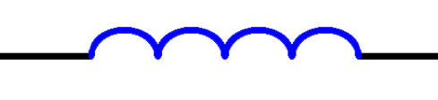
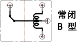
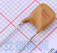

## 第 1 节 电阻器（Resistor）

**介绍：**电阻器是产生电阻的元器件，主要用于阻碍导体中电流的流动。

**电路符号：**

**数据单位：**mΩ（毫欧）、Ω（欧姆）、kΩ（千欧）、MΩ（兆欧）。

**数据单位转换关系：**103。

**用途：**限流、分流、分压、将电能转为内能。

**电阻的参数：**阻值、功率、精度。

- 阻值：电阻的阻值越大，电流越小，反之电流越大。
- 功率：电阻器的额定功率，指电阻在正常气候条件下，长时间连续安全工作可承受的最大功率。

​		举例：电阻额定功率为1/4W，阻值为1KΩ。

​		答：所以P=I2R=I2*1000Ω<=0.25W，所以I=0.015A=15mA，当U>15mA时，电阻容易损坏。

- 精度：一般电阻的精度有1%、5%等的误差，精密的电阻也有0.1%等的误差。精度越高，价格越贵。

### 1.1 固定电阻

#### 1.1.1 碳膜电阻

**图像：**

**应用场景：**家用电器等民用领域。

#### 1.1.2 金属膜电阻

**图像：**

**应用场景：**精密仪器或医疗设备等领域。

**补充：**比碳膜电阻更精密。

#### 1.1.3 线绕电阻

**图像：**

**应用场景：**用于高功率、过载保护、环境恶劣等场景。

**补充：**电阻电感要求高，对于高频响应非常差，不能用于高频场景。

#### 1.1.4 厚膜电阻

**图像：**

**应用场景：**精度低，用于主流电子产品。

#### 1.1.5 薄膜电阻

**图像：**

**应用场景：**精度更高，用于精密仪器、军工航空等高精度要求场合。

### 1.2 可变电阻

**介绍：**以薄膜电阻、金属膜电阻、线绕电阻为主。相比于固定电阻，多了一个调节电阻的指针。常见的封装类型：旋转式电位器、滑动式电位器、微调电位器、多转电位器等。

**图像：**

**应用场景：**用于家庭、商业、舞台灯光等场景中，通过控制电阻的阻值来调节灯光的亮度和颜色。

### 1.3 特殊电阻

#### 1.3.1 光敏电阻

**工作原理：**随着光照强度的增加，阻值降低。

**应用场景：**一般用于光线检测、照明控制、报警系统等场合。

#### 1.3.2 压敏电阻

**工作原理：**压敏电阻两端电压超过额定电压时，阻值降低。

**应用场景：**一般用在吸收过电压、浪涌保护、雷击保护等场合。

### 1.4 电阻的阻值识别

#### 1.4.1 直标法

**介绍：**直标法就是将电阻器的类别、标称阻值、允许偏差及额定功率等直接标注在电阻器的外表面上。

<table border="0.5" cellspacing="0">
	<caption style="font-weight:bold">误差精度代号表</caption>
	<tr align="center" valign="middle">
		<th>A</th>
		<th>B</th>
		<th>C</th>
		<th>D</th>
		<th>F</th>
		<th>G</th>
		<th>J</th>
		<th>K</th>
        <th>M</th>
	</tr>
	<tr align="center" valign="middle">
		<td>±0.05%</td>
		<td>±0.1%</td>
		<td>±0.25%</td>
		<td>±0.5%</td>
		<td>±1%</td>
		<td>±2%</td>
		<td>±5%</td>
		<td>±10%</td>
		<td>±20%</td>
	</tr>
</table>
<table border="0.5" cellspacing="0">
	<caption style="font-weight:bold">标称电阻值单位符号表</caption>
	<tr align="center" valign="middle">
		<th>文字符号</th>
		<th>单位及进位数</th>
	</tr>
	<tr align="center" valign="middle">
		<td>R</td>
		<td>Ω（100Ω）</td>
	</tr>
	<tr align="center" valign="middle">
		<td>K</td>
		<td>kΩ（103Ω）</td>
	</tr>
	<tr align="center" valign="middle">
		<td>M</td>
		<td>MΩ（106Ω）</td>
	</tr>
</table>
**例1：**

​	答：RX表示线绕电阻、24是型号

​		功率：50W、标称阻值：4Ω、误差：J=±5%。

**例2：**

​	答：功率：10W、标称电阻：200Ω、误差：J=±5%。

**例3：**

​	答：功率：50W、标称电阻：100Ω、误差：J=±5%。

#### 1.4.2 两位有效数字电阻读法

**介绍：**两位有效数字电阻读法就是在电阻体上用三位数字来表明阻值，一般用于±5%精度的阻值。它的前2位为有效数字，第3位表示在有效数字后面加几个0。

**例1：**

​	答：数字：472、有效数字：47、阻值：4700Ω。

**例2：**

​	答：数字：151、有效数字：15、阻值：150Ω。

**例3：**

​	答：“R”表示小数点“.”，阻值：2.4Ω。

​		若是“R15”，则阻值为：0.15Ω。

#### 1.4.3 三位有效数字电阻读法

	<b>介绍：</b>三位有效数字电阻读法就是在电阻体上用四位数字来标明阻值，一般用于±1%	精度的电阻。它的前3位为有效数字，第4位表示在有效数字后面加几个0。

**例1：**

​	答：数字：1001、阻值：1000Ω（1kΩ）。

**例2：**

​	答：数字：R500、阻值：0.5Ω（500mΩ）。

#### 1.4.4 精密电阻读法

**介绍：**精密电阻读法是由2位数字＋1位字母表示，一般用于±0.1%精度的电阻，例如：01B等。

<table border="0.5" cellspacing="0">
	<caption style="font-weight:bold">精密电阻阻值对照表</caption>
	<tr align="center" valign="middle">
		<th style="color:blue">代号</th>
		<th style="color:green">数值</th>
		<th style="color:blue">代号</th>
		<th style="color:green">数值</th>
		<th style="color:blue">代号</th>
		<th style="color:green">数值</th>
		<th style="color:blue">代号</th>
		<th style="color:green">数值</th>
	</tr>
	<tr align="center" valign="middle">
		<td style="color:blue">01</td>
		<td style="color:green">100</td>
		<td style="color:blue">25</td>
		<td style="color:green">178</td>
		<td style="color:blue">49</td>
		<td style="color:green">316</td>
		<td style="color:blue">73</td>
		<td style="color:green">562</td>
	</tr>
	<tr align="center" valign="middle">
		<td style="color:blue">02</td>
		<td style="color:green">102</td>
		<td style="color:blue">26</td>
		<td style="color:green">182</td>
		<td style="color:blue">50</td>
		<td style="color:green">324</td>
		<td style="color:blue">74</td>
		<td style="color:green">576</td>
	</tr>
	<tr align="center" valign="middle">
		<td style="color:blue">03</td>
		<td style="color:green">105</td>
		<td style="color:blue">27</td>
		<td style="color:green">187</td>
		<td style="color:blue">51</td>
		<td style="color:green">332</td>
		<td style="color:blue">75</td>
		<td style="color:green">590</td>
	</tr>
	<tr align="center" valign="middle">
		<td style="color:blue">04</td>
		<td style="color:green">107</td>
		<td style="color:blue">28</td>
		<td style="color:green">191</td>
		<td style="color:blue">52</td>
		<td style="color:green">340</td>
		<td style="color:blue">76</td>
		<td style="color:green">604</td>
	</tr>
	<tr align="center" valign="middle">
		<td style="color:blue">05</td>
		<td style="color:green">110</td>
		<td style="color:blue">29</td>
		<td style="color:green">196</td>
		<td style="color:blue">53</td>
		<td style="color:green">348</td>
		<td style="color:blue">77</td>
		<td style="color:green">619</td>
	</tr>
	<tr align="center" valign="middle">
		<td style="color:blue">06</td>
		<td style="color:green">113</td>
		<td style="color:blue">30</td>
		<td style="color:green">200</td>
		<td style="color:blue">54</td>
		<td style="color:green">357</td>
		<td style="color:blue">78</td>
		<td style="color:green">634</td>
	</tr>
	<tr align="center" valign="middle">
		<td style="color:blue">07</td>
		<td style="color:green">115</td>
		<td style="color:blue">31</td>
		<td style="color:green">205</td>
		<td style="color:blue">55</td>
		<td style="color:green">365</td>
		<td style="color:blue">79</td>
		<td style="color:green">649</td>
	</tr>
	<tr align="center" valign="middle">
		<td style="color:blue">08</td>
		<td style="color:green">118</td>
		<td style="color:blue">32</td>
		<td style="color:green">210</td>
		<td style="color:blue">56</td>
		<td style="color:green">374</td>
		<td style="color:blue">80</td>
		<td style="color:green">665</td>
	</tr>
	<tr align="center" valign="middle">
		<td style="color:blue">09</td>
		<td style="color:green">121</td>
		<td style="color:blue">33</td>
		<td style="color:green">215</td>
		<td style="color:blue">57</td>
		<td style="color:green">383</td>
		<td style="color:blue">81</td>
		<td style="color:green">681</td>
	</tr>
	<tr align="center" valign="middle">
		<td style="color:blue">10</td>
		<td style="color:green">124</td>
		<td style="color:blue">34</td>
		<td style="color:green">221</td>
		<td style="color:blue">58</td>
		<td style="color:green">392</td>
		<td style="color:blue">82</td>
		<td style="color:green">698</td>
	</tr>
	<tr align="center" valign="middle">
		<td style="color:blue">11</td>
		<td style="color:green">127</td>
		<td style="color:blue">35</td>
		<td style="color:green">226</td>
		<td style="color:blue">59</td>
		<td style="color:green">402</td>
		<td style="color:blue">83</td>
		<td style="color:green">715</td>
	</tr>
	<tr align="center" valign="middle">
		<td style="color:blue">12</td>
		<td style="color:green">130</td>
		<td style="color:blue">36</td>
		<td style="color:green">232</td>
		<td style="color:blue">60</td>
		<td style="color:green">412</td>
		<td style="color:blue">84</td>
		<td style="color:green">732</td>
	</tr>
	<tr align="center" valign="middle">
		<td style="color:blue">13</td>
		<td style="color:green">133</td>
		<td style="color:blue">37</td>
		<td style="color:green">237</td>
		<td style="color:blue">61</td>
		<td style="color:green">422</td>
		<td style="color:blue">85</td>
		<td style="color:green">750</td>
	</tr>
	<tr align="center" valign="middle">
		<td style="color:blue">14</td>
		<td style="color:green">137</td>
		<td style="color:blue">38</td>
		<td style="color:green">243</td>
		<td style="color:blue">62</td>
		<td style="color:green">432</td>
		<td style="color:blue">86</td>
		<td style="color:green">768</td>
	</tr>
	<tr align="center" valign="middle">
		<td style="color:blue">15</td>
		<td style="color:green">140</td>
		<td style="color:blue">39</td>
		<td style="color:green">249</td>
		<td style="color:blue">63</td>
		<td style="color:green">442</td>
		<td style="color:blue">87</td>
		<td style="color:green">787</td>
	</tr>
	<tr align="center" valign="middle">
		<td style="color:blue">16</td>
		<td style="color:green">143</td>
		<td style="color:blue">40</td>
		<td style="color:green">255</td>
		<td style="color:blue">64</td>
		<td style="color:green">453</td>
		<td style="color:blue">88</td>
		<td style="color:green">806</td>
	</tr>
	<tr align="center" valign="middle">
		<td style="color:blue">17</td>
		<td style="color:green">147</td>
		<td style="color:blue">41</td>
		<td style="color:green">261</td>
		<td style="color:blue">65</td>
		<td style="color:green">464</td>
		<td style="color:blue">89</td>
		<td style="color:green">825</td>
	</tr>
	<tr align="center" valign="middle">
		<td style="color:blue">18</td>
		<td style="color:green">150</td>
		<td style="color:blue">42</td>
		<td style="color:green">267</td>
		<td style="color:blue">66</td>
		<td style="color:green">475</td>
		<td style="color:blue">90</td>
		<td style="color:green">845</td>
	</tr>
	<tr align="center" valign="middle">
		<td style="color:blue">19</td>
		<td style="color:green">154</td>
		<td style="color:blue">43</td>
		<td style="color:green">274</td>
		<td style="color:blue">67</td>
		<td style="color:green">487</td>
		<td style="color:blue">91</td>
		<td style="color:green">866</td>
	</tr>
	<tr align="center" valign="middle">
		<td style="color:blue">20</td>
		<td style="color:green">158</td>
		<td style="color:blue">44</td>
		<td style="color:green">280</td>
		<td style="color:blue">68</td>
		<td style="color:green">499</td>
		<td style="color:blue">92</td>
		<td style="color:green">887</td>
	</tr>
	<tr align="center" valign="middle">
		<td style="color:blue">21</td>
		<td style="color:green">162</td>
		<td style="color:blue">45</td>
		<td style="color:green">287</td>
		<td style="color:blue">69</td>
		<td style="color:green">511</td>
		<td style="color:blue">93</td>
		<td style="color:green">909</td>
	</tr>
	<tr align="center" valign="middle">
		<td style="color:blue">22</td>
		<td style="color:green">165</td>
		<td style="color:blue">46</td>
		<td style="color:green">294</td>
		<td style="color:blue">70</td>
		<td style="color:green">523</td>
		<td style="color:blue">94</td>
		<td style="color:green">931</td>
	</tr>
	<tr align="center" valign="middle">
		<td style="color:blue">23</td>
		<td style="color:green">169</td>
		<td style="color:blue">47</td>
		<td style="color:green">301</td>
		<td style="color:blue">71</td>
		<td style="color:green">536</td>
		<td style="color:blue">95</td>
		<td style="color:green">953</td>
	</tr>
	<tr align="center" valign="middle">
		<td style="color:blue">24</td>
		<td style="color:green">174</td>
		<td style="color:blue">48</td>
		<td style="color:green">309</td>
		<td style="color:blue">72</td>
		<td style="color:green">549</td>
		<td style="color:blue">96</td>
		<td style="color:green">976</td>
	</tr>
	<tr align="center" valign="middle">
		<td style="color:red" colspan="2">Y=10-2</td>
		<td style="color:red" colspan="2">X=10-1</td>
		<td style="color:red" colspan="2">A=100</td>
		<td style="color:red" colspan="2">B=101</td>
	</tr>
	<tr align="center" valign="middle">
		<td style="color:red" colspan="2">C=102</td>
		<td style="color:red" colspan="2">D=103</td>
		<td style="color:red" colspan="2">E=104</td>
		<td style="color:red" colspan="2">F=105</td>
	</tr>
</table>
**例：**

​	答：数字：01B、阻值：100*10=1000Ω=1kΩ

#### 1.4.5 色环法

**介绍：**通过在电阻的体表涂上不同颜色的环带来表示电阻的阻值和精度。一般电阻上会有4或5个色环，每个色环代表1个数字或1个特定的系数。

- 四环电阻

  - 图像：

  - 描述：从左至右，第1环、第2环为有效数字，第3环为乘数，第4环为误差精度。

- 五环电阻
  - 图像：
  - 描述：从左至右，第1环、第2环、第3环为有效数字，第4环为乘数，第5环为误差精度。

<table border="0.5" cellspacing="0">
	<caption style="font-weight:bold">色环法阻值读法表</caption>
	<tr align="center" valign="middle">
		<th style="color:blue">色环颜色</th>
		<th style="color:green">第1环</th>
		<th style="color:blue">第2环</th>
		<th style="color:green">第3环</th>
		<th style="color:blue">乘数</th>
		<th style="color:green">精度</th>
	</tr>
	<tr align="center" valign="middle">
		<td bgcolor="Black" style="color:white">黑</td>
		<td>0</td>
		<td>0</td>
		<td>0</td>
		<td>1</td>
		<td></td>
	</tr>
	<tr align="center" valign="middle">
		<td bgcolor="SaddleBrown" style="color:white">棕</td>
		<td style="color:green">1</td>
		<td style="color:blue">1</td>
		<td style="color:green">1</td>
		<td style="color:blue">10</td>
		<td style="color:green">±1%</td>
	</tr>
	<tr align="center" valign="middle">
		<td bgcolor="Red" style="color:white">红</td>
		<td style="color:green">2</td>
		<td style="color:blue">2</td>
		<td style="color:green">2</td>
		<td style="color:blue">100</td>
		<td style="color:green">±2%</td>
	</tr>
	<tr align="center" valign="middle">
		<td bgcolor="DarkOrange" style="color:Black">橙</td>
		<td style="color:green">3</td>
		<td style="color:blue">3</td>
		<td style="color:green">3</td>
		<td style="color:blue">1k</td>
		<td style="color:green">±3%</td>
	</tr>
	<tr align="center" valign="middle">
		<td bgcolor="Yellow" style="color:Black">黄</td>
		<td style="color:green">4</td>
		<td style="color:blue">4</td>
		<td style="color:green">4</td>
		<td style="color:blue">10k</td>
		<td style="color:green">±4%</td>
	</tr>
	<tr align="center" valign="middle">
		<td bgcolor="green" style="color:white">绿</td>
		<td style="color:green">5</td>
		<td style="color:blue">5</td>
		<td style="color:green">5</td>
		<td style="color:blue">100k</td>
		<td style="color:green"></td>
	</tr>
	<tr align="center" valign="middle">
		<td bgcolor="blue" style="color:white">蓝</td>
		<td style="color:green">6</td>
		<td style="color:blue">6</td>
		<td style="color:green">6</td>
		<td style="color:blue">1M</td>
		<td style="color:green"></td>
	</tr>
	<tr align="center" valign="middle">
		<td bgcolor="Purple" style="color:white">紫</td>
		<td style="color:green">7</td>
		<td style="color:blue">7</td>
		<td style="color:green">7</td>
		<td style="color:blue">10M</td>
		<td style="color:green"></td>
	</tr>
	<tr align="center" valign="middle">
		<td bgcolor="Gray" style="color:white">灰</td>
		<td style="color:green">8</td>
		<td style="color:blue">8</td>
		<td style="color:green">8</td>
		<td style="color:blue">100M</td>
		<td style="color:green"></td>
	</tr>
	<tr align="center" valign="middle">
		<td bgcolor="white" style="color:black">白</td>
		<td style="color:green">9</td>
		<td style="color:blue">9</td>
		<td style="color:green">9</td>
		<td style="color:blue">1000M</td>
		<td style="color:green"></td>
	</tr>
	<tr align="center" valign="middle">
		<td bgcolor="gold" style="color:black">金</td>
		<td style="color:green">-1</td>
		<td style="color:blue">-1</td>
		<td style="color:green">-1</td>
		<td style="color:blue">0.1</td>
		<td style="color:green">±5%</td>
	</tr>
	<tr align="center" valign="middle">
		<td bgcolor="Gainsboro" style="color:black">银</td>
		<td style="color:green">-2</td>
		<td style="color:blue">-2</td>
		<td style="color:green">-2</td>
		<td style="color:blue">0.01</td>
		<td style="color:green">±10%</td>
	</tr>
	<tr align="center" valign="middle">
		<td style="color:black">无色</td>
		<td style="color:green"></td>
		<td style="color:blue"></td>
		<td style="color:green"></td>
		<td style="color:blue"></td>
		<td style="color:green">±20%</td>
	</tr>
</table>
**例1：**

​	分析：第1环：红色（2）、第2环：红色（2）、第3环：黑色（乘数1）、第4环：黄色（±4%）。

​	答：阻值=22*1±4%Ω。

**例2：**

​	分析：第1环：红色（2）、第2环：红色（2）、第3环：黑色（0）、第4环：绿色（乘数100k）、第5环：黄色（±4%）。

​	答：阻值=220*100k±4%Ω。

**注意：**电阻阻值直接用万用表测量即可，一般很少读色环。

## 第 2 节 电容器（Resistor）

**介绍：**电容就是电荷的容器，单位为法拉（F），1F代表升压1V可以储存1C电量。

**电路符号：**或。

**数据单位：**pF（皮法）、nF（纳法）、uF（微法）、mF（毫法）、F（法拉）。

**数据单位转换关系：**103。

**用途：**隔直通交、储能、充电、放电。

**补充：**电容对交流信号的阻碍作用成为容抗，它与交流信号的频率和电容量有关。电容容抗XC=1/2πfC。其中，f表示交流电信号的频率，C表示电容器的容量，==容抗与频率和容量成反比==。

**电容的参数：**容量、耐压值、容差。

- 电容的容量：电容容量的大小表示能储存电能的大小。

- 电容的耐压值：有2.5V、4V、6.3V、10V、16V、20V等，一般最高只用到600V的耐压值。==<u>其中，无极性电容的耐压值偏高，有极性电容耐压值偏低。一般情况，标称耐压值越高，则电容的体积越大。</u>==

- 电容的容差：电容的绝对容差是指电容器的实际容量与额定容量之间的差值。

<table border="0.5" cellspacing="0">
	<caption style="font-weight:bold">电容容差字符表</caption>
	<tr align="center" valign="middle">
		<th>B</th>
		<th>C</th>
		<th>D</th>
		<th>Y</th>
		<th>A</th>
		<th>V</th>
	</tr>
	<tr align="center" valign="middle">
		<td>±0.1pF</td>
		<td>±0.25pF</td>
		<td>±0.5pF</td>
		<td>±1pF</td>
		<td>±1.5pF</td>
		<td>±5pF</td>
	</tr>
</table>

### 2.1 固定电容

**介绍：**无极性电容和有极性电容都可以看作固定电容，区别是容量和对于电容两端极性要求不同。无极性电容对两端极性没有要求，但一般容量较小，可以用于交流电。有极性电容造价便宜，容量大，只能用于直流电场景。固定电容按照工艺区分有：电解电容（有极性）、瓷片电容，主要是在价格和容量间做取舍。

#### 2.1.1 电解电容

**图像：**

**正负极识别方法：**看表面颜色，颜色少的方向为负极，多的为正极。

#### 2.1.2 瓷片电容

**图像：**

**补充：**无极性，正反随意接。

### 2.2 可变电容

**介绍：**可变电容和固定电容工艺类似，但一般有一个调节装置，可以调节两个极片之间的相对面积，从而达到调节电容大小的目的，一般很少使用。

**图像：**

### 2.3 超级电容

**介绍：**一种特殊电容，介于传统电容器和电池之间，容量大、充电快，可以反复充放电。一般用于汽车、备用电源、风力发电等领域。比如：电路中电源突然断电，可以通过超级电容给后续电路瞬间提供电压，保证系统有时间切换到备用电源上。

**图像：**

### 2.4 电容的容量识别

#### 2.4.1 直标法

**介绍：**一般电解电容表面直接显示的容值就是实际的容值，例如：0.01uF、0.047uF、33pF、45pF等。

**例图：**

​	答：上图的电解电容的容值为：1500uF。

#### 2.4.2 乘方数表示法

**介绍：**一般陶瓷电容用3位数字表示容值，它的第1位和第2位是有效数字，第3位表示在有效数字后面加几个0，拼接后的容值单位是pF。

**例1：**100。

​	答：容值为：10*10^0^=10pF。

**例2：**101。

​	答：容值为：10*10^1^=100pF。

**例3：**102。

​	答：容值为：10*10^2^=1000pF=1nF。

**例4：**103。

​	答：容值为：10*10^3^=10000pF=10nF。

**例5：**

​	答：数字为：104，容值为：10*10^4^=100000pF=100nF。

**例6：**105。

​	答：容值为：10*10^5^=1000000pF=1000nF=1uF。

#### 2.4.3 字母表示法

**介绍：**字母表示法是国际电工会推荐标注的方法，使用的标注字母有4个，即：p、n、u、m，分别表示pF、nF、uF、mF。用2~4个数字和1个字母表示电容量，字母前的数字为容量的整数，字母后的数字为小数。

**例1：**1p5表示1.5pF。

**例2：**4u7表示4.7uF。

**例3：**3n9表示3.9nF。

#### 2.4.4 贴片电解电容

**介绍：**贴片电解电容上表示的数字就是实际电容量，单位是uF。

**例：**

​	答：数字为：470，容值为：470uF。

## 第 3 节 电感器

**介绍：**电感由一根具有绝缘外皮的铜丝缠绕几圈形成。电感对直流电流没有阻碍作用，对交流电流阻碍作用大。

**电路符号：**

**单位：**H（亨）、mH（毫亨）、uH（微亨）。

**单位转换关系：**10^3^。

**用途：**电感储能、通直隔交。

**补充：**对交流电流的阻碍作用称为感抗，感抗与交流电的频率以及电感的感量有关，公式：X~L~=2πfL。其中X~L~是电感的感抗，f是通过电感交流电的频率，L是电感的电感量，感抗是对交流电阻碍力的大小，==感抗与频率和电感量成正比==。

**电感的参数：**电感量、直流电阻、允许误差。

- 电感量：电感就有储存能量（磁能）的作用，存储能力的大小成为感量，电感在电路中用L表示。电感的感量与线圈的面积、线圈的圈数和有无磁心有关。
- 直流电阻：直流电阻（DCR）是指电感器金属导体中固有的电阻，可以将其理解为与电感器串联的电阻器，通常要求直流电阻的阻值尽可能的小。
- 允许误差：指电感器上标称的电感量与实际电感的允许误差值。

<table border="0.5" cellspacing="0">
	<caption style="font-weight:bold">电感允许误差字符表</caption>
	<tr align="center" valign="middle">
		<th>J</th>
		<th>K</th>
		<th>L</th>
		<th>M</th>
		<th>P</th>
		<th>N</th>
        <th>MIN</th>
	</tr>
	<tr align="center" valign="middle">
		<td>±5%</td>
		<td>±10%</td>
		<td>±15%</td>
		<td>±20%</td>
		<td>±25%</td>
		<td>±30%</td>
        <td>最小电感量</td>
	</tr>
</table>

### 3.1 磁环电感

**图像：**

**补充：**由于体积较大，实际应用中很少使用。

### 3.2 贴片电感

**图像：**

**补充：**线圈被封装在内部。

### 3.3 电感的大小识别

#### 3.3.1 由3位数字与1位字母表示

**介绍：**前2位数字表示有效数字，第3位数字表示有效数字后面加几个0，字母表示电感的允许误差，单位为uH。

例：201K

​	答：电感量=20*10^1^±10%uH

#### 3.3.2 由数字和字母“R”、“N”混合标注 

**介绍：**常用于小功率电感（如：贴片电感），由字母“R”、“N”表示小数点。用“R”时，电感单位为uH；用“N”时，电感单位为nH。最后以电感允许误差字母表示电感精度。

**例1：**4R7J

​	答：电感量=4.7uH±5%。

**例2：**5N2L

​	答：电感量=5.2nH±15%。

## 第 4 节 继电器

**介绍：**继电器是一种电控制器件，它实际上是用小电流去控制大电流运作的一种“自动开关”，常在电路中起着自动调节、安全保护、转换电路等作用。

**图像：**

**继电器的参数：**额定电压、最大切换电流、最大切换电压、触电形式。

- 额定电压：指继电器线圈在正常工作状态下所能承受的最大电压值。
- 最大切换电流：指继电器触点在额定电压下，通过继电器触点的最大负载电流。
- 最大切换电压：指继电器触点可以在小于最大切换电压的情况下进行正常的开关操作。
- 触点形式：常开（通电即关）、常关（通电即开）、转换。

## 第 5 节 保险丝

**介绍：**保险丝可以看成一种特殊的电阻，主要作用是在电路中电流高于某个元器件额定电流值时熔断，从而起到保护后续电路元器件的作用。保险丝分为一次性保险丝和自恢复保险丝：

- 一次性保险丝
  - 介绍：熔断过后不可用，需要换新的保险丝。
  - 图像：
- 自恢复保险丝
  - 介绍：熔断过后，可通过复位，反复使用。
  - 图像：

**保险丝的参数：**额定电压、额定电流、熔断速度。

- 额定电压：保险丝处于安全工作状态所安置的电路的最高工作电压。
- 额定电流：保险丝处于安全工作状态所安置的电路的最高工作电流。通常有：100mA、200mA、315mA、400mA、500mA、630mA、800mA、1A、1.6A、2A、2.5A、3A、4A、5A、6.3A等。
- 熔断速度：分为：TT（特慢速保险丝）、T（慢速保险丝）、M（中速保险丝）、F（快速保险丝）、FF（特快速保险丝）。

## 第 6 节 接插件

暂不介绍

## 第 7 节 蜂鸣器

**介绍：**能发出“滴滴”声音的元器件，在电子产品中主要用来发出警告音。例如：洗衣机操作按键的声音、烟感器发出的提示音等。蜂鸣器按照驱动方式的不同，分为“有源蜂鸣器”和“无源蜂鸣器”两种，这里的“源”指的不是电源，而是音频振荡源。

- 有源蜂鸣器
  - 介绍：内含驱动电路，也叫自激式蜂鸣器。
  - 图像：
- 无源蜂鸣器
  - 介绍：需要外部加一个震荡电路才能发出声音，也叫它激式蜂鸣器。
  - 图像：

**蜂鸣器内部结构：**

**蜂鸣器的参数：**额定电压、工作电压、消耗电流。

- 额定电压：指蜂鸣器可以正常工作的电压范围，超过额定电压会导致蜂鸣器声音过强或损坏，而低于额定电压会导致蜂鸣器无法正常工作或声音过弱。
- 工作电压：指蜂鸣器可以发出声响的电压范围。
- 消耗电流：指蜂鸣器可以发出声响的电流范围。

**补充：**无源蜂鸣器在电路中一般是由单片机的IO端口驱动的，但单片机的IO端口不足以驱动蜂鸣器，所以要配合三极管或MOS管来驱动蜂鸣器。

### 7.1 蜂鸣器有无源的区分

**介绍：**将万用表调到“欧姆”挡位，如果电阻数值有显示，则是无源蜂鸣器，若没有数值显示，则是有源蜂鸣器。

**有源蜂鸣器示例图：**

**无源蜂鸣器示例图：**

## 第 8 节 电源

### 8.1 电池

**介绍：**以化学能形式放电，电压会随着放电降低。

**电池的参数：**额定电压、电池容量。

- 额定电压：指电池设计和生产过程中确定的标准电压值，单位通常为：伏特（V）。
- 电池容量：指电池存储电量的大小，单位为：毫安时（mAh）。
  - 举例：电池容量200mAh，表示在额定电压情况下，电池可以提供200mA恒流的持续时间为1小时。

**按充电次数分类：**不可充电电池、可反复充电电池。

- 不可充电电池：
- 可反复充电电池：

### 8.2 稳压电源芯片

**介绍：**稳压电源芯片又称为电源管理芯片，是一种专门用来控制输出电压稳定的电子芯片，它能够将不稳定的电源电压，通过内部的反馈控制电路，转换为稳定的输出电压。常见的输出电压有：5V、3.3V。

